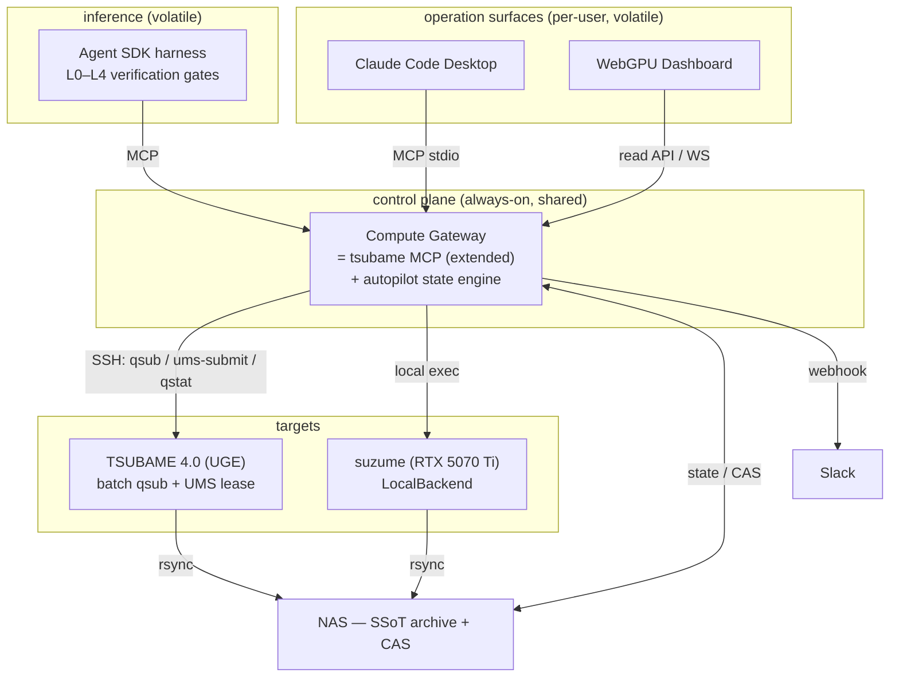

# Compute Gateway — multi-target AI research infrastructure

> **FROZEN 2026-06-21.** Describes the tree as of that date and is **not maintained** against the code — do not cite it as current.
> Live sources: `CLAUDE.md`, `docs/index.md`, and the code itself. Audit: `docs/audit/docs_inventory_2026-08-04.md`.

**Status**: design. Phase 1 substrate already live; this doc fixes the scope to
the genuinely new work (UMS, DAG, multi-user). Supersedes the inline plan; the
ground-truth audit it is reconciled against lives in
`compute_gateway_feasibility_review.md`.

Drive TSUBAME 4.0 (Altair Grid Engine / UGE) and the suzume GPU box from
Claude Code, with verification + analysis in one loop. Few users, shared base.

## Core idea

Separate the **volatile brain** (the Claude Code session — interactive, short,
per-user) from the **durable hands + memory** (compute, run state, artifacts —
long-lived, shared, survive a closed session). Wiring the two directly always
breaks. Four pillars:

1. **One control plane (Compute Gateway).** Claude Code never touches schedulers
   directly; it calls a long-lived Gateway that owns the state SSoT and the
   artifact registry. Sessions die; jobs and state do not.
2. **Abstract the executor.** TSUBAME is UGE (`qsub`/`qstat`/`qdel`), suzume is a
   standalone GPU. The `AutopilotBackend` abstraction already absorbs this.
3. **Kill interactive latency with a UMS lease.** HPC queue waits are toxic to an
   interactive agent. A *leased* `node_f` + UMS turns "run this param set" into an
   instant dispatch to a held allocation instead of a fresh queue submit.
4. **Reproducibility = artifacts (CAS) + environment (container).** Content-
   addressed runs dedup across users/machines; the env is pinned and carried to
   HPC via Apptainer (`scripts/spinorbec.def`).

## Build vs reuse (corrected)

The hard part is **mostly already built.** The autopilot *is* the Gateway state
engine; the table below is the honest inventory (see the review for file:line).

**Already live — reuse, do not rebuild:**

- MCP server: `scripts/mcp/tsubame_server.py` (FastMCP; enqueue / autopilot_status
  / qstat / job_detail / list_runs / pull_results / cancel / tail_log / budget /
  points / tick). The plan's `submit/status/results/list_runs` already exist here.
- Executor abstraction: `AutopilotBackend` (`stage_in`/`dispatch!`/`job_status`/
  `pull_live`/`collect!`/`cancel!`/`find_job_by_name`/`next_profile`/
  `prepare_status_snapshot`). The plan's 4-method trait is a subset.
- GridEngine executor: `UGEBackend` (`qsub -g` CLI flag, batched `qstat`, `qacct`
  fallback, `qdel`, rsync + SSH ControlMaster, Manifest-hash auto-instantiate,
  9 env auto-register). = the plan's `GridEngineExecutor`.
- Local executor: `LocalBackend` (subprocess). = suzume bare. **No SLURM needed.**
- State engine: `state.toml` SSoT, 5-state lifecycle, two-stage submit, 4 circuit
  breakers, `AutopilotBudget`, divergence kill, retry classification, on_complete.
- CAS: `content_id(spec)` → `<root>/<sha256[1:16]>/`, idempotent `run!`,
  `sweep`/`twin`/`tabulate`/`spec_diff`.
- Read surface: dashboard HTTP routes + WebSocket (`/ws/scrub`) + `_live_status.json`.
- Notifications: Slack `notify_slack`.
- Container: `scripts/spinorbec.def`.

**MCP schema note (avoid re-inventing types):** the runtime model is spec-centric.
Build `submit`/`results` on `Experiment` / `Vector{Experiment}` + the existing
*function* observables (`Fz_t`, `classify`, …) and `tabulate` (returns a
`NamedTuple`). There is no `Observable{T}` and no `Sweep` type — do not create
them. Use `config([...])` / `Experiment(spec)` / `run!` / `run_yaml`.

**Genuinely new — where the work goes:**

1. ~~**UMS low-latency path** (§ Decision 2).~~ **DEFERRED (2026-06-21)** — measured
   the premise and it doesn't hold: trial `qsub`→running = **7.8 s** (worst case;
   trial is lowest priority). No queue wait worth a lease. See
   `ums_lease_backend_design.md` (Status). Revisit only on observed `node_f`
   congestion or rapid-fire JIT friction (latter ≈ covered by sysimage).
2. **Submit-time DAG / `-hold_jid`** — `on_complete` is a *post-completion* trigger,
   not a submit-time dependency graph.
3. **Multi-user / namespace / per-user quota** — `enqueued_by` is a provenance
   string; budget is global. Phase 3 is all new.
4. **Cross-target routing** (TSUBAME↔suzume) — `next_profile` only escalates
   within one backend.
5. **Remote MCP transport** (stdio → HTTP/SSE) for Remote Control.

`SlurmExecutor` is dropped (suzume = `LocalBackend`).

## Architecture

## Decision 1 — extend the MCP, do not replace it

`tsubame_server.py` becomes the single Gateway, generalized to multi-target.
Structured tools (enqueue/status/list/pull) stay bound to the autopilot. Raw-SSH
tools are **demoted to an escape hatch** — additive, a bypass that preserves
freedom, not debt. The MCP stays a thin tool surface; the brain stays in the
Julia autopilot. No second MCP. This eliminates the audit's "MCP duplication"
risk.

Login-node compute ban: the Gateway/MCP must be code-constrained to
submit+monitor only (the current raw-SSH path can run arbitrary remote commands —
guard it).

## Decision 2 — lease the UMS allocation, do not hold it permanently

**Superseded (2026-06-21): UMS deferred — queue measured at ~8 s, so there is no
lease to manage. The decision below stands only if UMS is revived.**

Resolves the cost tension (a live `node_f` ⊥ a lightweight always-on Gateway):

- The **coordinator** is always-on and cheap; the **`node_f` allocation is an
  ephemeral lease.**
- "Enter low-latency mode" → `qsub node_f` + start UMS. Idle timeout → auto `qdel`.
- No new cost machinery: add a **max-idle policy to the existing `AutopilotBudget`
  + kill breaker.** Idle `node_f` burn counts against budget; the kill breaker
  reaps it on idle. The Gateway owns lease setup/teardown — closing the audit's
  "who owns the allocation lifecycle" gap.

Implementation seam: a `dispatch!` variant targeting the held allocation
(`ums-submit`), and swapping `prepare_status_snapshot` / `_uge_qstat_list_cmd`
for `ums-list`. Preserve the `qsub -g` CLI-flag knowledge (`#$ -g` is rejected).

## Routing

| axis | TSUBAME 4.0 | suzume |
|---|---|---|
| scale | many-node, large array, production sweep | single-box verify, small/medium |
| latency | queue (UMS-leased path mitigates) | none |
| cost | group points (trial mode free, limited) | electricity only |
| use | full-map scans, heavy TDHFB | debug, interactive iterate, dashboard, CI |

Rule: smoke → suzume or TSUBAME trial (`-g` omitted, ≤2 parallel, ≤3 min, free);
campaign → pointed `qsub`; interactive → suzume or UMS lease; CI/nightly →
`LocalBackend` on suzume.

## Roadmap (re-scoped)

Phase 1 collapses from "build" to "name + decide", because the structured tools
are already live.

### Phase 1 — fold (mostly naming + the two decisions above)
- Generalize `tsubame_server.py` to multi-target; demote raw-SSH to escape hatch.
- Confirm `submit/status/results/list_runs` map onto `Experiment` + autopilot queue
  (they already do).
- Code-guard the login-node compute ban.

### Phase 2 — headless harness (UMS dropped)
- ~~`node_f` lease + `ums-submit`/`ums-list` low-latency path.~~ **DEFERRED** —
  queue measured at ~8 s (`ums_lease_backend_design.md`); no wait to remove.
- Headless Agent SDK harness as a Gateway service; L0–L4 gates as the verification
  stage; only gate-passing runs promote to "validated" in CAS. **This is the real
  Phase-2 work now** — it never depended on UMS; it runs on the existing `qsub` path.

### Phase 3 — multi-user (all new)
- Per-user identity/namespace (replace provenance-only `enqueued_by`), per-user
  quota (replace global budget), OAuth (isct.ac.jp), tailnet ACL.
- Dashboard read API / SSE; PreToolUse / command-guard for multi-user safety.
- Submit-time DAG (`-hold_jid`) if campaigns need it.

### Phase 4 — optional
- Cross-target routing learning; VASPilot-style auto error-analysis + restart.

## Open questions / sharp edges

- UMS lease policy: idle timeout value, who may trigger a lease, max concurrent
  leases per group.
- Submit-time DAG vs `on_complete` lineage — keep them distinct; do not overload.
- Multi-user identity source (OAuth subject? tailnet user?) feeding the namespace.
- Remote MCP transport security once it leaves stdio.

## References

- Feasibility audit: `docs/design/compute_gateway_feasibility_review.md`
- Autopilot: `src/workflow/autopilot/`
- CAS / Experiment: `src/workflow/experiment.jl`
- MCP: `scripts/mcp/tsubame_server.py`
- TSUBAME guide: `docs/guides/tsubame.md`
- TSUBAME UMS: https://www.t4.cii.isct.ac.jp/docs/experimental/ums/
- VASPilot (arXiv 2508.07035): https://arxiv.org/pdf/2508.07035
