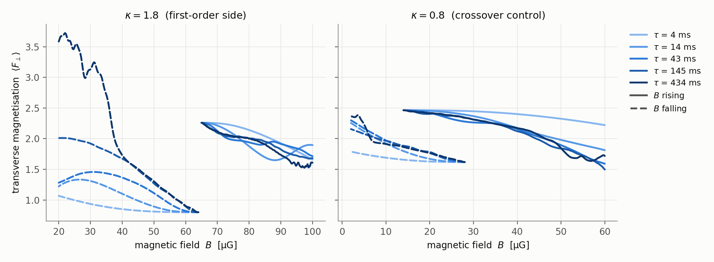
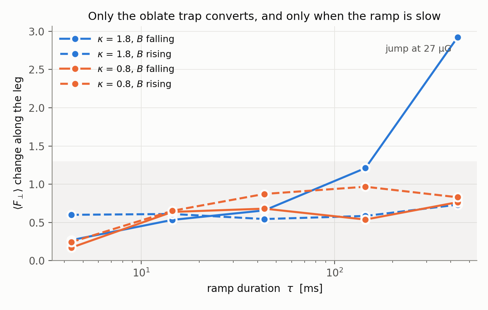
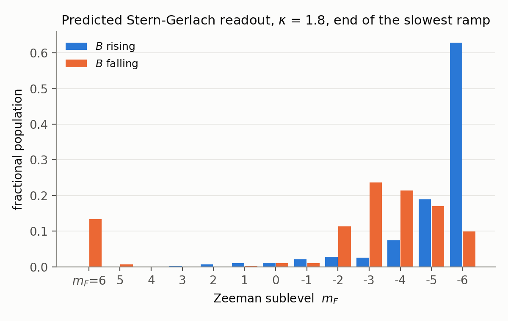
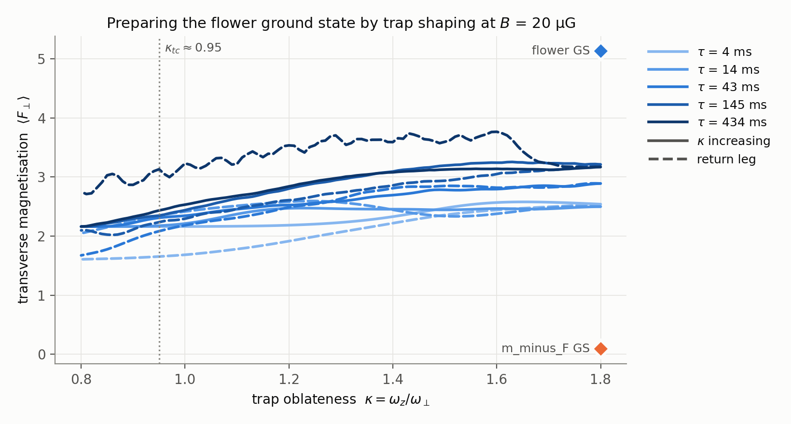
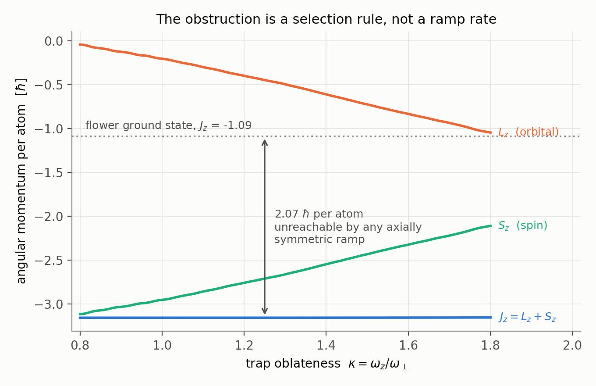
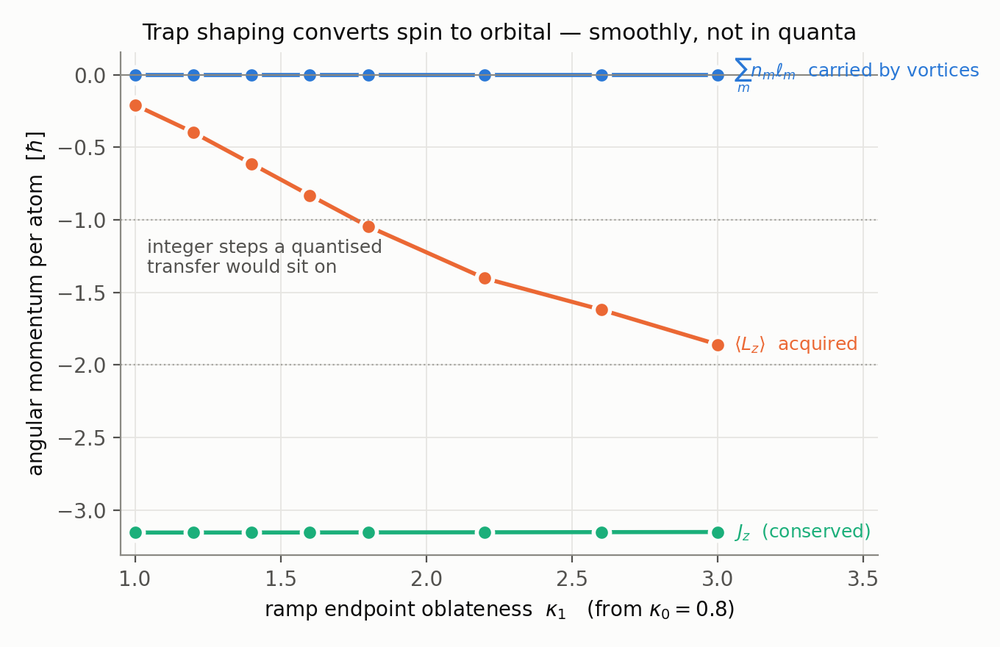
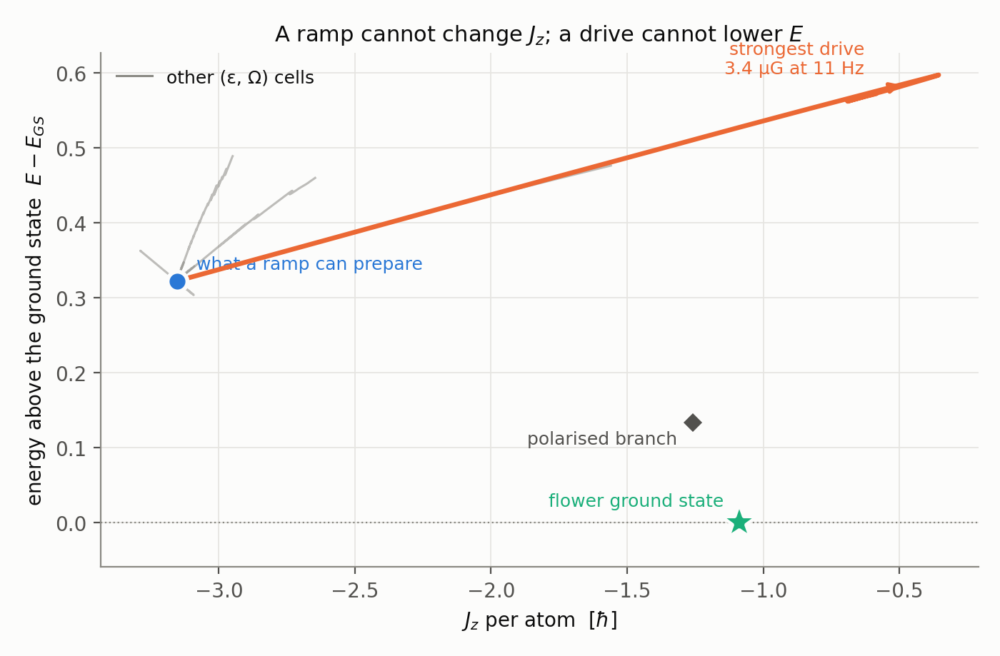

# Adiabatic-passage protocol for the weak-field ¹⁵¹Eu ground-state transition

Design of a *ground-state* experiment for the weak-field F=6 Eu + DDI transition:
ramp $B_z$ through the transition in both directions at several rates and read the
result out with Stern-Gerlach. This is the static counterpart of the Einstein–de
Haas measurement — EdH is a quench (dynamics); this asks whether the
chiral/flower phase can be *prepared* as a ground state.

## What is being claimed, and what would falsify it

The transition **order is set by the trap oblateness** $\kappa = \omega_z/\omega_\perp$,
with a tricritical point at $\kappa_{tc} \approx 0.95$:

| $\kappa$ | behaviour | evidence |
|---|---|---|
| $\le 0.9$ | crossover — one branch, $\delta\langle F_\perp\rangle \approx 0$ | grad-gated up/down sweeps agree to $10^{-3}$ |
| $\ge 1.0$ | bistable — two converged branches | $\delta\langle F_\perp\rangle \sim 0.1$ at onset |
| $1.8$ | clean first order, $B_{eq} = 61.9\ \mu$G | $\Delta E(B)$ sign flip, $\delta\langle F_\perp\rangle = 1.7$ |

Two numbers that are easy to mis-quote: **58–60 µG is saturation, not a
transition** ($E$, $dE/dB$ smooth; $\chi = -dF_z/dB$ collapses $0.11 \to 0.002$),
and there is **no single universal transition field** — a protocol has to name its
$\kappa$. A spherical trap ramped through 40 µG measures a crossover and sees no
hysteresis by construction.

That $\kappa$ dependence is what makes the prediction falsifiable with existing
apparatus: **the same ramp at two trap aspect ratios must give a loop at
$\kappa \gtrsim 1$ and none at $\kappa \le 0.9$.**

## Why rate dependence, not a single ramp

A ramp shows a loop for three different reasons, and only the rate scan separates
them:

| observation | conclusion |
|---|---|
| loop width shrinks as $\tau$ grows, $\to 0$ | dynamical lag — the ramp was too fast |
| loop width **saturates** at large $\tau$ | bistability: the metastable branch survives to its spinodal |
| no loop at any $\tau$ | crossover |

Two converged minima with a barrier are bistability, *not* by themselves a
first-order transition (ferromagnet coercivity is the counter-example). The
saturated loop width is the mean-field spinodal separation; the static
$\delta\langle F_\perp\rangle$ from the ground-state library is its $\tau\to\infty$
target.

## Running it

Both scripts read the converged GS library (`figs/eu_gs_library/`, keyed
`(grid, κ, B, branch)`); run them from the repo root that holds it.

```bash
# 1. static window analysis — seconds. Where to ramp, and the Larmor bound.
AR_KAPPAS=1.8,1.4,1.0,0.8 julia --project=. scripts/eu_adiabatic_window.jl

# 2. smoke every code path first (≤ 2 min on GPU)
LD_LIBRARY_PATH=/usr/lib/wsl/lib AR_SMOKE=1 \
  julia --project=. scripts/eu_adiabatic_ramp_protocol.jl

# 3. production: κ = 1.8 (first order) then κ = 0.8 (control), ~2.5 h each
bash scripts/run_eu_adiabatic_ramp.sh          # → logs/eu_adiabatic_ramp.log

# 4. figures
python scripts/viz_eu_adiabatic_ramp.py
```

`eu_adiabatic_window.jl` reports, per $\kappa$: the energy crossing $B_{eq}$, the
field range over which the branches stay distinct, each branch's converged
extent, and the Larmor bound. It flags when the distinct-branch range is
**data-limited** — if the branches are still separated at the edge of the library
(they are at $\kappa = 1.8$, $\delta\langle F_\perp\rangle$ only falling
$1.83 \to 1.52$ across 60–64 µG), the spinodals lie outside the static data and
the ramp has to run past it. Dynamics can; ITP from a fixed anchor cannot.

Each ramp is seeded from the branch that is metastable in its own direction:

| leg | seed | ramp | probes |
|---|---|---|---|
| `rise` | flower (library branch `up`), low $B$ | $B$ up | upper spinodal |
| `fall` | polarised (branch `dn`), high $B$ | $B$ down | lower spinodal |

## Numerical settings that are load-bearing

- **`split_step_midpoint!`, not `run_simulation!`.** Plain Strang is *first order
  in time* whenever DDI is active (the mean field is frozen at the $V$-step
  boundary), which a long ramp accumulates. The driver runs its own loop over the
  midpoint stepper for that reason.
- **Orszag 2/3 dealiasing OFF at 32³ / box 24**, against the general Eu-DDI
  recommendation. The 2/3 cutoff there is $k_{cut} = 2.62$ while the occupied band
  reaches $k \approx \sqrt{2\mu} \approx 4.3$ — the filter removes physically
  occupied modes, and measurably: with it on, $|\psi|^2$ bleeds $\approx 3\times10^{-6}$
  per step with no front-loading ($\approx 17\%$ over a $\tau = 100$ ramp). The
  library seeds were converged without it too. With it off, $|\psi|^2$ drift is
  $5\times10^{-13}$ and $J_z$ drift $2\times10^{-6}$ over a test ramp. Re-enable
  (`AR_DEALIAS=1`) only on a grid whose 2/3 cutoff clears the occupied band.
- **$dt = 0.002$.** $\langle F_\perp\rangle$ at the end of a test ramp agrees to
  three digits between $dt = 0.004$ and $dt = 0.001$.
- **Seed/preset assertion.** The driver aborts if the stored
  $(c_0, c_1, c_{dd}, p)$ of a library state disagree with the preset it rebuilds.
  A silent mismatch would put one parameter epoch's state into another's
  Hamiltonian: the seed would not be stationary and the rate scan would be
  measuring that transient instead of the ramp.

## The Larmor bound is not the constraint

The Goldstone pin $b_x = \varepsilon$ is held at the value each seed was converged
with, so the seed is stationary at $t = 0$; physically it is the residual
transverse lab field. The field-following bound it implies (spin tracks the
tilting quantisation axis, $\omega_L \gg \dot\theta$, via
`adiabaticity_trajectory`) comes out at $\tau \gtrsim 8\ \mu$s at $\kappa = 1.8$
and $\lesssim 0.7$ ms at $\kappa = 0.8$ — three or more orders below any plausible
ramp. **Ramp-speed design is therefore set entirely by the collective texture
rearrangement timescale**, which has no closed form here and is what the rate scan
measures.

## Result at $\kappa = 1.8$ (2026-07-27, 32³)

| leg | outcome |
|---|---|
| rise (flower, 65 → 100 µG) | flower survives at **every** rate 4–434 ms; $\langle F_\perp\rangle$ ends 1.61–1.89. The upper spinodal is above 100 µG |
| fall (polarised, 64 → 20 µG) | converts only at $\tau = 434$ ms: sharp jump at **$B = 27.4\ \mu$G** (sharpness 8.0, vs 1.65 at 145 ms), $\langle F_\perp\rangle\ 0.80 \to 3.58$, overshooting 3.72 with ringing |



**Reading the break between the two families of curves.** It is two different
things, and only one of them is physics:

- *Horizontally* (64 → 65 µG at $\kappa = 1.8$) there is simply no data. Each leg
  starts from the converged ground state of the branch that is metastable in its
  own direction, and the library has no low-field flower state at $\kappa = 1.8$ —
  the campaign that built it bracketed $B_{eq}$ and stopped. So the rising leg can
  only start at 65 µG and the falling leg at 64 µG. Generating flower seeds down to
  20 µG would let both legs span one window and turn the loop into a single number;
  that is the natural next run.
- *Vertically* at that seam is the result: at the same field the two branches sit at
  $\langle F_\perp\rangle = 0.80$ and $2.26$, i.e. $\delta\langle F_\perp\rangle = 1.46$.
  Two states coexisting at one field **is** the bistability. The $\kappa = 0.8$ facet
  has no such offset — its two seeds differ only through the field dependence of one
  branch, which is why no separation is annotated there.

So the field route *does* prepare the flower state — at $\tau \approx 0.4$ s, sweeping
to below 30 µG — but the overshoot and ringing say it arrives **excited**, not as a
cold ground state. The loop is wide and asymmetric: $[\approx 27, > 100]\ \mu$G,
consistent with the 35–85 µG spinodal range the static demagnetisation law implies.

The $\kappa = 0.8$ control shows a single smooth branch with no jump, as a crossover
must. Across all 20 runs only the $\kappa = 1.8$ falling leg converts:



Read the conversion depth, not a slope ratio. A ratio like
peak ÷ median $|dF_\perp/dB|$ divides by the typical slope, so a nearly flat curve
with one small bump outscores a real conversion — the $\kappa = 0.8$ control scores
10.2 on a span of 0.76 (a modest feature at $B = 5.7\ \mu$G, where the field nearly
vanishes and the soft manifold dominates), above the genuine $\kappa = 1.8$
conversion's 8.0 on a span of 2.92. A branch conversion moves
$\langle F_\perp\rangle$ by $\approx 2$; canting along one branch moves it by
$\le 1$.

What the experiment reads out is the $m_F$ distribution, and the two ramp directions
end up clearly distinct — $m_F = -6$ carrying 0.63 after the rising ramp, versus a
spread over $m_F = -2 \ldots -4$ with a $m_F = +6$ component after the falling one:



Because the conversion is a spinodal collapse rather than an adiabatic following,
the colder route is to avoid the barrier entirely: prepare on the crossover side and
cross the tricritical point along $\kappa$ instead —
`scripts/eu_kappa_ramp_protocol.jl`, driven by
`scripts/run_eu_kappa_ramp.sh`. Comparing the two endpoints at the same
$(B, \kappa)$ is the point of `KR_REF=1`.

## The κ route (2026-07-27, B held at 20 µG, round trip κ 0.8 → 1.8 → 0.8)

| τ | ⟨F⊥⟩ at κ = 1.8 | ΔE left after the return |
|---:|---:|---:|
| 4.3 ms | 2.540 | 0.960 |
| 14.5 ms | 2.500 | 0.672 |
| 43.4 ms | 2.891 | 0.446 |
| 144.7 ms | 3.213 | 0.348 |
| 434.1 ms | 3.171 | 0.389 |

Two things are solid. The state **tracks continuously across $\kappa_{tc}$** — there is
no event at $\kappa \approx 0.95$, which is what starting on the crossover side is
supposed to buy — and $\langle F_\perp\rangle$ at the endpoint **saturates at
$\approx 3.2$** for $\tau \gtrsim 145$ ms.

The round trip does **not** close. The energy left in the cloud after returning to
$(\kappa = 0.8,\ B = 20\ \mu\text{G})$, relative to the seed ground state there,
falls with τ and then plateaus at $\Delta E \approx 0.35$ (≈ 5 % of the seed's
7.45) rather than going to zero. ΔE is the measure to use here, not
$|\langle F_\perp\rangle_{\rm return} - \langle F_\perp\rangle_{\rm start}|$: the
endpoint oscillates with peak-to-peak 0.04–0.39, so a single-instant order-parameter
comparison mostly samples the phase of that oscillation, which is why the naive
reversibility number is non-monotonic in τ (0.56, 0.12, 0.49, 0.06, 0.59) while ΔE
is not.



### Both routes miss the ground state; the κ route misses by half as much

Both end at the *same physical point* — $\kappa = 1.8$, $B = 20\ \mu$G — so they can
be compared against the same reference. The two branches there, converged
independently with ε-ladder continuation to $|\nabla E| \sim 9\times10^{-6}$:

| state at $\kappa = 1.8$, $B = 20\ \mu$G | $E$ | excess over the GS | $\langle F_\perp\rangle$ |
|---|---:|---:|---:|
| flower — **the ground state** | 10.7314 | — | 5.138 |
| polarised | 10.8640 | +0.133 | 0.086 |
| κ ramp, τ = 145 ms | 11.0548 | **+0.323** | 3.213 |
| κ ramp, τ = 434 ms | 11.0503 | **+0.319** | 3.171 |
| field ramp, τ = 434 ms | 11.3459 | **+0.615** | 3.585 |

Three readings, in order of how much they matter:

1. **Neither route prepares the ground state.** Both stop far short —
   $\langle F_\perp\rangle$ of 3.2–3.6 against the ground state's 5.14 — and both
   excesses are *larger than the gap between the two branches* (0.133). The prepared
   states are not "the wrong branch"; they are excited states above both.
2. **The κ route does arrive colder**, by roughly a factor two in excess energy
   (+0.32 vs +0.62). Avoiding the barrier is worth something, just not enough.
3. **The κ route's excess has a floor**: +0.323 at 145 ms and +0.319 at 434 ms, and
   the round-trip ΔE plateaus at the same ≈ 0.35. A 3× slower ramp buys nothing.

## Why: $J_z$ is conserved and the ground state is in another sector



A trap deformation about $z$ is **axially symmetric**, so $J_z = L_z + S_z$ is a
constant of the motion up to the tiny pin — measured drift 3×10⁻³ over the whole
ramp, at every rate. And the target is far away in exactly that quantity:

| state | $J_z$ | $L_z$ | $S_z$ | $\langle F_\perp\rangle$ |
|---|---:|---:|---:|---:|
| κ = 0.8 seed | −3.156 | −0.042 | −3.113 | 2.161 |
| κ-ramp endpoint (every rate) | −3.153 | −1.044 | −2.109 | 3.171 |
| **flower ground state** | **−1.087** | −0.045 | −1.043 | 5.138 |

The ground state sits **2.07 ħ per atom away in $J_z$**, and no ramp of an axially
symmetric knob can move it there — a $B_z$ ramp is no better, since $B_z F_z$
commutes with $J_z$ too. What the ramp *can* do inside its sector is exactly what it
does: $L_z$ and $S_z$ trade one unit, $-0.04 \to -1.04$ against $-3.11 \to -2.11$.
That is Einstein–de Haas, driven by trap shaping.

So the endpoint is not a half-converted flower state; it is the **EdH-transferred,
vortex-carrying member of the seed's $J_z$ sector**. Reaching $S_z = -1.04$ at fixed
$J_z = -3.16$ would require carrying $L_z = -2.11$, and the state gets half way there.

### The shaped ramp was tested, and it changes nothing

Two shapes were run at τ = 145 ms against the linear ramp of the same duration —
`slow_at` (a Gaussian dwell at $\kappa_{tc}$, 70 % of the time below κ = 1.1) and
`const_dF` (equal time per unit of $\langle F_\perp\rangle$ change):

| ramp | $E$ at κ = 1.8 | excess | $\langle F_\perp\rangle$ | $J_z$ |
|---|---:|---:|---:|---:|
| linear, τ = 145 ms | 11.0548 | +0.3233 | 3.213 | −3.1544 |
| `slow_at`, τ = 145 ms | 11.0611 | +0.3296 | 3.143 | −3.1549 |
| `const_dF`, τ = 145 ms | 11.0697 | +0.3382 | 3.261 | −3.1550 |
| linear, τ = 434 ms | 11.0503 | +0.3189 | 3.171 | −3.1528 |

All four agree to ±0.02 in excess energy and to four decimals in $J_z$; the shaped
runs are if anything marginally *worse*, because they spend time at $\kappa_{tc}$
where nothing happens and pay for it at high κ. Critical slowing at the tricritical
point was the wrong hypothesis, and this is what ruled it out.

### Is the trap-shaping transfer quantised? No.

The 1 ħ traded at $\kappa: 0.8 \to 1.8$ looked like the Matsui/Kozuma
Einstein–de Haas signature with a mechanical drive instead of a magnetic one. It is
not. Scanning the ramp endpoint $\kappa_1$ from 1.0 to 3.0 (τ = 145 ms, one-way,
$B$ = 20 µG throughout):



| $\kappa_1$ | 1.0 | 1.2 | 1.4 | 1.6 | 1.8 | 2.2 | 2.6 | 3.0 |
|---|---:|---:|---:|---:|---:|---:|---:|---:|
| $\langle L_z\rangle$ | −0.21 | −0.40 | −0.61 | −0.83 | −1.04 | −1.40 | −1.62 | −1.86 |
| $\sum_m n_m \ell_m$ | 0 | 0 | 0 | 0 | 0 | 0 | 0 | 0 |
| $J_z$ | −3.1554 | −3.1554 | −3.1552 | −3.1549 | −3.1544 | −3.1537 | −3.1527 | −3.1519 |

$\langle L_z\rangle$ rises smoothly, roughly linearly in $\kappa_1$ with slope ≈ 0.9,
with no steps — **the "exactly 1 ħ" was a coincidence of the 0.8 → 1.8 span.** And
the net phase winding is identically zero in every component at every $\kappa_1$, so
none of the angular momentum is carried by vortices: it is smooth circulation, a
rotating texture.

Two checks make that null defensible, because an undetected vortex and an absent one
look the same:

- **The detector was validated** on synthetic $\psi = f(r)e^{i\ell\varphi}$: $\ell$ = 0
  and ±1 are recovered exactly. ($\ell = 2$ reads 5 on this grid — a doubly charged
  core makes the phase jump more than π between adjacent points — so $|\ell| \ge 2$
  is not reliably counted. Every measured value here is 0, so this does not bear on
  the conclusion.)
- **The threshold is per-component, not global.** A minority component holding 0.3 %
  of the atoms sits two to three orders below the total density peak, so a global
  mask erases it and reports a spurious zero — which is what the first pass did.
  With per-component thresholds there *are* charged plaquettes (70–314 per state),
  and they cancel in ±1 pairs. A net zero with charged plaquettes present is a
  measurement; a net zero with none is a masked read.

What survives is weaker but still usable: trap oblateness is a **continuous dial for
spin→orbital conversion at fixed $J_z$**, and the prediction is experimentally
checkable — at fixed field, opening the trap aspect ratio depolarises the
Stern-Gerlach distribution monotonically, with no vortex nucleation.

## The torque works, and it still does not get there

A transverse field does not commute with $F_z$, so it can move $J_z$. It does —
no new code was needed, since `TimeDependentZeeman` already carries `bx_wf`/`by_wf`
and the propagator reads `transverse_b(ws.zeeman, t)` every step. Rotating
$b_x = \varepsilon\cos\Omega t$, $b_y = \varepsilon\sin\Omega t$ for 145 ms at fixed
$\kappa = 1.8$, $B = 20\ \mu$G, starting from the state the κ ramp actually produces:

| ε [µG] | Ω [Hz] | $\Delta J_z$ | $J_z$ end | $E$ end |
|---:|---:|---:|---:|---:|
| 3.38 | **11** | **+2.570** | −0.585 | 11.304 |
| 3.38 | 33 | +0.508 | −2.646 | 11.191 |
| 3.38 | 110 | +0.205 | −2.949 | 11.220 |
| 3.38 | −33 | −0.133 | −3.288 | 11.094 |
| 1.35 | **11** | **+1.595** | −1.560 | 11.208 |
| 1.35 | 33 | +0.064 | −3.091 | 11.073 |
| 1.35 | −33 | −0.002 | −3.156 | 11.055 |

The sector opens wide — $\Delta J_z = +2.57$ against the +2.07 required, and the
strongest cell crosses into the ground state's $J_z$ at $t = 57.9$ ms. Note that the
efficient drive is the **low-frequency** one, 11 Hz, not the Larmor-resonant 33 Hz:
the mechanism is quasi-static dragging of the transverse spin, not a resonant flip.
The sense of rotation matters — $\Omega < 0$ moves $J_z$ the wrong way.



**But the energy never falls.** Along every trajectory the minimum energy is at
$t = 0$; at the moment the strongest drive reaches the ground state's sector,
$E = 11.261$, i.e. $+0.530$ above the ground state — worse than the $+0.322$ it
started with — and $\langle F_\perp\rangle = 3.05$ against the ground state's 5.14.

That is not a tuning failure, it is the structure of the problem. On a closed
Hamiltonian system at $T = 0$ there are only two moves and each is blocked:

- **ramp a parameter** — every axially symmetric knob (κ, $B_z$) conserves $J_z$, and
  the target is 2.07 ħ/atom away in it;
- **drive** — a drive that breaks the symmetry does positive work, so it moves right
  in the figure and up, never down.

Dissipation alone does not rescue it either, and that was already visible in the
reference solves: imaginary-time relaxation *is* perfect dissipation, and started
from the polarised anchor it converges to the polarised branch at $E = 10.864$, not
to the flower at 10.731. It falls into the nearest local minimum.

### What this says to the experiment

**The flower ground state is not reachable by transforming a state prepared
elsewhere. It has to be nucleated in place** — cooled through the transition at the
target $(\kappa, B)$, with fluctuations available to select the flower texture,
rather than adiabatically transported into it.

The simulation counterpart is SGPE (`src/solvers/sgpe.jl`) with finite temperature,
optionally driven by the field-noise waveform layer, started above the transition at
$\kappa = 1.8$, $B = 20\ \mu$G and cooled through it. The question it answers is not
"can we get there" — ITP from a flower anchor already shows the state exists and is
the ground state — but "does a realistic cooling trajectory select it, or does it get
caught on the polarised branch". That is the experiment's actual risk.

Trap compression is not the culprit: the trap period is
$\sim 1\ \omega_{ref}^{-1} = 1.45$ ms, so even the 145 ms ramp is 100× slower than
the breathing mode it would excite.

## Limits of the present run

- **Reference solves need the ε-ladder.** A fixed pin stalls at
  $|\nabla E| \sim 10^{-2}$ on this soft manifold — four orders above the library
  gate, and `converged=false`. With `KR_REF_RAMP=0.02,0.01,0.005` and 1500 LBFGS
  iterations both branches reach $9\times10^{-6}$. Any future reference at a new
  $(\kappa, B)$ must do the same; an unconverged reference is worse than none,
  because it looks like a number.
- **Grid 32³** — the library's grid. 32³ and 64³ agreed to < 1 % on early-time Eu
  dynamics, but the loop width itself is not yet grid-checked.
- **Mean field at $T = 0$.** No thermal or technical noise, so the measured loop is
  the *upper bound* on what an experiment sees: noise and finite temperature
  nucleate the stable branch early and narrow the loop.
- **$\varepsilon$ is small.** The pin is 0.068 µG at $\kappa = 1.8$ and 0.135 µG at
  $\kappa = 0.8$ — *below* realistic transverse-field nulling. Scanning $\varepsilon$
  upward to the µG scale is the natural follow-up and is the same calculation as
  the magnetic-shielding specification (how well must $B_\perp$ be nulled for the
  loop to survive).
- **LHY** is off. The F=6 spinor LHY table is incomplete (`PolarTwoChannelLHY` is
  30–70 % off at F=6); the seeds were converged without it, so the protocol is
  internally consistent but inherits that model limitation.
