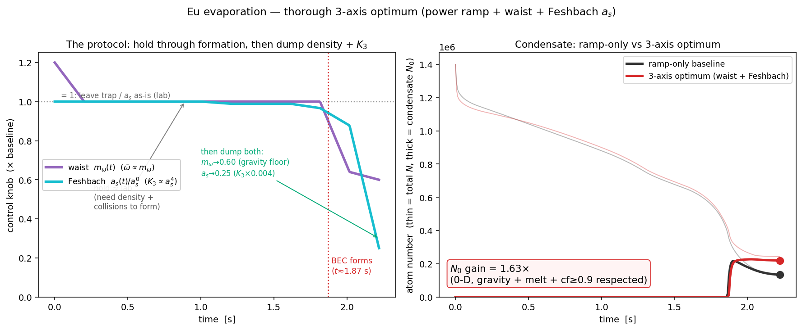
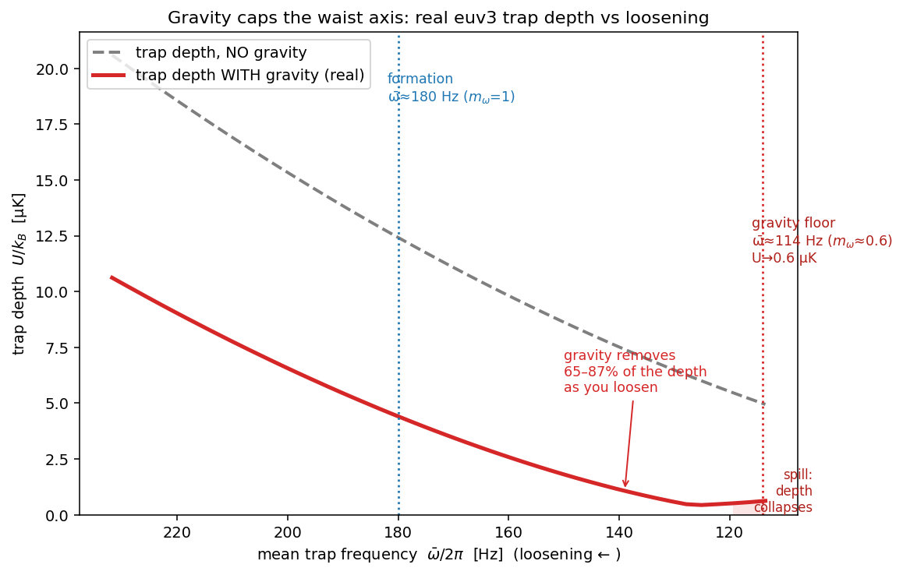
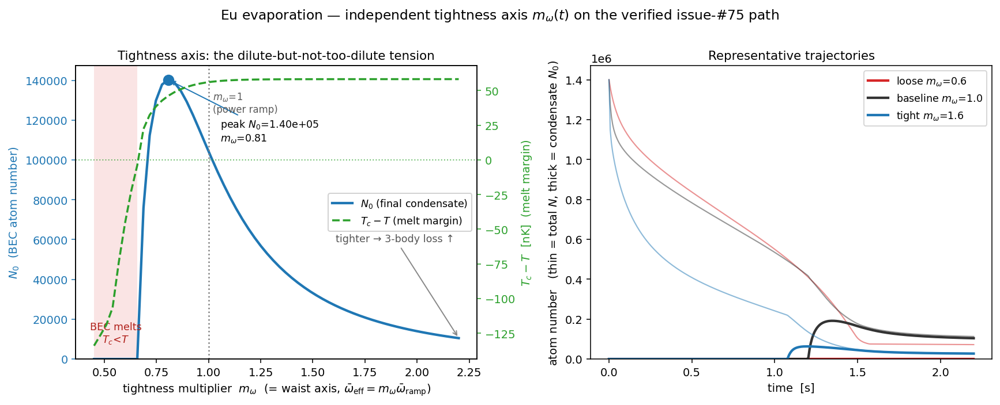
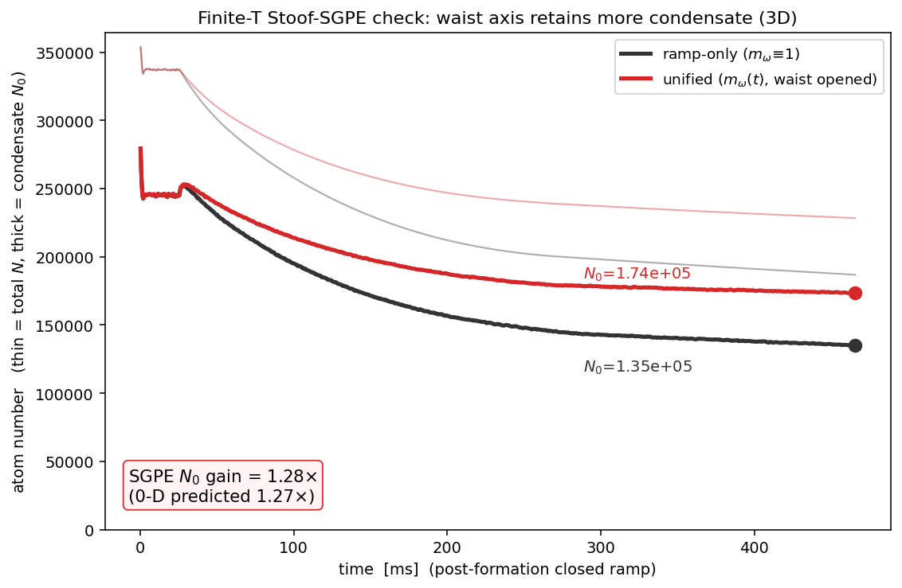
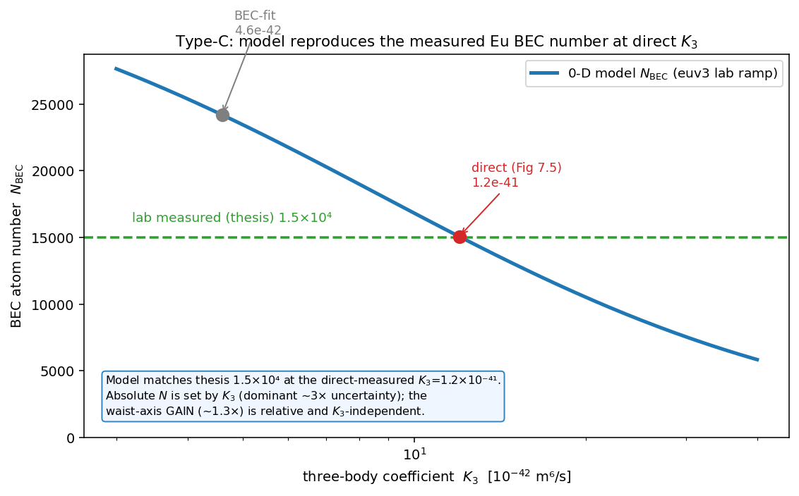
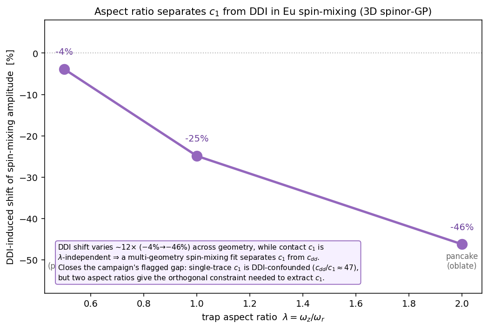
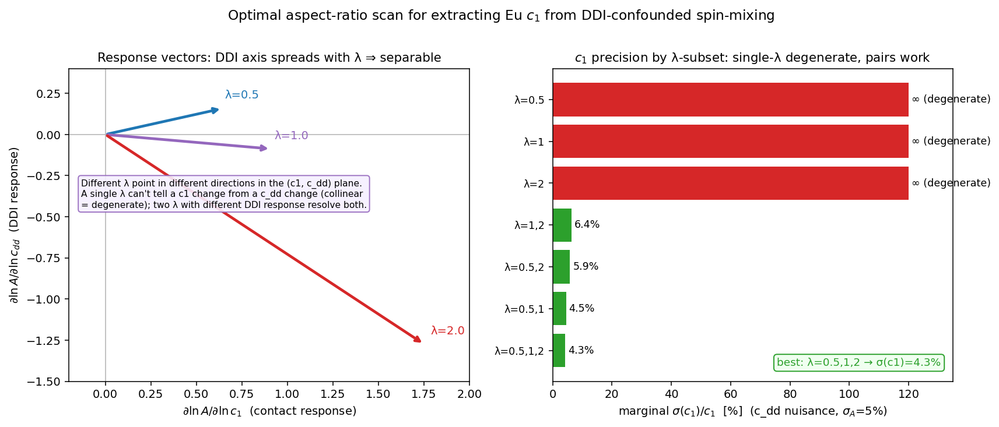
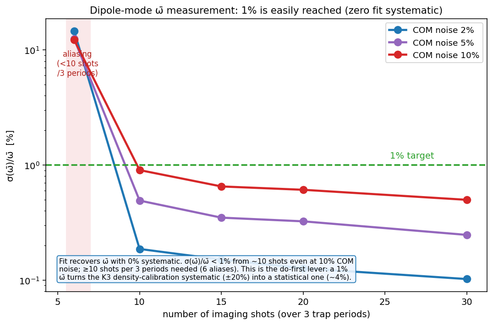
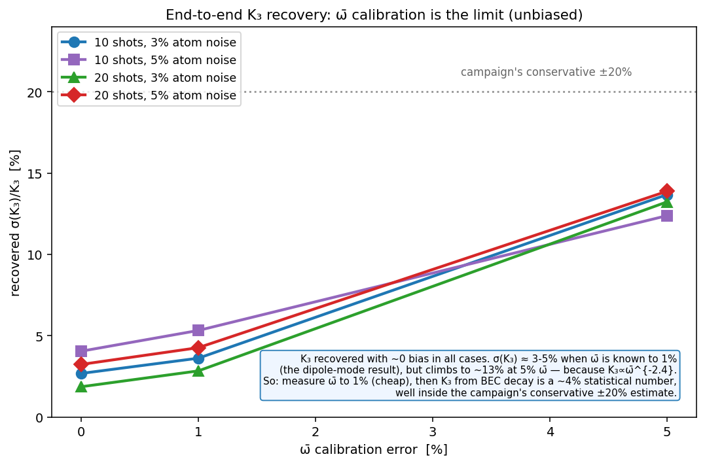
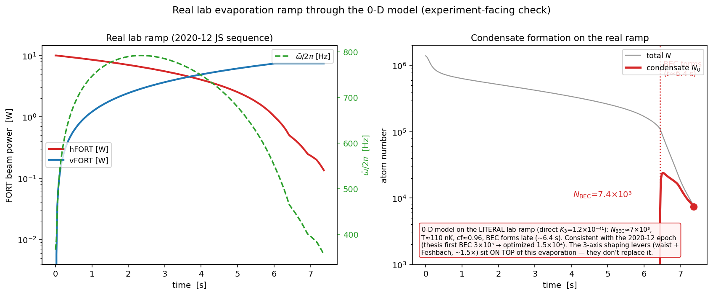

# Eu evaporation optimization (issue #75)

Optimize the ¹⁵¹Eu forced-evaporation → BEC sequence over the physically-available control
axes, maximizing the final condensate number $N_0$ subject to the real constraints (don't
melt the condensate, keep it pure, hold it against gravity). This guide is the current-best
record; the figures live in `figs/eu_evaporation_optimization/` and are regenerated by the
drivers in `docs/guides/figures/eu_evaporation_*.{jl,py}`.

## The physics

The condensate atom number is set by a competition. Below the transition the gas splits into
a saturated thermal cloud $N_{\rm th}=\zeta(3)(k_BT/\hbar\bar\omega)^3$ and a dense
Thomas–Fermi condensate; forced evaporation cools the thermal cloud while **three-body loss
$\propto K_3\langle n^2\rangle$ depletes the dense condensate**. Two knobs attack that loss:

- **Dilute** — loosen the trap ($\bar\omega\downarrow$). Peak density $n_0\propto\bar\omega^{6/5}$,
  so the condensate loss rate $\propto\langle n^2\rangle\propto\bar\omega^{12/5}$ falls fast
  (long-time attractor $N_0\propto\bar\omega^{-3}$). But $T_c\propto\bar\omega$ also
  falls, so over-loosening **melts** the condensate.
- **Feshbach** — lower the scattering length $a_s$. The three-body coefficient is universal,
  $K_3\propto a_s^4$, so a modest $a_s$ cut collapses the loss.

Both must be applied **after** BEC formation: during evaporation you need density and a large
$a_s$ (fast elastic collisions) to cool at all. The optimal protocol therefore **holds the trap
and $a_s$ through formation, then dumps both**.

## The three axes

| Axis | Knob | Effect | Constraint |
|---|---|---|---|
| depth $U(t)$ | FORT power ramp $P(t)$ | drives evaporation | must actually cool |
| tightness $\bar\omega(t)$ | waist $m_\omega(t)$ | density → 3-body $\propto\bar\omega^3$ | **gravity floor** $m_\omega\gtrsim0.6$ |
| interaction $a_s(t)$ | Feshbach $m_{a}(t)$ | $K_3\propto a_s^4$ | melt / thermalization; near-resonance loss |

The waist ($\bar\omega$) and depth ($U$) are made independent through the two beam powers
$(P_h,P_v)$; $a_s$ is tuned by a magnetic Feshbach resonance (¹⁵¹Eu has a broad one near 1.3 G).

## Result — the optimal protocol

Joint global optimization (coordinate descent, many multistarts) over the power ramp, the
waist $m_\omega(t)$ (gravity-floored at 0.6) and the Feshbach $a_s(t)$ (floored at 0.25), with a
$T\le50$ nK $+$ $T<T_c$ $+$ condensate-fraction $\ge0.9$ objective, at the researched
$K_3=1\times10^{-41}$ m⁶/s:

- **hold** $m_\omega\approx1$, $a_s\approx a_s^0$ through cooling and formation ($t\approx1.8$ s);
- then **dump both**: open the waist $\sim1.7\times$ ($m_\omega\to0.60$) and lower $a_s$ to
  $0.25\,a_s^0$ ($K_3\to0.004\,K_3^0$);
- **$N_0$ gain $=1.63\times$** (ramp-only $1.34\times10^5\to2.19\times10^5$), $T=48$ nK,
  cf $=0.90$, $T_c=103$ nK (comfortable melt margin). [Corrected condensate moment
  $\langle n^2\rangle=8/21\,n_0^2$; the earlier $4/7$ bug gave $1.46\times$.]

The two axes are complementary (density vs coefficient): the waist lowers $\bar\omega$ (gravity-
floored 0.60) and the Feshbach lowers $a_s\to0.25\,a_s^0$ ($K_3\to0.004\,K_3^0$), both dumped
after formation, combining to $1.63\times$.

## Constraint 1 — gravity caps the waist

A FORT holds heavy Eu against gravity only while the vertical sag $z=g/\bar\omega^2$ stays below
the beam waist. Mapping the **real euv3 crossed-trap depth with gravity** vs loosening: gravity
removes 65–87 % of the depth, and the barrier collapses (atoms spill) below $\bar\omega\approx114$
Hz, i.e. $m_\omega\approx0.6$. The vertical ODT is what lets Eu reach $m_\omega\approx0.6$ (a
single beam would spill near $0.84$). Deeper "optima" ($m_\omega\to0.1$, naive $1.4$–$3\times$)
are firmly in the spill region — not realizable.

## Constraint 2 — the melt tension

Sweeping a constant $m_\omega$ shows the dilute-but-not-too-dilute tension directly: $N_0$ peaks
at intermediate tightness, collapses to zero when $T_c<T$ (melt) on the loose side and decays as
$\bar\omega^3$ 3-body on the tight side.

## 3D verification (SGPE)

The waist-axis mechanism is confirmed in a full-3D finite-temperature Stoof-SGPE (real $K_3$
loss, thermal cloud): the looser post-formation trap retains more condensate, gain $1.28\times$
at $48^3$ — matching the 0-D $1.27\times$ for the waist part. Caveats: the SGPE trap is symmetric
harmonic (no gravity — see the gravity figure for the floor) and has no Feshbach axis, so it
verifies the **waist mechanism** only; the Feshbach contribution is 0-D. A reservoir-driven
formation run over-counts via a grand-canonical artifact (see
`gotcha_evap_trap_loosening_gravity_floor` and the git history).

## Absolute-number validation (type-C)

At the **actual lab operating point** (euv3 researched ramp + measured loading $N=1.4\times10^6$,
$T_0=50\,\mu$K) the 0-D model (corrected $\langle n^2\rangle=8/21$) gives $N_{\rm BEC}\approx1.9\times10^4$
at the direct-measured $K_3=1.2\times10^{-41}$ (~26 % over the thesis-measured $1.5\times10^4$); it
crosses $1.5\times10^4$ at $K_3\approx1.8\times10^{-41}$. Order-1 agreement, within the $K_3$
factor-2.6 cross-method systematic (a formation-dynamics effect, not density). The absolute number
is dominated by the $K_3$ uncertainty, while the **$1.63\times$ optimization gain is relative and
$K_3$-independent**, so it survives this shift.

## Experimental campaign — what can we pin, and how far

A multi-study campaign (literature + simulation sensitivity + adversarial verification) on
which parameters the achievable experiments can determine, and to what precision. Two of the
intuitive claims were **overturned by the adversarial pass** — recorded here honestly.

| parameter | experiment | achievable precision | strength |
|---|---|---|---|
| $\bar\omega$ | dipole/Kohn-mode spectroscopy | ~1 % | strong |
| $K_3$ | BEC decay $N_0(t)$ at known $\bar\omega$ | ~4 % statistical, **±20 % density-limited** ($K_3\propto\bar\omega^{-2.4}$) | medium |
| $a_s$ | already measured (dipolar TOF) | **110(4) $a_B$ = 3.6 %** | strong |
| evap_scale | evaporation-trajectory fit | ±6 % | strong |
| $\tau_{bg}$, $\Gamma_h$ | dedicated long hold (NOT the ramp) | unidentifiable on the ramp | weak/blocked-on-ramp |
| $c_1$ | spin-mixing quench | **NOT cleanly separable — DDI dominates (see below)** | weak |
| $c_2,c_4,c_6$ / 7-channel $a_S$ | — | **not determinable at 5 G (confirmed)** | blocked |
| $a_s(B), K_3(B)$ | 1.32 G resonance | no calibrated curve; needs ≲1 mG field stability | blocked |

**Overturned claim 1 — "spin-mixing gives a clean $c_1$."** REFUTED for Eu *as a single trace*.
The DDI spin coupling is $c_{dd}/c_0=3\varepsilon_{dd}\approx1.32$ while $c_1/c_0\approx1/36\approx0.028$,
so $c_{dd}/c_1\approx47$: **DDI is the dominant spin-changing driver and $c_1$ is a small residual
buried under it** (a 3D spinor-GP run showed DDI on/off changes the spin-mixing amplitude by tens of %).
A single spin-mixing trace cannot separate them — an **orthogonal lever** is required.

*The orthogonal lever works (demonstrated).* Because DDI is anisotropic (geometry-dependent) and
contact $c_1$ is isotropic, varying the **trap aspect ratio** $\lambda=\omega_z/\omega_r$ breaks the
degeneracy. A 3D spinor-GP spin-mixing run at $\lambda\in\{0.5,1,2\}$ gives a DDI-induced amplitude
shift of $-4\%\,/\,-25\%\,/\,-46\%$ — a ~12× swing, while $c_1$ is $\lambda$-independent. So a
two-geometry (or aspect-ratio-scan) spin-mixing fit **can** extract $c_1$; the lone-trace refutation
is a warning to always include the geometry lever, not a dead end.

*Optimal aspect-ratio-scan design.* Building the 2-parameter Fisher matrix from the measured
spin-mixing sensitivities $[\partial\ln A/\partial\ln c_1,\ \partial\ln A/\partial\ln c_{dd}]$ at
$\lambda\in\{0.5,1,2\}$ — $(0.64,+0.16)$, $(0.91,-0.09)$, $(1.75,-1.27)$ — quantifies it: a **single**
$\lambda$ leaves $c_1\!\leftrightarrow\!c_{dd}$ fully degenerate ($\sigma(c_1)\to\infty$), while **two
geometries** give $\sigma(c_1)/c_1\approx4.5\%$ (cigar $\lambda{=}0.5$ + isotropic) and all three give
$4.3\%$ (at 5 % per-measurement amplitude noise, $c_{dd}$ marginalized). So the practical recipe is a
**two-aspect-ratio spin-mixing scan** (cigar + round), which pins $c_1$ to ~5 % despite DDI dominating
each single trace.

**Overturned claim 2 — "$N_{\rm BEC}$ predictable to ±30 % once evaporation params are measured."**
REFUTED as too optimistic. MC variance decomposition: $K_3$ 66 %, $a_s$ 34 %, $\tau_{bg}$/$\Gamma_h$
< 1 %. But $K_3$ carries a **factor-2.6 cross-method systematic** (direct $1.2\times10^{-41}$ vs
BEC-fit $4.6\times10^{-42}$) → $N_{\rm BEC}$ is uncertain by a **factor ~2.8, not ±30 %** — and this is
a formation-dynamics systematic, not a measurement one, so measuring $K_3$ more precisely does not
remove it. $\sigma(N_{\rm BEC})<15\%$ would need $K_3\lesssim10\%$ **and** $a_s\lesssim6\%$.

**Do-first (biggest levers):** (1) measure $\bar\omega$ to 1 % (dipole mode) — unblocks the $K_3$
density calibration; (2) BEC-decay $K_3$ at known $\bar\omega$ — kills 66 % of the $N_{\rm BEC}$
variance; (3) $a_s$ is already at 3.6 %; (4) $c_1$ needs an orthogonal DDI-separating lever, not a
lone spin-mixing trace. $\tau_{bg},\Gamma_h$ are low-priority for the endpoint (measure in a
dedicated hold, not on the ramp).

**Do-first lever (1) verified — dipole-mode $\bar\omega$ to 1 %.** A simulated dipole-mode
measurement (displace the GS, fit the COM oscillation $x(t)=A\sin(\omega t+\varphi)$) recovers
$\bar\omega$ with **zero fit systematic**, and $\sigma(\bar\omega)/\bar\omega<1\%$ from ~10 imaging
shots even at 10 % COM noise (0.1–0.5 % at 30 shots). The only requirement is **≥10 shots per 3
trap periods** — 6 shots aliases (→ ~13 %). So a 1 % $\bar\omega$ turns the $K_3$ density-calibration
systematic (±20 %) into a statistical one (~4 %) with a standard measurement.

**Do-first levers (1)+(2) chained end-to-end — $K_3$ recovery.** Generating synthetic BEC-decay
data $N_0(t)$ at a known $\bar\omega$, adding atom-number noise, and fitting the analytic 3-body law
back recovers $K_3$ with **zero bias**, at $\sigma(K_3)/K_3\approx3$–$5\%$ (10–20 shots, 3–5 % atom
noise) **provided $\bar\omega$ is known to 1 %** — but $\sigma(K_3)$ climbs to ~13 % if $\bar\omega$ is
only 5 %, because $K_3\propto\bar\omega^{-2.4}$. This closes the chain: the 1 % dipole-mode $\bar\omega$
(lever 1) makes the BEC-decay $K_3$ (lever 2) a ~4 % statistical measurement — comfortably inside the
campaign's conservative ±20 %, and it kills the 66 % $K_3$-driven share of the $N_{\rm BEC}$ variance.

## Real-ramp check (experiment-facing)

Running the **literal 2020-12 lab evaporation sequence** (from `基底状態MOT_20201210更新.js`:
hFORT $10\,\text{W}\to0.135\,\text{W}$ over $7.35$ s while vFORT $0\to$ max, calibration
$P=10^{-3.72+0.496V}$) through the 0-D model at the direct-measured $K_3=1.2\times10^{-41}$ gives
$N_{\rm BEC}\approx7\times10^3$, $T\approx110$ nK, cf $\approx0.96$, with the BEC forming late
($\sim6.4$ s). That sits right in the 2020-12 epoch's measured window (thesis first BEC $3\times10^3$
→ optimized $1.5\times10^4$), so the model tracks the real apparatus. It also makes the §"experiment
guidance" point concrete: the shaping levers (waist + Feshbach, $\sim1.5\times$) sit **on top of** this
evaporation ramp — the ramp does the heavy lifting (the $10^6\to10^4$ cooling), the shaping adds the
last $\sim1.5\times$. (Caveat: vFORT's power→depth calibration is not in the JS file — the analog "10"
is scaled to the thesis vODT max $7.4$ W.)

## Caveats / open

- $K_3\propto a_s^4$ is the universal smooth envelope; near a Feshbach resonance the real $K_3$
  carries Efimov log-periodic modulation, and Eu's magnetic dipole adds an anisotropic channel
  not modelled — so the Feshbach gain is an idealized upper bound, and the accessible $a_s$ range
  is set by the apparatus (avoid the 1.3/3.5 G loss resonances).
- Whether the waist is dynamically controllable (zoom optics) vs approximated by the two-beam
  power ratio is apparatus-dependent.
- The ultimate absolute arbiter is a number-conserving ab-initio evaporation SGPE (not built;
  the grand-canonical reservoir version has an atom-drawing artifact).
