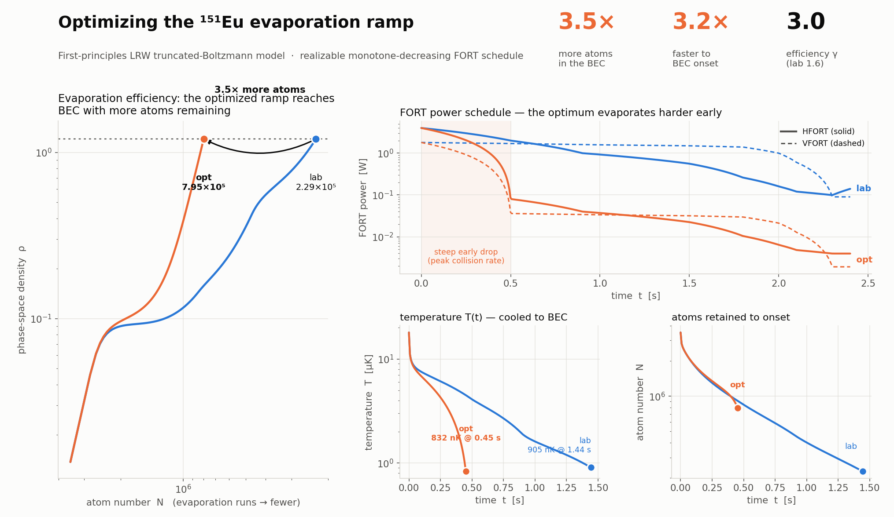

# ¹⁵¹Eu evaporation ramp optimization

Optimizing the FORT power schedule to maximize the BEC atom number, on the
first-principles LRW evaporation model (`src/solvers/evaporation/`). Companion to
[`evaporation_model.md`](evaporation_model.md) (the model itself) and
[`eu_evaporation_calibration.md`](eu_evaporation_calibration.md) (lab inputs).



## Result

Optimizing over the **realizable monotone-decreasing** ramp family
(`optimize_ramp_monotone`, each beam only ever steps down from its loaded power,
floor 2 %) beats the transcribed `euv3 r14` lab schedule by **3.5×** in BEC atom
number:

| | N_BEC | efficiency γ = −dlnρ/dlnN | BEC onset | T_BEC |
|---|---|---|---|---|
| lab ramp (`euv3 r14`, from-loaded) | 2.29×10⁵ | 1.64 | 1.44 s | 905 nK |
| **optimized (monotone family)** | **7.95×10⁵** | **3.03** | **0.45 s** | 840 nK |
| improvement | **3.48×** | 1.85× | **3.2× faster** | — |

## Why it works — evaporate harder early

The optimum drops HFORT from the loaded 4.0 W to ~0.08 W over the **first 0.5 s**
(continuous linear ramp, not an instantaneous cut), while VFORT drops similarly.
This dumps the trap depth fast **exactly when the elastic collision rate is
highest** (N = 3.5×10⁶ at loading), pushing the gas deep into the runaway regime:
η climbs to ~12 and the phase-space density rises far more steeply per atom lost
(panel, left). The trajectory stays healthy — η never approaches the validity
floor (η_min = 4) and N does not collapse. This is the textbook "evaporate on the
knee" strategy, found automatically.

## Caveats (read before quoting numbers)

- **The 3.5× factor is robust; the absolute N_BEC is not.** Both ramps use the
  same 3-body coefficient K₃, so the *ratio* is insensitive to it. The absolute
  numbers use the ab-initio universal-vdW `K₃ = 1×10⁻⁴¹ m⁶/s` (the low-loss edge
  of the [1e-42, 1e-40] band — Eu's K₃ is unmeasured), which over-predicts the
  measured 2022 endpoint (5.02×10⁴). See `_EUV3_K3` in `euv3.jl`.
- **Model, not experiment.** Verification type **B** (physics agreement to LRW
  theory), not **C** (matched to new lab data). It optimizes the *model's* ramp;
  the recommended schedule should be validated in the lab before trusting the
  factor quantitatively.
- The monotone family is what the lab can actually run (`optimize_ramp_coordinate`
  can also re-tighten the trap, which relies on the adiabatic-compression heating
  being modelled exactly — avoid for a schedule you intend to execute).

## Reproduce

From this worktree (the LRW model: T₀ = 18 µK, K₃ = 1×10⁻⁴¹; `main` still carries
the older fitted model):

```julia
using SpinorBEC
d    = euv3_defaults()
trap = euv3_evap_trap(; waists=d.waists, alpha=d.alpha)
p    = EvapParams(; a_s=d.a_s, tau_bg=d.tau_bg, K3=d.K3)
base = euv3_evaporation_ramp()

lab = run_evaporation(trap, base, p; N0=d.N0, T0=d.T0)
opt = optimize_ramp_monotone(trap, p, base; N0=d.N0, T0=d.T0,
          frac_bounds=(0.02, 1.0), n_sweeps=12, n_line=25, restarts=16, seed=1)

opt.N_BEC / lab.N_BEC        # ≈ 3.48
```

Driver + plotting scripts and the trajectory/ramp CSVs are in `figures/`
(`traj_{lab,opt}.csv`, `ramp_{lab,opt}.csv`, `summary.txt`). Runtime ≈ 9 min
(single core, ~5×10⁵ model evaluations; each `run_evaporation` is a ms-scale RK4).

## Next steps

- **Robust optimum:** re-run with `ensemble = param_uncertainty_ensemble(trap, p;
  alpha_factors, K3_factors)` to maximize the *worst-case* N_BEC over the α / K₃
  calibration uncertainty — a schedule that does not sit on a cliff.
- **Factor robustness:** confirm the 3.5× holds across K₃ ∈ [1e-42, 1e-40].
