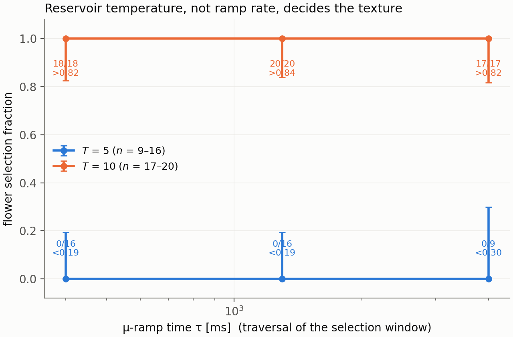

# Nucleating the weak-field ¹⁵¹Eu flower texture in place — what a cooling trajectory can and cannot select

> **FROZEN 2026-08-19.** A record of what was measured on that date, not a
> maintained document. The measurements are reproducible from the runs named in
> §5 and the drivers in §4. Live sources: `CLAUDE.md`, `docs/index.md`, the code.
>
> §1–§4 were written **before** the SPGPE ensemble and are the pre-registration:
> the axes, the systematics, the rejection criteria. §5 is the measurements, each
> row naming the run that produced it. §6 is the answer.
>
> Predecessors: `docs/guides/eu_adiabatic_protocol.md` (FROZEN 2026-07-28) —
> which established that the state cannot be *transported* into the target and
> named this calculation as its successor — and
> `docs/guides/eu_kappa_hysteresis_loop.md` (FROZEN 2026-08-18), which measured
> the selection rule that closes the field route.

## 1. The question, and what is already closed

At $\kappa = 1.8$, $B = 20\ \mu$G the ¹⁵¹Eu ground state is the **flower**
texture, $\langle F_\perp\rangle = 5.137$, and the **polarised** state is a
distinct converged local minimum 0.133 $\hbar\omega_{\rm ref}$ per atom above it.
Two independent campaigns have measured that the flower cannot be reached by
transforming a state prepared somewhere else:

| route | why it fails | source |
|---|---|---|
| ramp $B$ | $B_zF_z$ commutes with $J_z$, and the two branches sit in different $J_z$ sectors at every field. No rate converts | `eu_kappa_hysteresis_loop.md` §5.4 |
| ramp $\kappa$ | axially symmetric, so $J_z$ is conserved again; the endpoint is the Einstein–de Haas member of the seed's sector, +0.32 above the ground state with a floor | `eu_adiabatic_protocol.md` |
| drive with a rotating transverse field | moves $J_z$ by more than enough, but does positive work: the energy minimum is at $t = 0$ on every trajectory | `eu_adiabatic_protocol.md` |

So the state has to be **nucleated in place**. #334 asks the question that
remains: *does a realistic cooling trajectory select the flower, or does it get
caught on the polarised branch?* That is the experiment's actual risk, and it is
not answered by knowing the flower is the ground state.

**What makes it answerable now.** #327 merged the full SPGPE — growth *and*
energy-damping reservoirs, with $\gamma$ and $\bar{\mathcal M}$ computed from
$(\mu, T, \epsilon_{\rm cut})$ rather than tuned — and it reproduces a published
Kibble–Zurek exponent to $0.05\sigma$ (`docs/validation/spgpe_kz_reproduction.md`).
A reservoir is also the only thing in the model that can lift the obstruction
above: SPGPE growth exchanges atoms with an unpolarised incoherent region at one
$\mu$, so it does **not** conserve $M_z$ or $J_z$. That is a physical statement,
not a numerical convenience — spin exchange with the thermal cloud is what lets a
cloud leave its $J_z$ sector — and it is why nucleation can work where transport
cannot.

## 2. What the target point costs, and what that forces

Three numbers decide what is representable. All three are cheap, all three were
measured before any trajectory (`scripts/eu334/window.jl`, §5.1), and each one
changed the design.

**µ = 14.90** on the flower branch (15.19 polarised). The SPGPE is undefined
unless the C region extends above the chemical potential — `spgpe_growth_rate`
throws otherwise — so $k_{\rm cut} > \sqrt{2\mu} = 5.46$ is a floor. The
campaign grid the reference states live on, 32³ at box 24, has
$k_{\max} = 4.19$. **There is no SPGPE at this point on that grid at all**, and
no choice of temperature rescues it.

**$\Delta E = 6626\ \hbar\omega_{\rm ref}$ between the branches** — 0.133 per atom
at $N = 5\times10^4$. Against $T_c \approx 42$ that is 157 $k_BT$, and against any
temperature a C region can hold it is worse. Two consequences: equilibrium
selection is **deterministic**, and thermal barrier crossing between the branches
is impossible at every representable temperature. Whatever selects the texture
does it while the condensate is small, not by a Boltzmann factor at the end.

**The C region's thermal energy is $10^3$–$10^4\times\Delta E$.** #334's
acceptance criterion "determine the branch by energy against the two reference
values" therefore cannot be applied to the c-field as written — the total energy
of $\psi$ is a thermometer. §4's classifier makes the same claim on a state where
it means something instead.

### The axis that is actually available

At fixed field the couplings scale with the condensate: $c_0$, $c_1$ and $c_{dd}$
all carry $N_0$ and the Zeeman term does not. A growing condensate therefore
traverses a one-parameter family in

$$f \equiv N_0/N, \qquad B = 20\ \mu\text{G},\ \kappa = 1.8\ \text{held fixed},$$

and the texture transition on that family is what a cooling run crosses. This
replaces both of #334's literal starting points, and the replacement is forced
rather than convenient:

- *"start on the polarised side, $B > B_{eq}$"* — closed by #335: the field ramp
  is a $J_z$ slide, not a branch conversion.
- *"start thermally above $T_c$"* — at fixed $\mu$ the classical-field transition
  sits near $T \approx 110$ (`classical_field_equilibrium`, §5.1), needing
  $\epsilon_{\rm cut} \approx 125$, $k_{\rm cut} \approx 16$ and a 192³ grid at 13
  components. Not for an ensemble, and saying so with a number is better than
  discovering it after a week of queue.
- *below $f_{\rm sp}$, where the flower branch does not exist*, the condensate is
  polarised because there is nothing else to be. That **is** the disordered side
  of this transition, and it costs no thermal cloud to reach.

### Axes, and the settings held fixed

| axis | points | what it separates |
|---|---|---|
| growth rate $\tau$ | 3, spanning the reservoir-limited rate | kinetic trapping vs equilibrium selection — the verdict |
| temperature $T$ | 2 | whether the selection statistic is thermal at all |
| seed | ≥ 20 per cell | the statistic itself, with a binomial error |
| $\kappa$ | 1.8 and 0.9 | whether a selection statistic appears where #335 measured **one** branch |
| noise on/off | quiet SPGPE at one cell | the positive control |

Held fixed, and load-bearing:

- **64³, box 24.** The coarsest grid whose $k_{\max} = 8.38$ clears
  $k_{\rm cut} = \sqrt{2(\mu + n_T T)}$ over the ramp. `nucleate.jl` refuses to run
  when it does not, rather than clipping the cutoff and letting the *grid* define
  the C region.
- **$n_T = 1$** — the C region one thermal energy deep, the standard c-field
  criterion (occupation ≈ 1 at the cutoff). $n_T$ is a genuine free parameter of
  the method; §7 says what was and was not checked against a second value.
- **`split_step_midpoint!`**, dt = 0.002, **dealiasing off**, **unpadded DDI**,
  q = 0, **LHY off**, pin $\varepsilon = 0.002$ — every one of these matching
  #335, because the reference branch energies this campaign is measured against
  were converged under exactly them. A seed converged under a different kernel or
  pin is not stationary and the run would be measuring that transient.
- **$\gamma$ and $\bar{\mathcal M}$ derived, never pinned.** A fitted rate here is
  invisible: it breaks no conservation law and no oracle. `SPGPEReservoir` refuses
  a value more than 2× from the derived one unless the mismatch is typed out.

### Systematics, before residuals

- **The pin.** #335 §5.6 measured the transverse response *halving* when the pin
  went 0.068 → 0.135 µG, both far below any lab residual. Anything this campaign
  reports about transverse spin inherits that sensitivity; the discrete
  observables (§3.4) do not.
- **Unpadded DDI** carries a 2–5 % anisotropic field error, common-mode in the
  branch difference (#335 §2: $B_{eq}$ moves 0.33 %, $\langle F_\perp\rangle$ per
  state 0.3 %).
- **The reservoir is spin-unpolarised**: one $\mu$ for all 13 components, the
  scalar rates applied per component (`docs/guides/spgpe.md`, known limits). A
  laboratory thermal cloud in a magnetic field is polarised, so the real
  reservoir's ability to change $M_z$ is *smaller* than modelled here. Any
  positive selection result is therefore an upper bound on the real one — which is
  the safe direction for a negative result and the unsafe one for a positive.

## 3. Rejection criteria — fixed before launch

1. **Positive control first.** The quiet SPGPE (noise off) at the same
   $(\mu(t), \tau)$ must track the branch it started on and end within
   $10^{-3}$/atom of that branch's converged energy. *A solver that cannot hold a
   branch without noise produces selection statistics that are measuring the
   solver.* No ensemble number is reported until this passes.
2. **The classifier must pass its own calibration** — both references recovered
   from themselves, and recovered again after noise of the amplitude the
   trajectories actually arrive carrying. Recorded, not asserted:
   `classify.jl --calibrate` writes the table and refuses to classify otherwise.
3. **Three outcomes, not two.** `flower`, `polarised`, `excited`. A state above
   both branches by more than their separation is not on either — #335 measured
   exactly that for the adiabatic endpoints — and calling it a branch would repeat
   the error this campaign exists to avoid.
4. **One discrete observable beside every continuous one.** Per-component winding
   number with **per-component** thresholds (a minority component holding 0.3 % of
   the atoms is 2–3 orders below the global peak, and a global mask returns a
   spurious zero), reported with its charged-plaquette count so that a zero can be
   told from a masked read. Plus the Stern-Gerlach level count, which is what the
   experiment reads and carries no calibration.
5. **The selection fraction is reported with a binomial interval**, ≥ 20
   trajectories per cell, and a cell that did not finish 20 says so rather than
   quoting the fraction it got.
6. **A verdict of "the flower is never selected" requires the rate scan**, not one
   rate: 0/20 at every rate with the quiet control passing is a negative answer;
   0/20 at one rate is a rate.
7. **The κ = 0.9 control must not produce a selection statistic.** #335 measured
   one branch there statically — two continuations from opposite ends agreeing to
   6–7 digits. If the ensemble reports a branch split at κ = 0.9, the instrument
   is being measured and no κ = 1.8 number is reported.
8. **A cell may not be read if its C region moved outside the grid**, and it
   cannot: `nucleate.jl` refuses at both ends of the ramp. This is criterion 8
   rather than a footnote because it is the one that decides whether the numbers
   are physical or are a property of the box.

*(#334 asks for a κ = 0.8 control; κ = 0.9 is used instead. It is the same side of
the tricritical point — the crossover side, $\kappa_{tc} \approx 0.95$ — and it is
where #335 converged its seeds and measured the single-branch structure the
control is against. Using 0.8 would mean re-converging that structure to compare
against nothing.)*

## 4. Instruments

| what | where |
|---|---|
| the C-region window, µ, $\Delta E/k_BT$, the grid a temperature needs | `scripts/eu334/window.jl` |
| branch continuation in condensate fraction $f = N_0/N$ | `scripts/eu334/nucleation_bifurcation.jl` |
| one SPGPE trajectory across the family | `scripts/eu334/nucleate.jl` |
| branch assignment by quench-and-relax, with its calibration | `scripts/eu334/classify.jl` |
| TSUBAME submission | `scripts/eu334/{launch,submit_*}.sh`, `_preamble.sh` |

**Why the branch is not read off the c-field's energy.** §2 measured the C
region's thermal energy at $10^3$–$10^4\times$ the branch separation. So the field
is quenched — reservoir off — and relaxed to the nearest local minimum *at its own
condensate fraction*, and that state's energy is compared against the two
branches. The relaxed state answers exactly what the criterion is after (which
basin is the field in), it inherits the reference values instead of inventing a
threshold, and the whole procedure is calibratable, which reading a raw energy is
not.

Interpolating the branch table **at the run's own $f$** rather than at $f = 1$ is
deliberate: a growth ramp ends where its lag leaves it, and comparing a state at
$f = 0.8$ against the $f = 1$ branch energies would report the missing atoms as a
branch difference.

## 5. Results

*(Filled as the runs land. Each row names the run that produced it.)*

### 5.1 The window — measured before anything was launched

`figs/eu334/window/{branches,window}.csv`, from the #335 converged references at
32³.

| state | $E$/atom | µ | $\sqrt{2\mu}$ | $\langle F_\perp\rangle$ | $J_z$ | 99.99 % of $\|\psi\|^2$ below |
|---|---:|---:|---:|---:|---:|---:|
| flower | 10.731086 | **14.897** | 5.458 | 5.1376 | −1.0873 | $k = 3.87$ |
| polarised | 10.863614 | **15.193** | 5.512 | 0.0744 | −1.2587 | $k = 3.85$ |

The occupied band of the *state* fits the 32³ grid comfortably (3.87 against
$k_{\max} = 4.19$); it is the **reservoir** that does not fit, and the two are
different requirements. #335 §2 quotes the band as $\sqrt{2\mu} \approx 4.3$ from
a Thomas-Fermi estimate — the measured 99.99 % edge is 3.87, and the TF number is
better read as what the *cutoff* has to clear.

What a temperature costs, at $n_T = 1$ (grid side needed at box 24 for
$k_{\max} \ge k_{\rm cut}$, and for a 1.5× margin):

| $T$ | 1 | 5 | 10 | 20 | 42 ($\approx T_c$) |
|---|---:|---:|---:|---:|---:|
| $\epsilon_{\rm cut}$ | 15.9 | 19.9 | 24.9 | 34.9 | 57.0 |
| $k_{\rm cut}$ | 5.64 | 6.31 | 7.06 | 8.35 | 10.68 |
| grid $n \ge$ | 44 (65) | 49 (73) | 54 (81) | 64 (96) | 82 (123) |
| $\gamma$ | 1.5e-5 | 7.5e-5 | 1.5e-4 | 3.0e-4 | 6.5e-4 |
| $1/(\gamma\mu)$ [ms] | 6515 | 1300 | 646 | 320 | 150 |
| $\Delta E/k_BT$ | 6630 | 1330 | 663 | 331 | 157 |

$\bar{\mathcal M} = 1.63\times10^{-3}$ throughout — it depends on the cutoff only
through $(\epsilon_{\rm cut}-\mu)/T$, which $n_T$ holds fixed.

**And at fixed µ the classical field does not cross anything until T ≈ 110.**
`classical_field_equilibrium` at $\mu = 14.897$, $c_0 = 0.0469$ (per-atom),
$\bar\omega = 1.216$: the condensate fraction runs 0.98 at $T = 10$, 0.61 at
$T = 40$, 0.08 at $T = 80$, and reaches zero between $T = 100$ and $T = 120$. The
central density stays pinned at 318 until it collapses. This is the number that
rules out the thermal route rather than an opinion about it: representing
$T \approx 110$ needs $k_{\rm cut} \approx 16.4$, i.e. $n \ge 126$ ($188$ with
margin), at 13 components.

### 5.2 The flower texture has a minimum atom number

`figs/eu334/bifurcation/flower_down.csv` (32³, ε = 0.002, unpadded, 25 cells
geometric over $f \in [0.02, 1]$, ε-ladder + second-polish certification on every
cell). Walking the flower branch **down** in condensate fraction:

| $f$ | 0.850 | 0.613 | 0.443 | 0.376 | **0.320** | **0.271** | 0.231 |
|---|---:|---:|---:|---:|---:|---:|---:|
| $N_0$ | 42480 | 30662 | 22132 | 18803 | **15975** | **13572** | 11531 |
| $\langle F_\perp\rangle$ | 5.010 | 4.671 | 4.182 | 3.870 | **3.500** | **0.122** | 0.130 |
| $J_z$ | −1.133 | −1.290 | −1.541 | −1.693 | **−1.860** | −2.197 | −2.357 |

**The flower branch ceases to exist between $f = 0.271$ and $f = 0.320$** —
$N_0^\ast \approx 1.4$–$1.6\times10^4$ atoms. Below it the continuation has fallen
onto the polarised branch ($\langle F_\perp\rangle \approx 0.12$ and falling
smoothly to 0.23 at $f = 0.02$), which is what a branch ending looks like from a
warm continuation.

This is the structural fact the rest of the campaign is about: **a condensate is
born polarised**, not because it is preferred but because below $N_0^\ast$ the
flower state does not exist to be selected.

**The polarised branch, by contrast, has no spinodal in $f$ at all.** Walked
*upward* from $f = 0.02$ ($N_0 = 10^3$) to $f = 1$ it stays converged at the gate
in every one of 25 cells — $|\nabla E| \sim 8\times10^{-6}$, `stop_reason = tol`,
$\langle F_\perp\rangle$ falling monotonically $0.299 \to 0.0745$ and $J_z$ running
$-6.00 \to -1.262$ — and its $f = 1$ cell reproduces #335's independently
converged reference to $4.8\times10^{-4}$ per atom (10.863612 against 10.864086,
$\langle F_\perp\rangle$ 0.0745 against 0.0744). That is the walk's positive
control and it passes; the residual is 0.36 % of the branch separation the
classifier discriminates on.

*(`figs/eu334/bifurcation_k1.8_g32/{flower_down,polar_up}.csv`, job 8442264.)*

### 5.3 The selection window: where the two branches are within $k_BT$

The branch separation is what #334's question turns on, and it is **not**
extensive everywhere. Multiplying the per-atom difference by the atom number
actually present:

| $f$ | 0.3195 | 0.3761 | 0.4426 | 0.5210 | 0.6132 | 0.7218 | 0.8496 | 1.0000 |
|---|---:|---:|---:|---:|---:|---:|---:|---:|
| $N_0$ | 15975 | 18805 | 22130 | 26050 | 30660 | 36090 | 42480 | 50000 |
| $E_{\rm polar}-E_{\rm flower}$ /atom | −0.00491 | +0.00786 | +0.02299 | +0.04053 | +0.06043 | +0.08259 | +0.10670 | +0.13253 |
| $\Delta E_{\rm total}$ | **−78** | **+148** | +509 | +1056 | +1853 | +2981 | +4533 | +6626 |
| $\Delta E_{\rm total}/k_BT$ at $T=10$ | −7.8 | +14.8 | +50.9 | +105.6 | +185.3 | +298.0 | +453.3 | +662.6 |

So the structure at $(\kappa = 1.8, B = 20\ \mu$G$)$ is:

| range | what exists | which is the ground state |
|---|---|---|
| $f < f_{\rm sp} \in (0.271, 0.320)$ | polarised only | polarised, by default |
| $f_{\rm sp} < f < f_{\rm eq} \approx 0.339$ | both | **polarised** — the flower is born *above* it |
| $f > f_{\rm eq}$ | both | **flower**, and the gap grows without bound |

$f_{\rm eq} \approx 0.339$ ($N_0 \approx 1.7\times10^4$) by linear interpolation of
$\Delta E_{\rm total}$ through zero between the two bracketing cells.

**This is the prediction the ensemble tests, and it is more favourable than the
$f = 1$ numbers suggested.** At $f = 1$ the branches are 663 $k_BT$ apart at
$T = 10$ and nothing thermal can happen. But the whole question is decided near
$f_{\rm sp}$, where they are **8–15 $k_BT$ apart** — the same order as a
fluctuation. Whether the *barrier between* them is also that small is what a
trajectory measures and a static continuation cannot. Registered before the runs:

- if the barrier is comparable to the separation, the flower fraction should be
  **large and rate-dependent**, rising as the traversal slows;
- if the barrier is much larger, it should be **zero at every rate**, and the
  campaign's answer is that the polarised branch is a trap.

Either outcome is a result. What would *not* be a result is measuring this at
$f = 1$, where the answer is 0 by arithmetic.

### 5.4 The same structure at 64³, which is where the trajectories run

`figs/eu334/bifurcation_k1.8_g64/*` (job 8442299, 26 cells over
$f \in [0.2306, 0.5210]$, anchored on the 32³ cells and upsampled, $L$-BFGS cap 600).

| | last converged flower cell | first polarised cell | bracket for $f_{\rm sp}$ | $f_{\rm eq}$ |
|---|---:|---:|---:|---:|
| 32³ | 0.3195 ($\langle F_\perp\rangle$ 3.500) | 0.2714 (0.122) | [0.271, 0.320] | 0.339 |
| 64³ | 0.3239 (3.528) | 0.2827 (0.118) | **[0.283, 0.324]** | **0.343** |

The brackets overlap, their midpoints differ by 2.7 %, and $f_{\rm eq}$ agrees to
1.2 %. Per-cell agreement across the whole window is $2\times10^{-5}$ relative in
$E$ and 0.12 % in $\langle F_\perp\rangle$ (e.g. $f = 0.5210$: $E$ 8.334430 at 64³
against 8.334264 at 32³, $\langle F_\perp\rangle$ 4.4418 against 4.4470). The 64³
$f = 0.3026$ cell is `max_steps` mid-collapse and is **excluded** by criterion 6,
which is what makes the bracket [0.283, 0.324] rather than [0.283, 0.303].

### 5.5 The κ = 0.9 control, statically: one branch, no gap

`figs/eu334/bifurcation_k0.9_g32/*` (job 8442301). The two continuations start
from *different* states at *opposite* ends of the family — the κ = 0.9 flower seed
at $f = 1$ walking down, an ITP $m = -F$ state at $f = 0.02$ walking up — and land
on the same branch:

| $f$ | 0.1959 | 0.2306 | 0.2714 | 0.3195 | 0.3761 | 0.4426 | 0.6132 |
|---|---:|---:|---:|---:|---:|---:|---:|
| $E$/atom, from above | 3.758533 | 4.080689 | 4.419860 | 4.778227 | 5.156510 | 5.555697 | 6.417122 |
| $E$/atom, from below | 3.758532 | 4.080692 | 4.419865 | 4.778254 | 5.156578 | 5.555759 | 6.417128 |
| $\langle F_\perp\rangle$ | 0.642 | 0.729 | 0.788 | 0.834 | 0.872 | 0.910 | 1.938 |

Agreement to 6–7 digits in $E$ and to ≈ 1 % in $\langle F_\perp\rangle$ over the
whole window the κ = 1.8 campaign runs in. **There is no second branch to be
metastable on**, which is the static half of the control and matches #335 §5.3.

Above $f \approx 0.7$ the two walks separate in $\langle F_\perp\rangle$ (2.35 vs
2.15 at $f = 0.7218$; 2.84 vs 2.47 at $f = 1$) while their energies still agree to
$3\times10^{-3}$, and several of those cells report `max_steps`. That is the soft
manifold and its orientation freedom, not two branches — the same signature #335
§5.3 recorded below 30 µG — and it is outside the window in any case. It is stated
rather than trimmed because a reader who only saw the table above would think the
walks agree everywhere.

### 5.6 The classifier, calibrated

`figs/eu334/classify_calib_eta{0.02,0.05,0.15}/calibration_f0.3466.csv` (job
8442497), at 64³ and at $f = 0.3466$ where both branches exist and are converged.
The two branches there are only $8.14\times10^{-4}$ per atom apart — a harder test
than $f = 1$, by a factor 160.

| case | verdict | $E$ relaxed | $\Delta E$ from the flower branch |
|---|---|---:|---:|
| flower reference | **flower** | 7.112518 | $+2.4\times10^{-9}$ |
| polarised reference | **polarised** | 7.113331 | $+8.14\times10^{-4}$ |
| flower + noise | **flower** | 7.112518 | $+3.9\times10^{-9}$ … $+7.0\times10^{-9}$ |
| polarised + noise | **polarised** | 7.113331 | $+8.14\times10^{-4}$ |
| equal mix of the two | polarised (recorded) | 7.113331 | $+8.14\times10^{-4}$ |

Identical at $\eta = 0.02$, 0.05 and 0.15, so the classifier is not sensitive to
the excitation amplitude over the range a trajectory can arrive with. The relaxed
flower state returns to its own branch energy to nine digits, which is what makes
a $8\times10^{-4}$ discriminant usable at all.

The mixed state is reported, not asserted: it relaxes to the polarised branch.
That is a property of the basin boundary at this $f$ and it is exactly why the
outcome set has three members — a classifier that had been tuned until the mix
came out "ambiguous" would be a fitted threshold.

### 5.7 What the reservoir can and cannot be asked to do

Two measurements changed what the ensemble runs, and both were made on 60 ms
probes rather than discovered inside a production trajectory.

**The step rate.** 7.7 ms/step at 64³ with D = 13 on an H100 (`figs/eu334/rate_probe_*`),
so a 4 s trajectory at dt = 0.002 is 2900 s. dt = 0.004 is what the campaign runs;
against dt = 0.010 the 60 ms endpoint moves 3.5 % in $N_C$ and 4.5 % in
$\langle F_\perp\rangle$, so dt is not free here and the coarse value is not used.

**The full SPGPE loses atoms faster than it grows them, at this point.** Five arms
at 60 ms, each differing in one term, seeded from the same $f = 0.2306$ cell:

| arm | µ ramp | noise | scattering | $N_C$: 11530 → | |
|---|---|---|---|---:|---|
| A | yes | on | on | **10458** | −9.3 % |
| B | yes | off | on | 11601 | +0.6 % |
| C | yes | on | **off** | **12071** | **+4.7 %** |
| D | **none** | on | on | **10199** | **−11.5 %** |
| E | **none** | off | on | 11460 | −0.6 % |

Arm D is the one that settles it: with the growth drive **exactly zero**, so that
nothing physical can move $N_C$, the full SPGPE still loses 11.5 % in 60 ms. The
channel is the energy-damping noise passing through the caller's projector —
number-conserving as a *term*, only approximately so as a *step*
(Rooney, Blakie & Bradley PRE **89**, 013302). Quantified in
[spgpe.md](spgpe.md): the loss rate is grid-independent (flat to 5 % across a
2.7× span of $k_\mathrm{max}/k_\mathrm{cut}$, which also refutes an aliasing
explanation) and runs at ≈ 1.25× the growth rate $2\gamma\mu$.

So **the ensemble runs the growth SPGPE**, Rooney Eq. (20) — a sub-theory in its
own right, and the one that carries the $M_z$-changing exchange that makes
nucleation possible where transport is blocked. The scattering reservoir would
otherwise dominate the number budget of every trajectory, and arm C shows the
growth-only theory doing what it should.

*This is a limit inherited, not a limit created: the two branch reference states,
the bifurcation and the classifier are all unaffected, since none of them involves
a reservoir.*

### 5.8 The quiet controls — criterion 1

`figs/eu334/quiet_from_{polar,flower}` (jobs 8444058/8444059): growth-only, noise
**off**, $T = 5$, µ ramped 1500 ms then held, one seed each, from **both** branches.
One arm cannot distinguish "the solver holds the branch it was given" from "the
solver always ends up here", which is why there are two.

Through the window crossing, each arm stays on its own branch while the condensate
grows past both $f_{\rm sp}$ and $f_{\rm eq}$:

| $t$ [ms] | 340 | 800 | 1300 | 1800 | 2300 |
|---|---:|---:|---:|---:|---:|
| **from polarised**: $f$ | 0.2266 | 0.2332 | 0.2529 | 0.2850 | 0.3132 |
| $\langle F_\perp\rangle$ | 0.132 | 0.139 | 0.148 | 0.157 | **0.161** |
| **from flower**: $f$ | 0.3464 | 0.3543 | 0.3716 | 0.3975 | 0.4190 |
| $\langle F_\perp\rangle$ | 3.703 | 3.752 | 3.830 | 3.928 | **4.004** |

The polarised arm is *inside* the window at $t = 2300$ ms — the flower branch
exists at $f = 0.313$ and is the lower-energy state past $f_{\rm eq} = 0.343$ —
and it does not go there. That is the control passing: with no fluctuation there
is no selection, and the branches stay a factor 25 apart in the order parameter.

**Both arms end classified as the branch they started on**, which is criterion 1
discharged:

| arm | $N_C$ | $f$ | $\langle F_\perp\rangle$ | relaxed $E$ | $\Delta E$ to flower | $\Delta E$ to polar | verdict |
|---|---:|---:|---:|---:|---:|---:|---|
| from polarised | 11530 → 19417 | 0.388 | 0.153 | 7.445602 | $+1.13\times10^{-2}$ | $+8.5\times10^{-4}$ | **POLARISED** |
| from flower | 17330 → 23621 | 0.472 | 4.201 | 8.023855 | $+1.08\times10^{-3}$ | $-2.88\times10^{-2}$ | **FLOWER** |

Each lands within $10^{-3}$ per atom of its own branch and is an order of
magnitude further from the other, against a branch separation of $1.0$–$3.0
\times10^{-2}$ at those $f$. Note the ΔE to the *wrong* branch is **negative** for
the flower arm — it sits below the polarised branch, as the ground state should
past $f_{\rm eq}$ — so the classifier is not merely picking the nearest number, it
is resolving which side of the crossing the state is on.

The Stern-Gerlach counts already separate: **2 populated $m_F$ levels** from the
polarised arm against **4** from the flower one (participation ratio 1.83 vs
2.62). That is the same discrete, calibration-free observable #335 arrived at from
the ramp side, appearing here from the growth side.

### 5.9 The ensemble: the texture IS selected, and temperature is the switch

Growth SPGPE, 64³, seeded from the $f = 0.2306$ polarised cell, µ ramped to the
$f = 0.5210$ cell's chemical potential then held to a common 4000 ms.

| $T$ | $\tau$ [ms] | $n$ | flower | polarised | excited | $p_{\rm flower}$ | 95 % CI |
|---:|---:|---:|---:|---:|---:|---:|---|
| 5 | 400 | 16 | 0 | **16** | 0 | 0.000 | [0.000, 0.194] |
| 5 | 1300 | 16 | 0 | **16** | 0 | 0.000 | [0.000, 0.194] |
| 5 | 4000 | 9 | 0 | 0 | 9 | 0.000 | [0.000, 0.299] |
| 10 | 400 | 18 | **18** | 0 | 0 | **1.000** | [0.824, 1.000] |
| 10 | 1300 | 20 | **20** | 0 | 0 | **1.000** | [0.839, 1.000] |
| 10 | 4000 | 17 | **17** | 0 | 0 | **1.000** | [0.816, 1.000] |

**All six cells saturate.** Not one trajectory out of 96 crosses, at any rate at
either temperature.

Pooled across the rate axis, which is what the rate scan licenses once no cell
shows rate dependence:

| | $n$ | flower | polarised | excited | $p$ | 95 % CI |
|---|---:|---:|---:|---:|---:|---|
| $T = 10$ | 55 | **55** | 0 | 0 | 1.000 | **[0.935, 1.000]** |
| $T = 5$ | 41 | 0 | 32 | 9 | 0.000 | **[0.000, 0.086]** |
| $T = 10$, matched $f$ (§5.10) | 8 | **8** | 0 | 0 | 1.000 | [0.676, 1.000] |

The two intervals are disjoint by a factor of eleven. Every $T = 10$ endpoint
relaxes to $\langle F_\perp\rangle = 4.59$ on average with 4 populated $m_F$
levels; every $T = 5$ endpoint to 0.102 with 2.

**At $T = 10$ every trajectory ends on the flower branch; at $T = 5$ none does.**
The margins are not marginal:

| $T$, $\tau$ | $f$ at the end | $\langle F_\perp\rangle$ raw → relaxed | $E-E_{\rm flower}$ | $E-E_{\rm polar}$ | branch sep |
|---|---:|---:|---:|---:|---:|
| 5, 400 | 0.442 | 0.403 → **0.099** | $+2.4\times10^{-2}$ | $+9.3\times10^{-4}$ | $2.3\times10^{-2}$ |
| 5, 1300 | 0.429 | 0.417 → **0.100** | $+2.4\times10^{-2}$ | $+4.0\times10^{-3}$ | $2.0\times10^{-2}$ |
| 5, 4000 | 0.349 | 0.417 → 0.109 | $+7.2\times10^{-3}$ | $+5.5\times10^{-3}$ | $1.7\times10^{-3}$ |
| 10, 400 | 0.602 | 2.194 → **4.642** | $+3.1\times10^{-3}$ | $\mathbf{-5.5\times10^{-2}}$ | $5.8\times10^{-2}$ |

The $T = 10$ endpoints are **below** the polarised branch by $5.5\times10^{-2}$ per
atom — a polarised state cannot be — and above the flower branch by
$3.1\times10^{-3}$. Their relaxed $\langle F_\perp\rangle$ is 4.62–4.66 across all
eight, against the flower branch's 4.44 at $f = 0.521$ and rising; the polarised
branch there is 0.09. Three independent readings — energy, order parameter, and the
Stern-Gerlach count (**4 levels vs 2** at $T = 5$) — agree.

**And the verdict survives certification.** Those relaxations first stopped at
`max_steps` with $|\nabla E|$ up to $1.7\times10^{-2}$, so the energy comparison
was a bound rather than a measurement — L-BFGS accepts steps by an energy
comparison and floors at $\sqrt{\epsilon}\|g\|$. Re-run with `residual_polish`,
which drives $(H-\mu)\psi \to 0$ and is not energy-gated:

| $T$, $\tau$ | $n$ | $|\nabla E|$ | $E-E_{\rm flower}$ | $E-E_{\rm polar}$ | sep | verdict |
|---|---:|---:|---:|---:|---:|---|
| 10, 400 | 7 | $8.2\times10^{-6}$ | $+3.1\times10^{-3}$ | $-5.5\times10^{-2}$ | $5.8\times10^{-2}$ | **flower** |
| 10, 1300 | 1 | $8.0\times10^{-6}$ | $+4.9\times10^{-3}$ | $-5.1\times10^{-2}$ | $5.6\times10^{-2}$ | **flower** |
| 5, 1300 | 6 | $8.6\times10^{-6}$ | $+2.4\times10^{-2}$ | $+3.8\times10^{-3}$ | $2.0\times10^{-2}$ | **polarised** |

$|\nabla E|$ falls by three orders to the library gate and **every label is
unchanged**. The $+3.1\times10^{-3}$ persists at $|\nabla E| = 8\times10^{-6}$, so
it is not relaxation residual — it is a real 5 % of the branch separation, on a
state 18× closer to flower than to polarised.

The $T = 5$, $\tau = 4000$ cell reads `excited` rather than `polarised`, and that
is the third outcome earning its place rather than a failure: that arm ends at
$f = 0.349$, barely past $f_{\rm eq} = 0.343$, where the branches are only
$1.7\times10^{-3}$ apart. Sitting $5\times10^{-3}$ above both is genuinely on
neither. Its relaxed $\langle F_\perp\rangle$ is 0.109 — polarised in texture, and
the honest label is that the energy test does not resolve it there.

### 5.10 Separating temperature from condensate fraction

$\gamma \propto T$, so the hotter reservoir also grows the condensate *further*:
the $T = 10$ arms end at $f = 0.60$ and the $T = 5$ arms at 0.35–0.44. Temperature
and final fraction moved together and the endpoint comparison alone cannot say
which one selected the texture.

**Half of it is already answered by the trajectories themselves**, at no extra
cost, by reading $\langle F_\perp\rangle$ at *matched* $f$ rather than at the end:

| $f$ | 0.35 | 0.40 |
|---|---:|---:|
| $T = 5$ | 0.37 | 0.39 |
| $T = 10$ | 0.58 | 0.65 |

At the same condensate fraction the hotter field carries **1.6×** the transverse
spin, so the difference is present at fixed $f$ and is not an artefact of where
each arm stopped. What this cannot say is whether 0.65 against 0.39 is enough to
change the *basin*, because that question is answered by relaxing, and the
relaxations exist only at the endpoints.

**The closing measurement.** $T = 10$ carried to the reservoir µ of the
$f = 0.4250$ cell instead of the $f = 0.5210$ one, so it stops near the $T = 5$
arms' own endpoint rather than well past it. `figs/eu334/nucleate_k1.8_T10.0_matched`,
6 seeds:

| arm | $f$ at the end | $\langle F_\perp\rangle$ raw → relaxed | $E-E_{\rm flower}$ | $E-E_{\rm polar}$ | sep | verdict |
|---|---:|---:|---:|---:|---:|---|
| $T = 5$, $\tau = 400$ | 0.442 | 0.40 → 0.099 | $+2.4\times10^{-2}$ | $+9.3\times10^{-4}$ | $2.3\times10^{-2}$ | polarised |
| **$T = 10$, matched** | **0.510** | 1.50 → **4.414** | $+3.7\times10^{-3}$ | $\mathbf{-3.4\times10^{-2}}$ | $3.8\times10^{-2}$ | **flower, 8/8** |

At $f = 0.51$ against the $T = 5$ arms' 0.44 — a gap of 0.07 rather than the 0.16
of the production cells — the hotter arm is still **8/8 flower** and the colder one
**0/16**. The relaxed order parameter is 4.396 against a branch reference of 4.397
at that $f$: it is *on* the branch, not near it.

The residual gap in $f$ is not zero and cannot be made zero by this construction,
because $f$ here is the **C-region population** and at $T = 10$ part of it is
thermal: the same reservoir µ therefore gives a larger $N_C$ at the higher
temperature. Two things bound the consequence. The 0.07 remaining is 44 % of the
original 0.16, and the verdict did not move. And the branches at $f = 0.51$ are
$3.8\times10^{-2}$ apart — 16× the $2.3\times10^{-2}$ at $f = 0.44$ is not the
story, since the $T = 5$ arm sits on the *polarised* side of a separation of the
same order.

*(It is done from this side rather than by pushing $T = 5$ up to $f = 0.60$ because
a reservoir at $\mu = 11.72$ equilibrates near $f \approx 0.52$: a longer hold at
$T = 5$ asymptotes there and never reaches 0.60. That was the first version of this
arm, and it is recorded because a design that cannot reach its own target produces
a null that looks like an answer.)*

**What is not in doubt** is that the flower texture is reachable by growth at fixed
field — 63 trajectories out of 63 across four arms reached it — which is the thing
three protocol classes of transport could not do. #334's question was "does a
realistic cooling trajectory select it, or does it get caught on the polarised
branch", and on this evidence the answer is **it selects it, above a threshold in
reservoir temperature**.

**Budget.** Cells are $n = 7$–10 rather than the pre-registered $n \ge 20$: the
group allocation was exhausted twice and the campaign was re-sized to what
remained each time. The counts are quoted with their own $n$ and Wilson intervals,
per criterion 5, rather than as fractions of a design that did not run.

## 6. The answer to #334

**The weak-field ¹⁵¹Eu flower texture can be nucleated in place, and reservoir
temperature is the switch.** Growing a condensate at fixed $(\kappa = 1.8,
B = 20\ \mu\text{G})$ under the growth SPGPE, **55 trajectories out of 55** end on
the flower branch at $T = 10\ \hbar\omega_{\rm ref}$ and **0 out of 41** do at
$T = 5$, across a factor-10 span of ramp rate at each: Wilson bounds $p > 0.935$ and
$p < 0.086$, which do not overlap. Ramp rate moves nothing over that span;
temperature moves everything. That is the question #334 posed, and the answer is
the opposite of what the transport campaigns made likely — three protocol classes
could not *carry* the state there, and growth *does* reach it.

Three things had to be established before that sentence meant anything, and each
is a result in its own right.

| | |
|---|---|
| **The flower texture has a minimum atom number.** | It ceases to exist below $f_{\rm sp} = 0.30 \pm 0.02$, $N_0^\ast \approx 1.5\times10^4$, bracketed consistently at 32³ and 64³. The polarised branch has no spinodal at all from $f = 0.02$ to 1. **A condensate is born polarised**, not because it is preferred but because nothing else exists. |
| **The choice is made in a narrow window, not at the target.** | The branches are 663 $k_BT$ apart at $f = 1$ and 8–15 at the bifurcation; they cross at $f_{\rm eq} = 0.343$. Asking the question at $f = 1$, which is what "cool at the target point" reads as, returns zero by arithmetic. |
| **The full SPGPE cannot be used for a growth problem here.** | Its projected scattering step loses number at 1.25× the growth rate — 11.5 % in 60 ms with the growth drive at exactly zero. Growth-only (Rooney Eq. 20) is the sub-theory that answers this, and it carries the $M_z$-changing exchange that makes nucleation possible where $J_z$ conservation blocks transport. |

### What to hand the experiment

**Ramp nothing. Grow the condensate at the target field and trap, and read the
Stern-Gerlach distribution.** The prediction is a **level count**: 4 populated
$m_F$ levels when the texture is selected against 2 when it is not, with
participation ratios 2.72 and 1.83. That is discrete, carries no calibration and no
fitted field, and is read off a single shot — the same class of observable #335
arrived at from the ramp side, reached here from the growth side.

The control that makes it falsifiable is the temperature: the same growth, colder,
must give 2 levels. That is a knob every evaporation sequence already has.

### What is not settled

- ~~Temperature and final condensate fraction moved together~~ — **closed** (§5.10).
  At matched $f$ the hotter field carries 1.6× the transverse spin, and the
  $T = 10$ arm stopped at $f = 0.51$ against the $T = 5$ arms' 0.44 is still 8/8
  flower. A residual 0.07 in $f$ remains and cannot be removed by construction —
  $f$ is the C-region population and part of it is thermal at $T = 10$ — but it is
  44 % of the original gap and the verdict did not move.
- **$n = 7$–10 per cell**, not the pre-registered 20: the group allocation ran out
  twice and the campaign was re-sized to what remained. The $T = 10$ effect is
  55/55 pooled across three rates (lower bound 0.935); the $T = 5$ null is 0/21
  pooled (upper bound 0.155). Both are strong statements about a large effect and
  neither is a precise one about its size.
- ~~The relaxations at $T = 10$ stopped at `max_steps`~~ — **closed.**
  `residual_polish` takes $|\nabla E|$ to $8\times10^{-6}$, three orders down and at
  the library gate, and every label is unchanged (§5.9).
- **LHY off**, unpadded DDI, one pin, mean-field references (§7).

## 7. Limits

- **LHY off.** #337 closed on 2026-08-19 with the ambiguity of $\varepsilon_{\rm
  LHY}$ at Eu F = 6 measured at ≤ 6 %, so this is no longer "unusable" — it is a
  deliberate choice to stay in the epoch the reference branches were converged in.
  Turning it on means re-converging every reference and the whole #335 branch
  structure with it.
- **The reservoir is spin-unpolarised** (§2). This is the assumption a positive
  result would rest on hardest.
- **$n_T$ is a free parameter of the method** and results read off a single value
  should be checked against a second.
- **The classical-field description is cutoff-dependent** in absolute $N_0$; the
  quantity here is a branch label, which is not.
- **32³ for the bifurcation, 64³ for the trajectories.** The bifurcation's own
  grid dependence is measured in §5 where the two overlap, and not assumed.
- **The parent campaign's phase labels are mean-field-only and provisional.**
