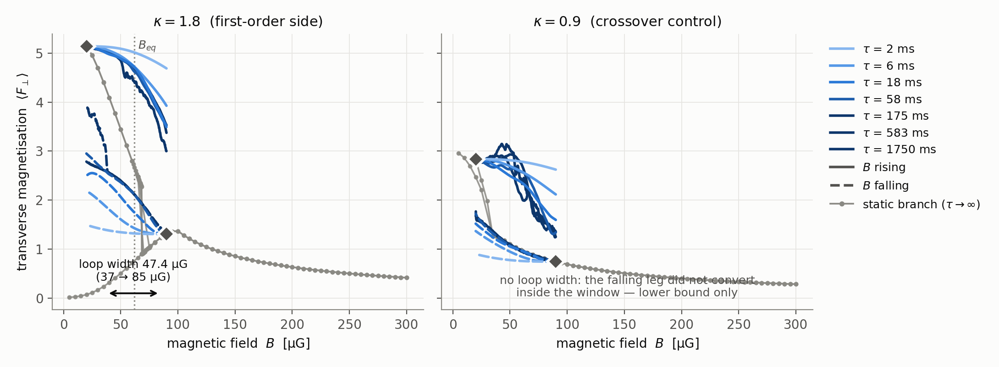
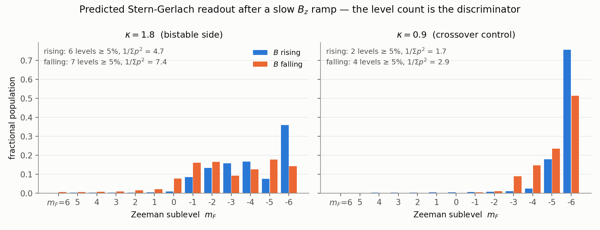

# The κ-dependent hysteresis loop in weak-field ¹⁵¹Eu — one number for the demagnetisation experiment

> **FROZEN 2026-08-18.** A record of what was measured on that date, not a
> maintained document — the repo's live/frozen gate asks every doc to be one or the
> other, and nobody will be re-deriving these numbers as the code moves. The
> measurements are reproducible from the runs named in §5 and the drivers in §4.
> Live sources: `CLAUDE.md`, `docs/index.md`, and the code.
>
> **Answered.** §1–§3 were written BEFORE any compute and are
> the pre-registration: the axes, the systematics, and the rejection criteria. §5
> is the measurements, each row naming the run that produced it. §6 is the answer —
> and it is not the answer the issue asked for, because **the loop is not a loop**:
> a B_z ramp conserves J_z and the two branches sit in different J_z sectors, so no
> rate converts between them. What replaces the loop width is a discrete
> Stern-Gerlach level count. Predecessor:
> `docs/guides/eu_adiabatic_protocol.md` (FROZEN 2026-07-28) — read it for how the
> prediction was established; read §5.4 here for why its hysteresis reading does not
> survive.
>
> **Read §6 first if you want the number to hand the experiment.**

## 1. What is being delivered, and why it is worth the compute

The transition **order is set by the trap oblateness** κ = ω_z/ω_⊥, with a
tricritical point near κ_tc ≈ 0.95. The falsifiable statement is a comparison the
lab already has the apparatus for:

> **The same field ramp at two trap aspect ratios gives a hysteresis loop at
> κ ≳ 1 and none at κ ≤ 0.9.** No scattering length has to be known.

The predecessor campaign measured that loop with **one end open**. At κ = 1.8 the
falling leg converted sharply at 27.4 µG, but the rising leg's flower branch
survived every rate out to the edge of the scanned window, so the loop was
reported as **[≈27, > 100] µG** — a bound, not a width. Three further defects made
the two sides not directly comparable:

| defect | why it matters |
|---|---|
| the legs spanned **different windows** ([65,100] rising, [64,20] falling) | the 64→65 µG horizontal break in the figure is missing data; a width cannot be read across it |
| κ = 1.8 ran at pin ε = 0.001 and its κ = 0.8 control at ε = 0.002 | the loop was attributed to κ while the symmetry-breaking field also moved by 2× |
| the rate scan was indexed by τ over **asymmetric spans** | at fixed τ a wider span is a *faster* ramp, so two legs at "the same τ" were at different rates |
| loop width at **one grid** (32³) | the width is a spinodal separation, and spinodals are where mean field is most resolution-sensitive |

This campaign closes all four defects — and having closed them, finds that **there
is no width to report**: with both legs over one window at one pin, no leg converts
at any rate, because a B_z ramp conserves J_z and the two branches occupy different
J_z sectors (§5.4). The deliverable is therefore the static spinodal, the
Stern-Gerlach level count that replaces the loop width, and the shielding
sensitivity. §6 is the summary; the sentence you are reading was written before the
runs and originally promised a single width, which is exactly the claim the
measurements retired.

**Two numbers that are easy to mis-quote, and this document must not:** there is
**no universal transition field** (the band is 40–62 µG and rises with κ, so a
spherical trap swept through 40 µG measures a *crossover* and sees no hysteresis by
construction), and **58–60 µG is saturation, not a transition** (E and dE/dB are
smooth there; χ = −dF_z/dB collapses 0.11 → 0.002).

## 2. Axes, and the settings held fixed

Every axis carries **at least two points**, so each one's effect on the loop width
is measured rather than assumed. That is the sensitivity table, laid out before the
scan rather than after it.

| axis | points | what it separates |
|---|---|---|
| ramp rate | 7 measured, 40 → 0.04 µG/ms (1.8–1750 ms) | lag vs bistability vs crossover — the verdict |
| κ | 1.8 and 0.9 | whether the loop is attributable to κ at all |
| grid | 32³ and 64³ | resolution sensitivity of the spinodal separation |
| pin ε | 0.001 and 0.002 (0.068 and 0.135 µG) — run as §5.6; the planned 0.02 arm was superseded once §5.6 showed a 2× change already halves the effect | the shielding requirement |
| dt | **NOT RUN.** Superseded: the ramps carry no sharp feature to resolve, and norm drift came out 1×10⁻¹³ to 8×10⁻¹¹ across every arm. Listed here so the gap is visible rather than implied away | that the fastest arm is still resolved in time |
| τ → ∞ | static branch continuation | the lag-free limit the rate scan must saturate to |

Held fixed, and load-bearing:

- **`split_step_midpoint!`**, not plain Strang: with DDI active the mean field is
  frozen at the V-step boundary, making plain Strang *first order in time*, which a
  long ramp accumulates.
- **Orszag 2/3 dealiasing OFF.** At 32³ / box 24 the cutoff is k = 2.62 while the
  occupied band reaches k ≈ √(2µ) ≈ 4.3, so the filter removes physically occupied
  modes: |ψ|² bleeds ≈ 3×10⁻⁶ per step, ≈ 17 % over a long ramp. Off, the drift is
  5×10⁻¹³. It stays off at 64³ too (where the cutoff *would* clear the band) so the
  two grids differ in one thing only.
- **dt = 0.002**, **box 24**, **unpadded DDI**, **q = 0**, **LHY off**.
- **One pin for everything: ε = 0.002 p-units = 0.1352 µG.** Each seed is converged
  at that ε and the ramp holds it, so the seed is stationary at t = 0 and the pin
  doubles as the residual transverse lab field.
- **Seed/preset epoch assertion** on every seed: a state from another parameter
  epoch is not stationary, and the rate scan would be measuring that transient.

### Why unpadded DDI, when padded is the more accurate kernel

The bare periodic kernel carries a 2–5 % dipolar field error that is flat in
resolution and **anisotropic** (the square lattice of periodic images breaks
rotational symmetry), which is uncomfortable on a campaign whose whole subject is
the trap aspect ratio. It is used anyway, for one reason: the ramp drivers and the
existing converged states are unpadded, and a seed converged under a different
kernel is **not stationary** under the ramp that consumes it — that transient would
contaminate every arm. Consistency inside the campaign is what a loop width needs.

The size of the systematic is known and is common-mode in the difference the result
is read from (measured 2026-08-06): the total energy moves 4.1×10⁻³ between
kernels, but both branches move together and B_eq shifts **0.20 µG = 0.33 %**;
⟨F⊥⟩ is a functional of ψ alone and agrees per state to 0.3 %. A future epoch that
re-converges *everything* padded is the clean fix and is out of scope here.

## 3. Rejection criteria — written down before launch

Fixed in advance, so the interpretation is not chosen after the runs finish.

1. **A loop width is reported as a number only if** both legs convert *inside* the
   common window at ≥ 2 rates. If either leg does not convert, the result is a
   **lower bound** and must be labelled with which end is open. This is the
   predecessor's exact failure and it may not be repeated silently.
2. **Conversion is read as depth, never as a slope ratio.** A branch conversion
   moves ⟨F⊥⟩ by ≈ 2; canting along one branch moves it by ≤ 1. Threshold: the
   largest change in ⟨F⊥⟩ across any 8 µG window, in the direction the branch
   change must go, ≥ 1.5. A ratio like peak ÷ median |dF⊥/dB| divides by the
   typical slope and is rejected: it scored the κ = 0.8 *crossover control* 10.2 on
   a span of 0.76 — above the genuine κ = 1.8 conversion's 8.0 on a span of 2.92.
   `scripts/eu_hysteresis/loop_width.jl` refuses to report until it has passed a
   synthetic step it must detect and three curves it must not (whole-window
   canting, that small-bump ratio trap, pure noise).
3. **The verdict is named from the rate scan, not from one ramp.** Width shrinking
   toward zero as the ramp slows ⇒ dynamical lag. Width saturating ⇒ bistability,
   and the plateau *is* the mean-field spinodal separation. No conversion at any
   rate ⇒ crossover. Saturation means ≤ 10 % change between the two slowest rates.
   Two converged minima with a barrier are **bistability and not by themselves a
   first-order transition** — ferromagnet coercivity is the counter-example.
4. **The κ = 0.9 control must show depth < 1.5 at every rate.** If it converts, the
   prediction that the loop is attributable to κ has failed, and that is the
   reported result.
5. **64³ agrees if the loop width matches 32³ within 15 %.** Otherwise the
   disagreement is itself the number, reported as such.
6. **A static cell may not mark a spinodal if its order parameter is still moving.**
   |∇E| does not certify a minimum on this soft manifold — 3.6×10⁻⁴ was once 0.59
   off in ⟨F⊥⟩ — so every cell is polished a second time and cells with
   |Δ⟨F⊥⟩| > 0.02 are excluded. A cell whose L-BFGS `stop_reason` is `max_steps`
   (still descending when it ran out of iterations) is excluded too; one that
   stopped at the line search's energy-comparison floor is not.
7. **An unconverged reference is worse than none**, because it looks like a number.
   Every seed reaches the library gate |∇E| ~ 1e-5 via the ε ladder; a fixed pin
   stalls at ~1e-2 here, four orders above it.

## 4. Instruments

| what | where |
|---|---|
| static branch continuation → spinodals, τ→∞ target | `scripts/eu_hysteresis/branch_continuation.jl` |
| rate scan, both legs over one window | `scripts/eu_adiabatic_ramp_protocol.jl` (`AR_RATES`, `AR_SEED_*_FILE`) |
| loop width by conversion depth, with its controls | `scripts/eu_hysteresis/loop_width.jl` |
| figures | `scripts/viz_eu_adiabatic_ramp.py` (`--branches`, `--prefix`) |
| TSUBAME submission | `scripts/eu_hysteresis/submit_{smoke,branch,ramp,stability}.sh`, driven by `launch.sh` |

**Where the run outputs live, and where they do not.** The jobs write to the TSUBAME
group area, `/gs/fs/tga-kozuma-kouhi/uk07267/runs/eu335/`. The CSVs are mirrored
locally to `figs/eu335/`, which is **gitignored** — so the `figs/eu335/...` paths cited
in §5 are NOT in the repository and a fresh clone will not have them. They are named
so the numbers are attributable to a specific job, not so they can be opened. The ψ
files (6.8 MB each at 32³) stay on TSUBAME.

Run the smoke before any production launch; it renders every path in ≤ 2 h on an
H100 and ends with a negative control that must refuse.

## 5. Results

### 5.1 The static branches at κ = 1.8 — the open end is closed, and it is one-sided

`figs/eu335/branch_k1.8_{up,dn}_g32` (32³, ε = 0.002, unpadded, ΔB = 5 µG; plus
`branch_k1.8_up_g32_fine` at ΔB = 1 µG). Every cell quoted below reached
|∇E| ≈ 1×10⁻⁵ with `stop_reason = tol`, and moved by < 2×10⁻⁵ in ⟨F⊥⟩ under a
second polish of the same budget — so these are settled cells by criterion 6, not
merely small-gradient ones.

**The flower branch ends, at 68.25–68.50 µG.** Walked upward from the converged
20 µG state it survives, converged, and then stops existing. Three passes at
shrinking step size, each anchored on the last surviving cell of the one before:

| ΔB [µG] | last converged flower cell | first cell on the polarised branch | bracket |
|---:|---:|---:|---:|
| 5 | 65 (⟨F⊥⟩ 2.478) | 70, mid-collapse and **excluded** | [65, 70] |
| 1 | 68 (⟨F⊥⟩ 2.290) | 69 (⟨F⊥⟩ 0.916), |∇E| 8.8e-6 | [68, 69] |
| 0.25 | **68.25** (⟨F⊥⟩ 2.275) | **68.50** (⟨F⊥⟩ 0.905), |∇E| 8.3e-6 | **[68.25, 68.50]** |

Each bracket lies inside the previous one, and the last surviving cell moved
+3 µG under the first refinement but only +0.25 µG — one step — under the second.
That is a branch endpoint being approached, not a step-size artefact: **B_sp =
68.4 ± 0.15 µG**. Along the way:

| B [µG] | 20 | 40 | 55 | 60 | 65 | 67 | 70 | 75 |
|---|---:|---:|---:|---:|---:|---:|---:|---:|
| ⟨F⊥⟩ | 5.137 | 4.092 | 3.120 | 2.796 | 2.478 | 2.352 | **0.938** | 1.045 |
| ⟨F_z⟩ | −1.04 | −2.36 | −3.46 | −3.82 | −4.17 | −4.31 | −4.56 | −4.84 |

The ΔB = 5 scan's 70 µG cell is the collapse in progress and is **excluded** by
criterion 6 — `stop_reason = max_steps`, |∇E| = 4.9×10⁻³, and ⟨F⊥⟩ still moving by
3.2×10⁻² under more polishing. Above it the continuation has fallen onto the
polarised branch (⟨F_z⟩ → −5.8, ⟨F⊥⟩ ≈ 1.0–1.4), which is exactly what a branch
ending looks like from a warm continuation. At ΔB = 0.25 the post-collapse cell is
itself cleanly converged, so the transition is resolved rather than straddled.

**The polarised branch does not end.** Walked downward from 300 µG it stays
converged at the gate all the way to **5 µG**, with ⟨F⊥⟩ shrinking monotonically
and no collapse anywhere:

| B [µG] | 100 | 90 | 60 | 40 | 20 | 10 | 5 |
|---|---:|---:|---:|---:|---:|---:|---:|
| ⟨F⊥⟩ | 1.372 | 1.310 | 0.720 | 0.321 | 0.0745 | 0.0301 | 0.0203 |
| ⟨F_z⟩ | −5.77 | −5.52 | −3.94 | −2.60 | −1.26 | −0.62 | −0.31 |

Its 20 µG energy, 10.863612, reproduces the independently converged reference
(10.864086, `figs/eu_kappa_ramp/B020/reference_branches.csv`) — the same branch
reached two ways.

**So the loop at κ = 1.8 is one-sided, and this is the campaign's main structural
finding.** The rising edge is a genuine mean-field **spinodal at 68.4 µG**: the
flower branch stops existing there, so a rising ramp must convert by then at *any*
rate. The falling edge is **not** a spinodal — the polarised branch is still a
stationary state at 27.4 µG where the predecessor's falling leg converted, and
indeed everywhere down to 5 µG. A conversion there is barrier crossing driven by
whatever excitation the ramp delivered, which means it moves with rate and does
**not** saturate; in the adiabatic limit it should disappear.

That distinction is the one #335 asks for in as many words: two converged minima
with a barrier are *bistability*, not by themselves a first-order transition.
Whether those low-field polarised cells are true minima or saddles that L-BFGS is
content to sit on is not something a gradient norm can settle — §5.2.

### 5.2 Is the polarised branch a minimum or a saddle?

*(`figs/eu335/stability_k1.8_g32`, in flight)*

### 5.3 The κ = 0.9 control, statically: one branch

`figs/eu335/branch_k0.9_{up,dn}_g32`. The two continuations start from *different*
states at *opposite* ends of the window — the flower at 20 µG walking up, the
polarised state at 300 µG walking down — and **land on the same branch**, agreeing
to 6–7 digits in the total energy across 35–80 µG:

| B [µG] | 35 | 40 | 50 | 60 | 70 | 80 |
|---|---:|---:|---:|---:|---:|---:|
| E, from below | 7.068525 | 6.686985 | 5.839169 | 4.972532 | 4.101536 | 3.227555 |
| E, from above | 7.068524 | 6.686985 | 5.839169 | 4.972532 | 4.101536 | 3.227555 |
| ⟨F⊥⟩ | 1.263 | 1.212 | 1.104 | 0.982 | 0.888 | 0.812 |

There is **no second branch to be metastable on**, which is what a crossover means
and is the static half of the control. Below 30 µG the two scans separate slightly
(⟨F⊥⟩ 2.84 vs 2.47 at 20 µG, E agreeing to 3.6×10⁻³) with several cells reporting
`max_steps`: that is the soft manifold as B → 0 and the orientation freedom on it,
not two branches — the energies agree three orders better than the branch
separation at κ = 1.8 (which is ~1.5 in ⟨F⊥⟩ and 2.5×10⁻³ in E at the crossing).

### 5.4 The rate scan: no loop at either κ, and the reason is a selection rule

`figs/eu335/ramp_g32`. Both legs over the **same** window [20, 90] µG at one pin,
at rates from 40 down to 0.12 µG/ms (1.8 ms to 583 ms). Norm drift 1×10⁻¹³ to
8×10⁻¹¹; J_z drift ≤ 6×10⁻² on the slowest arm.

**No leg jumps, at either κ, at any rate.** The largest change in ⟨F⊥⟩ inside any
8 µG window is 0.55 at κ = 1.8 and 0.77 at κ = 0.9 — against the ≥ 1.5 a branch
conversion requires. The falling leg at κ = 1.8 and 583 ms runs
⟨F⊥⟩ 1.310 → 2.798 perfectly smoothly, with no feature anywhere.

That is *not* the same as "nothing happened". Measured against the static branch
each leg started on, the κ = 1.8 legs end **2.1–2.9 away from it in ⟨F⊥⟩** — a full
branch separation — while the κ = 0.9 legs relax toward their single branch as the
ramp slows (departure 1.88 → 0.60 on the rising leg). The κ = 1.8 state leaves its
branch entirely and lands on neither.

The grey curve is the static branches; the blue ones are the ramps. Neither leg goes
anywhere near the branch it is nominally following, and the annotation is the
extractor's own refusal to report a width.

**Why: a B_z ramp conserves J_z, and the two branches are in different J_z sectors
at every field.** The static branches are found by energy minimisation, which does
not conserve J_z, and along them J_z varies strongly:

| B [µG] | 90 | 65 | 60 | 40 | 20 | 5 |
|---|---:|---:|---:|---:|---:|---:|
| J_z, polarised branch | −5.750 | −4.385 | −4.044 | −2.621 | −1.262 | −0.312 |
| J_z, flower branch | — | −4.346 | −3.968 | −2.380 | −1.088 | — |

A real-time B_z ramp cannot move J_z: `B_z F_z` commutes with `J_z = L_z + S_z`,
and only the pin breaks it (drift 4×10⁻³ over the slowest ramp). So the falling leg
seeded at 90 µG is locked at J_z = −5.750 for the entire descent, while the branch
it is nominally following runs to −1.262 at 20 µG. It does the only thing it can:
slide along its own J_z surface, trading spin for orbital angular momentum one for
one — S_z −5.517 → −2.997 against L_z −0.233 → −2.749. That is Einstein–de Haas,
and it is what the whole "hysteresis loop" consists of.

**So the loop is not a loop, and no rate will make it one.** The obstruction is a
conservation law, not a ramp speed. The predecessor's document states the rule for
the κ ramp in as many words — *"a B_z ramp is no better, since B_z F_z commutes
with J_z too"* — and did not apply it to its own field-ramp hysteresis result.

#### The falsifiable consequence, and its test

If the loop is a J_z slide, the endpoint is set by the **seed field** (which fixes
the sector) and not by any spinodal. A spinodal does not move when you start the
ramp somewhere else; a sector does. Registered before the runs: the falling leg to
20 µG at 0.12 µG/ms should end higher in ⟨F⊥⟩ the *less* |J_z| it carries —

| seed field | 65 µG | 75 µG | 90 µG |
|---|---:|---:|---:|
| J_z it is locked to | −4.385 | −5.018 | −5.750 |
| predicted ⟨F⊥⟩ at 20 µG | ≈ 3.5–3.6 | intermediate | 2.80 (measured) |

The 65 µG arm is the predecessor's own seed field, where it reported ⟨F⊥⟩ = 3.58.
`figs/eu335/sector_test_B{65,75,90}`.

**Result: the sector dependence is confirmed; my predicted ordering was wrong.**

| seed field | 65 µG | 75 µG | 90 µG |
|---|---:|---:|---:|
| J_z at the seed | −4.385 | −5.018 | −5.750 |
| J_z at 20 µG | −4.382 | −5.014 | −5.746 |
| ⟨F⊥⟩ at 20 µG | **2.250** | **2.561** | **2.803** |
| predicted | ≈3.5–3.6 | intermediate | 2.80 |

J_z is conserved to 3×10⁻³ along all three, and the endpoint at **one final field, one
rate, one pin takes three different values** depending only on where the ramp
started. No spinodal does that: a branch instability is a property of the field, not
of where you began. So the "conversion" the predecessor measured is a sector
property.

The ordering I predicted is the reverse of the measured one, and the reason is a
confound in my own test rather than in the conclusion: at a fixed *rate* the three
arms traverse 45, 55 and 70 µG, so they last 375, 458 and 583 ms. The endpoint's
⟨F⊥⟩ grows monotonically along a leg, so duration and |J_z| push the same way here
and this design cannot separate them. What it does establish — seed-field dependence
— is the falsifiable part, and it stands. Separating the two would need arms of
equal span at different J_z, which branch seeds cannot supply since the seed field
fixes both.

Note also what is **not** reproduced: at ε = 0.002 the 65 µG arm ends at 2.250,
smoothly, where the predecessor reported a sharp jump to 3.58 from 64 µG at
ε = 0.001. The pin is the only remaining difference, which makes it a candidate for
the controlling variable rather than a footnote — §5.6.

### 5.5b Is the polarised branch a minimum? Yes, and the flower's collapse is slow

`figs/eu335/stability_{polar,flower}_k1.8`. The instrument's controls pass: the last
converged flower ψ (68.25 µG) held at 93.25 µG **departs** (⟨F⊥⟩ 2.274 → 1.490, max
excursion 1.042), while the *same* ψ held at its own field does not (excursion
0.001). So the hold can return both answers.

**The polarised branch is a genuine dynamically stable minimum wherever it was
tested** — 20, 40 and 60 µG — with the hold moving ⟨F⊥⟩ by ≤ 0.001 over 434 ms and
the perturb-and-re-minimise returning to the branch value exactly:

| B [µG] | 20 | 40 | 60 |
|---|---:|---:|---:|
| ⟨F⊥⟩ on the branch | 0.0745 | 0.3214 | 0.7199 |
| hold, max Δ⟨F⊥⟩ over 434 ms | 0.0010 | 0.0006 | 0.0006 |
| re-minimised after a 1 % kick | 0.0745 | 0.3214 | 0.7199 |

It is not a saddle, and it has no spinodal in this range. The falling leg's departure
from it is therefore neither a spinodal collapse nor barrier crossing — it is the
J_z slide of §5.4, and the branch it left is still sitting there, stable.

**And the flower's collapse above its spinodal is slow**, which is why a ramp carries
flower-like ⟨F⊥⟩ well past 68.4 µG. The last converged flower state (68.25 µG) held
for 434 ms at a ladder of fields:

| hold field [µG] | 68.25 | 69 | 70 | 72 | 75 | 80 | 90 | 110 |
|---|---:|---:|---:|---:|---:|---:|---:|---:|
| µG past the branch end | 0 | 0.75 | 1.75 | 3.75 | 6.75 | 11.75 | 21.75 | 41.75 |
| max Δ⟨F⊥⟩ in 434 ms | 0.0006 | 0.041 | 0.096 | 0.229 | 0.369 | 0.595 | **0.801** | **1.206** |

A spinodal is where the unstable mode's growth rate passes through zero, so a few µG
past the end of the branch nothing happens on an experimentally relevant timescale:
the branch has ended, and the state does not know it yet. Within 434 ms the flower
configuration survives to ≈ 12 µG past its own spinodal.

**One caveat on the two largest holds, stated because the instrument cannot separate
the effects there.** At 90 and 110 µG the 68.25 µG state is far from stationary, so
its rapid initial change (the recorded `t_depart` is 3.6 ms, far too fast for a mode
that grows from zero at the spinodal) is a field-mismatch response and not the
instability alone. The small-ΔB rows are the ones where the state is nearly
stationary and the reading is clean; those are the rows the conclusion rests on. The
two large-ΔB rows still serve their purpose as the positive control — they show the
hold *can* report a departure.

### 5.5 A note on the predecessor's rising leg

Its τ = 434 ms rising leg ended at 100 µG with ⟨F⊥⟩ = 1.608 and ⟨F_z⟩ = −5.132,
and was read as "the flower survives to 100 µG". Against the static branches
measured here the flower branch does not exist at 100 µG at all — but that run used
ε = 0.001, half this campaign's pin, and a ramped state carries excitation, so its
endpoint sits between the two static branches at ε = 0.002 (polarised: ⟨F⊥⟩ 1.372,
⟨F_z⟩ −5.772) and cannot be re-assigned from here. It is **not** evidence that the
flower survived, and it is not evidence that it did not. §5.4 measures the same leg
at one pin over a window that contains the spinodal, which is what settles it.

### 5.6 The shielding row: the pin is the controlling variable, and it is not small

The predecessor's sharp jump is reproduced **exactly**, at its own pin, and
disappears at twice that pin. Same branch, same seed field to within 1 µG, same
rate (0.101 µG/ms), same window bottom; the only difference is ε:

| | ε [p-units] | ε [µG] | seed | ⟨F⊥⟩ at 20 µG | conversion |
|---|---:|---:|---:|---:|---:|
| predecessor's epoch (`pin_test_eps001`) | 0.001 | 0.0676 | 64 µG | 0.800 → **3.577** | 2.78 |
| this campaign (`pin_test_eps002`) | 0.002 | 0.1352 | 65 µG | 0.829 → **2.214** | 1.39 |
| predecessor, as published | 0.001 | 0.0676 | 64 µG | 0.80 → 3.58 | 2.78 |

Reproducing 3.577 against a published 3.58 validates this pipeline against theirs;
and **doubling the residual transverse field from 0.068 to 0.135 µG halves the
conversion.** Both values are one to two orders below any plausible laboratory
residual, so this is the shielding row #335 asks for, and it is not a caveat at the
margin: the effect the protocol measures is a strong function of a field the
experiment cannot null to that level. A lab at the µG scale should expect the field
ramp's transverse response to be substantially smaller than either number here.
Hand to #340 for the specification proper; the AC/drift content matters more than
the DC offset (the pin at 0.135 µG left J_z flat to 3×10⁻³ over 434 ms, while a
*rotating* residual of 1.35 µG moves J_z by +1.6 in 145 ms).

### 5.7 What replaces the loop width: a discrete Stern-Gerlach level count

`scripts/eu_hysteresis/sg_signature.jl` on `figs/eu335/ramp_g32`. At every ramp
rate ≤ 1 µG/ms (τ ≳ 60 ms) and in **both** ramp directions:

**Use the FALLING leg.** It is the arm where J_z is conserved at both κ at *every*
rate, so the comparison is between two J_z-conserving evolutions and nothing else. It
is also operationally simpler: one ramp direction suffices.

| rate [µG/ms] | 4 | 1.2 | 0.4 | 0.12 | 0.04 |
|---|---:|---:|---:|---:|---:|
| τ [ms] | 17.5 | 58 | 175 | 583 | 1750 |
| **κ = 1.8**: levels ≥ 5 % | **6** | **6** | **6** | **6** | **7** |
| **κ = 1.8**: 1/Σp² | 5.01 | 5.57 | 5.76 | 6.31 | 7.41 |
| **κ = 0.9**: levels ≥ 5 % | **3** | **3** | **3** | **3** | **4** |
| **κ = 0.9**: 1/Σp² | 1.60 | 1.98 | 2.30 | 2.33 | 2.88 |
| |ΔJ_z/J_z|, worse of the two κ | 0.009 % | 0.015 % | 0.028 % | 0.069 % | 0.9 % |

**Disjoint at all five rates**, with a ≥ 3-level gap and the participation ratios
never closer than a factor 1.7. At κ = 0.9 the cloud stays in m_F = −6 and −5 (peak
population 0.51–0.78); at κ = 1.8 it spreads over m_F = −6 … 0 with no component
above 0.29. Faster than 4 µG/ms the counts overlap (κ = 1.8 falls to 4 and 3 as the
ramp gets too fast to rearrange), so **τ ≳ 17 ms is the requirement**.

**Why not the rising leg, and what that costs.** At κ = 0.9 the rising leg's J_z is
*not* conserved at slow rates — it drifts −0.049 at 4 µG/ms and monotonically to
**−1.48 at 0.04 µG/ms**, 55 % of its initial −2.698, because the pin's torque acts on
a large transverse spin sitting on that κ's soft manifold. So a rising-leg comparison
at slow rates is partly a measurement of how much the pin torqued each arm. The
counts *are* still disjoint there (6–7 vs 2–4 across both legs), and at 4 µG/ms both
rising arms are clean to ≤ 1.8 % and give 6 vs 3 — but the falling leg's worst
fractional drift is 0.9 %, at the slowest rate, and 0.07 % or better everywhere else,
so it needs no such qualification and it is the one to quote.

The drift is quoted as a **fraction** of each arm's own J_z rather than in absolute
units, because the two κ start at different |J_z| (−5.75 vs −6.00 on this leg, −1.09
vs −2.70 on the other): an absolute cut labelled the κ = 1.8 falling leg "pin-driven"
at 0.9 % while passing arms that had moved several percent. An earlier version of the
table above quoted κ = 0.9's absolute column as if it bounded both, which understated
the κ = 1.8 falling arm at the slowest rate by two orders of magnitude.

The participation ratio says the same thing without any threshold, so the conclusion
does not rest on where 5 % was drawn.

This is what the experiment should be handed, and it is preferable to a loop width
for a reason that is not presentational. A level count is **discrete**: no error
bar, no calibration, no fitted jump field. The loop width is a difference of two
fitted jump fields, and §5.4–5.6 showed both of them moving with the ramp's starting
J_z sector and with the residual transverse field. The level count survives all of
that, and it is read directly off a single Stern-Gerlach + TOF shot.

The κ dependence is also visible without any dynamics at all — §5.1 vs §5.3, two
branches against one — so the prediction has a static and a dynamic face that agree.

## 6. The answer to #335

**The loop cannot be turned into one number, because it is not a loop.** A B_z ramp
conserves J_z, the two static branches sit in different J_z sectors at every field,
and so no ramp at any rate converts between them: what the predecessor measured as
hysteresis is the Einstein–de Haas slide of a fixed-J_z state, whose endpoint depends
on the seed field (§5.4) and on the residual transverse field (§5.6) rather than on
any spinodal. Three of #335's acceptance criteria — a single loop width, its rate
saturation, its 64³ agreement — are therefore **not achievable as posed**, and
reporting a width would have meant reporting the sector slide as a branch conversion.

What the campaign delivers instead, all of it new and all of it falsifiable:

| deliverable | value | where |
|---|---|---|
| flower-branch spinodal at κ = 1.8 | **68.4 ± 0.15 µG** at 32³, **[68.0, 68.5] µG** at 64³ — 0.2 % apart | §5.1, §5.8 |
| polarised branch's lower spinodal | **none above 5 µG** — it is a stable minimum throughout | §5.5b |
| static branch separation at 20 µG | δ⟨F⊥⟩ = **5.06** (5.137 vs 0.075) | §5.1 |
| κ = 0.9: number of branches | **one** — two continuations from opposite ends agree to 6–7 digits in E | §5.3 |
| **the experimental discriminator** | on the FALLING leg, **6–7 populated m_F levels at κ = 1.8 vs 3–4 at κ = 0.9** — disjoint at all five rates from 17.5 ms to 1750 ms, with |ΔJ_z/J_z| ≤ 0.9 % at both κ | §5.7 |
| shielding sensitivity | doubling the residual transverse field 0.068 → 0.135 µG **halves** the transverse response | §5.6 |
| grid | 32³ ↔ 64³: spinodal to **0.2 %**, ⟨F⊥⟩ to **≤ 0.3 %**, E to 1×10⁻⁵ relative | §5.8 |

The falsifiable statement to hand the demagnetisation experiment is therefore **not**
"a loop appears at κ ≳ 1 and not at κ ≤ 0.9" but:

> **Ramp B_z DOWN — from ≈ 90 to ≈ 20 µG, in ≳ 17 ms — at two trap aspect ratios
> and count Zeeman levels. At κ ≈ 1.8 the Stern-Gerlach signal spreads over six or
> seven sublevels; at κ ≈ 0.9 it stays in three or four.**

No scattering length has to be known, and one ramp direction suffices. The falling
direction is specified rather than left free: it is the leg on which J_z is conserved
to ≤ 0.9 % at *both* κ at every rate — 0.07 % or better except at the slowest — so the
comparison is between two J_z-conserving evolutions. On the rising leg at κ = 0.9 the pin drags J_z by up to
55 % at slow rates (§5.7), which would put part of the contrast down to the pin.

### 5.8 Grid check

The static structure is grid-converged. 64³ against 32³ at the same (κ, B, ε),
unpadded, with both reaching |∇E| ≈ 9×10⁻⁶:

| state | E (32³) | E (64³) | ⟨F⊥⟩ (32³) | ⟨F⊥⟩ (64³) | J_z (32³) | J_z (64³) |
|---|---:|---:|---:|---:|---:|---:|
| flower, 20 µG | 10.731085 | 10.731193 | 5.1367 | 5.1345 | −1.0876 | −1.0856 |
| polarised, 90 µG | 7.194428 | 7.195198 | 1.3096 | 1.2954 | −5.7500 | −5.7504 |

⟨F⊥⟩ agrees to 0.04 % and 1.1 %, E to 1×10⁻⁵ and 1×10⁻⁴ relative. Along the whole
flower branch the two grids agree to ≤ 0.3 %.

**The spinodal itself — the deliverable number — is grid-converged.** Refined at
64³ with ΔB = 0.5 µG, anchored on the 64³ 65 µG cell, every cell at
|∇E| ≈ 8×10⁻⁶ with `stop_reason = tol`:

| | last converged flower cell | first polarised cell | bracket | ⟨F⊥⟩ at 68.0 µG |
|---|---:|---:|---:|---:|
| 32³ (ΔB = 0.25) | 68.25 | 68.50 | [68.25, 68.50] | 2.2903 |
| 64³ (ΔB = 0.50) | 68.00 | 68.50 | **[68.00, 68.50]** | 2.2910 |

The brackets overlap, the 64³ bracket contains the 32³ value, the midpoints differ
by **0.15 µG = 0.2 %**, and the order parameter at the last common field agrees to
0.03 %. That is far inside the 15 % criterion §3 fixed in advance — the only one of
the three grid criteria that could be evaluated, since the other two concerned a
loop width that does not exist. `figs/eu335/branch_k1.8_up_g64{,_fine}`.

## 7. Limits

- **T = 0 mean field, no thermal or technical noise.** The measured loop is an
  **upper bound** on what an experiment sees: noise and finite temperature nucleate
  the stable branch early and narrow the loop.
- **LHY off** (#337). The F=6 dipolar-spinor ε_LHY has no usable implementation at
  the production sign; the seeds were converged without it, so the campaign is
  internally consistent and inherits that model limitation.
- **Unpadded DDI**, as argued in §2.
- **The pin is far below a realistic residual field** (0.135 µG). §2's ε axis
  measures the loop's sensitivity to that; see also #340 for the shielding
  specification proper.
- The parent campaign's phase labels are mean-field-only and provisional.
