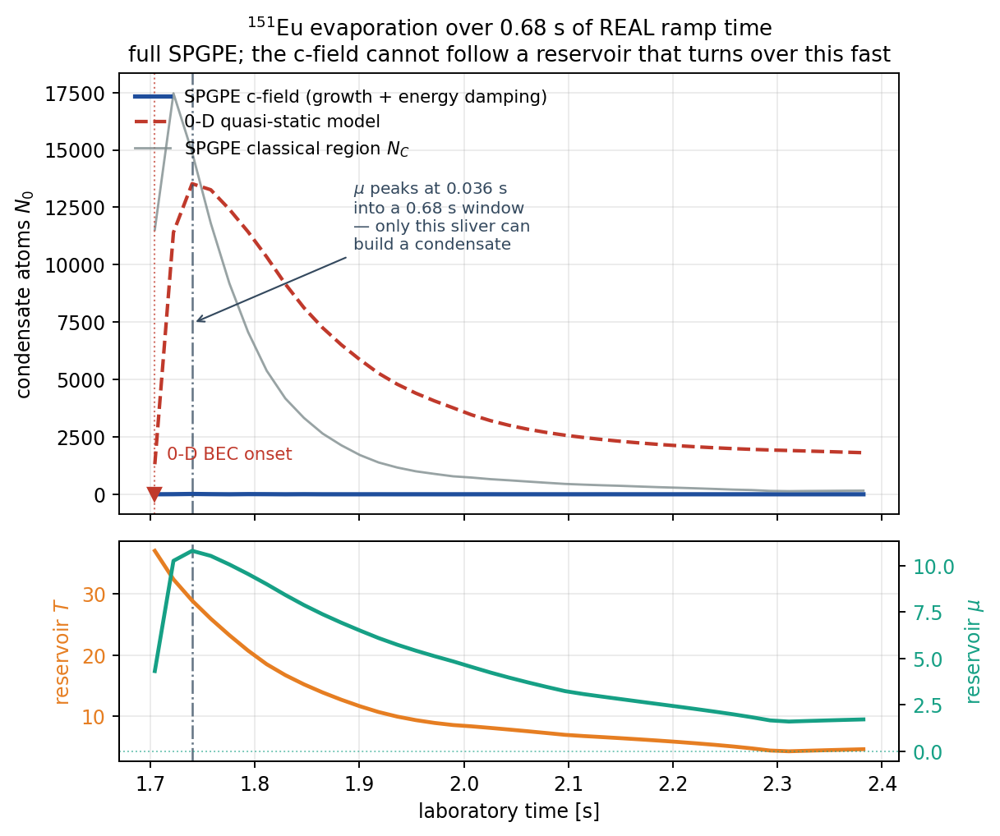

# The full SPGPE — growth + energy-damping reservoirs

The stochastic projected Gross–Pitaevskii equation of Rooney, Blakie & Bradley
(PRA **86**, 053634 (2012), [arXiv:1210.0952]), with **both** reservoir processes
and with the dissipation coefficients computed from the reservoir rather than
supplied by hand. Implementation: `src/solvers/spgpe.jl`; the evaporation bridge
is `src/solvers/evaporation/spgpe_reservoir.jl`.

## What it adds over the existing SGPE

The classical field occupies a low-energy **C region** ($\epsilon \le
\epsilon_\mathrm{cut}$); everything above is the **I region**, treated as a
reservoir at $(\mu, T)$. The two couple through two physically distinct
processes:

| process | mechanism | conserves | ensemble |
|---|---|---|---|
| **growth** (number damping) | two I atoms collide, one enters C | — | grand canonical |
| **scattering** (energy damping) | a C atom and an I atom exchange energy | $N_C$ **exactly** | canonical |

The existing `apply_sgpe_step!(…; full_hamiltonian=true)` **is** the growth term
(Rooney Eq. 21) — with $\gamma$ as a free knob. What was missing:

1. **$\gamma$ and $\bar{\mathcal M}$ from the reservoir.** Eq. (19) and Eq. (26)
   turn both coefficients into predicted numbers, so a run has a temperature and
   a chemical potential rather than a tuning parameter.
2. **The scattering term.** Number-conserving energy exchange, which the growth-
   only theory cannot represent at all. In the Eu evaporation regime it comes out
   *larger* than $\gamma$ ($\bar{\mathcal M}\approx3\times10^{-3}$ vs
   $\gamma\approx7\times10^{-4}$), so it is not a correction.
3. **A time-dependent reservoir**, which is what makes a second-scale evaporation
   ramp a thing you can drive rather than impose.

## The equations, in internal units

With $\hbar=m=\omega_\mathrm{ref}=1$, $T \equiv k_BT/\hbar\omega_\mathrm{ref}$,
lengths in $a_\mathrm{ho}$, both coefficients are dimensionless (Rooney Eq. 30).

**Growth** (Eq. 21), which is the Stoof-form SGPE step:

$$d\psi|_\gamma = \mathcal P\{\gamma(\mu - \mathcal L)\psi\,dt + dW_\gamma\},
\qquad \langle dW_\gamma^* dW_\gamma\rangle = 2\gamma T\,\delta_C\,dt$$

$$\gamma = \gamma_0\sum_{j=1}^{\infty}\frac{e^{\beta\mu(j+1)}}{e^{2\beta\epsilon_\mathrm{cut}j}}
\Phi\!\left[\frac{e^{\beta\mu}}{e^{\beta\epsilon_\mathrm{cut}}},1,j\right]^2,
\qquad \gamma_0 = \frac{8a_s^2}{\lambda_{dB}^2} = \frac{4a_s^2T}{\pi}$$

($\Phi$ = Lerch transcendent.) Implemented via the exact regrouping
$\gamma = \gamma_0\sum_j z^{1-j}\big(\sum_{n\ge j}x^n/n\big)^2$ with
$z=e^{\beta\mu}$, $x=e^{\beta(\mu-\epsilon_\mathrm{cut})}$ — the printed form
builds $e^{\beta\mu(j+1)}$ and $\Phi$ separately, both large where the product is
small. Terms fall off like $e^{\beta(\mu-2\epsilon_\mathrm{cut})}$.

**Scattering** (Eq. 27):

$$d\psi|_{\mathcal M} = \mathcal P\{-i V_{\mathcal M}\psi\,dt + i\psi\,dU\},
\qquad
V_{\mathcal M} = -\mathcal F^{-1}\!\left\{\frac{\bar{\mathcal M}}{|k|}\,
\mathcal F\{\nabla\!\cdot\!j\}\right\},
\qquad
\bar{\mathcal M} = \frac{16\pi a_s^2}{e^{(\epsilon_\mathrm{cut}-\mu)/T}-1}$$

with $\langle dU\,dU\rangle = 2T\varepsilon(r-r')dt$, i.e. white noise coloured by
$\sqrt{2T\bar{\mathcal M}/|k|}$.

Three properties make this cheap and exact where it matters:

- **No current is needed.** $\nabla\!\cdot\!j = \mathrm{Im}(\partial_d\psi^*\partial_d\psi)
  + \mathrm{Im}(\psi^*\partial_d^2\psi)$ and the first term is real, so
  $\nabla\!\cdot\!j = \sum_c \mathrm{Im}(\psi_c^*\nabla^2\psi_c)$ — one Laplacian
  per component instead of $N$ gradients plus a divergence.
- **Both terms are one real phase**: $\psi \leftarrow \psi\exp(i(dU - V_{\mathcal M}dt))$.
  This is the *exact* Stratonovich solution of $dX = iX\circ dU$, not an $O(dt)$
  approximation, and it conserves $\int|\psi|^2$ to machine precision.
- The $k=0$ component of both kernels is zeroed: $\nabla\!\cdot\!j$ has no $k=0$
  content for a localised field, and a $k=0$ noise is an unobservable global
  phase with divergent variance.

## Usage

```julia
res = SPGPEReservoir(; T=5.0, mu=2.0, a_s=0.015, k_cut=6.0)   # ϵ_cut = ½k_cut² by default
spgpe_rates(res, 0.0)          # (; T, mu, eps_cut, gamma, M)

# compose with the unitary split-step
cb = spgpe_callback(res, dt; every=5)
run_simulation!(ws; callbacks=SimulationCallbacks(on_step=cb))
```

A ramped reservoir takes `Waveform`s:

```julia
res = SPGPEReservoir(;
    T  = PiecewiseLinearWaveform(t_internal, T_of_t),
    mu = PiecewiseLinearWaveform(t_internal, mu_of_t),
    a_s = a_s / a_ho, k_cut = 10.6)
```

Sub-stepping the reservoir (`every=5`) is safe because $\gamma\,dt_\mathrm{eff}$ and
$\bar{\mathcal M}\,dt_\mathrm{eff}$ are both $\lesssim10^{-5}$; it is worth a
factor of ~2.3 in wall time.

`number_damping=false` / `energy_damping=false` select the scattering-only and
growth-only sub-theories. `gamma=` / `M=` override the reservoir formulas — used
for the strongest available check, that equilibria are **independent** of both
coefficients (Rooney §III D 3, §III E 3).

## Driving a physical, second-scale evaporation

`spgpe_reservoir(evap_result, trap, ramp; omega_ref, a_s, k_cut, t_start)` maps a
two-component 0-D trajectory ([`run_evaporation_bec`](evaporation_model.md)) onto
$(T(t), \mu(t))$ in internal time. Above $T_c$, $\mu$ comes from the ideal-Bose
phase-space density ($\mathrm{Li}_3(z) = N(\hbar\bar\omega/k_BT)^3$); below, it is
pinned by the condensate, $\mu = \tfrac12\hbar\bar\omega(15N_0a_s/a_\mathrm{ho})^{2/5}$.
The branches meet continuously at $N_0\to0$.

**Why this replaces the energy knife.** A closed c-field cannot evaporate —
something has to remove the hot atoms. Doing that with a mechanical knife forces
the sweep into ~25 ms of internal time to stay affordable, ~60× faster than the
real Eu evaporation, which is non-adiabatic spilling rather than evaporation. With
the reservoir, the thermal cloud is not simulated at all; it is the I region, and
the 0-D model already describes it on the experimental timescale.

**What is and is not predicted.** Prescribing $\mu(t)$ **prescribes $N_0$** — see
the euv3 section below; this is a property of the grand-canonical ensemble, not of
how $\mu$ is derived. The absolute condensate number is therefore an input, and
"does a BEC form" is not a question this configuration answers. What is
independent is the **lag**: growth proceeds at finite $\gamma$, so a ramp faster
than $1/\gamma$ leaves the condensate behind its quasi-static value. The 0-D model
cannot produce that gap at all, and it is what decides whether an "optimised"
fast ramp actually delivers atoms.

### The window a c-field can represent

The C region must contain the thermal cloud, so $\epsilon_\mathrm{cut}\gtrsim\mu+T$.
At the 50 µK start of the euv3 ramp $T\approx3.7\times10^3$ and $k_\mathrm{cut}\approx86$
— no grid resolves that. The c-field description becomes affordable only near
degeneracy. On the euv3 ramp (BEC onset at 1.70 s):

| window | real duration | internal units | grid | steps @ dt=0.002 |
|---|---|---|---|---|
| $T\le1.05\,T_c$ | **0.714 s** | 1288 | $80^3$ | $6.4\times10^5$ |
| $T\le1.20\,T_c$ | 0.770 s | 1442 | $94^3$ | $7.2\times10^5$ |
| $T\le1.50\,T_c$ | 0.934 s | 1911 | $118^3$ | $9.6\times10^5$ |

The driver refuses to run when the grid cannot resolve $k_\mathrm{cut}$, rather
than quietly lowering it — a lowered cutoff would let the *grid* define the C
region and would push $\epsilon_\mathrm{cut}$ below $\mu$, where the reservoir
formulas are undefined.

### The euv3 ramp: a diagnostic, NOT a physics result



Run it and no condensate forms. **Do not read that as a statement about ¹⁵¹Eu.**
It is a statement about the reservoir trajectory that was fed in, and it fails two
independence tests.

**It does not survive the $K_3$ systematic.** $\mu = \mu_\mathrm{TF}(N_0)$ follows the
0-D condensate down as three-body loss eats it, so the verdict tracks a
one-parameter fit:

| $K_3$/fit | 0-D final $N_0$ | vs measured | $\mu$ peak@ | $G_\mathrm{eff}$ | verdict |
|---|---|---|---|---|---|
| 1 | 1789 | **0.04** | 7.4 % | 4.5 | SHORT |
| 0.25 | 7200 | 0.14 | 10.4 % | 15.3 | FORMS |
| 0.02 | $6.1\times10^4$ | 1.21 | 19.5 % | 60.8 | FORMS |

The fitted $K_3$ leaves 4 % of the **measured** $5.02\times10^4$ (PRL 129, 223401).
Reproducing the measurement takes $K_3\approx$ fit/50 — near the independent
BEC-fit estimate — and there the budget clears by $8.8\times$. The verdict flips at
$K_3/\mathrm{fit}\approx0.3$. Tuning $K_3$ until a condensate appears would be
fitting the input to the desired answer, so it is not done here.

**And the deeper problem is the ensemble, not the fit.** In a grand-canonical
SPGPE, $\mu$ below $\varepsilon_0$ forbids a condensate and $\mu$ above it *sets* the
equilibrium size via $\mu = \varepsilon_0 + c_0n_0$. **Prescribing $\mu$ is
prescribing $N_0$**, whatever $\mu$ is derived from. Taking $\mu$ from the I region
instead (`mu_branch=:thermal`) does not escape it — an ideal Bose gas caps $\mu$ at
$0$ while $\varepsilon_0 = \tfrac32\bar\omega \ge 0.62$, so the drive is negative at
**all 447** trajectory points and $N_0 \equiv 0$ is imposed rather than predicted.

So this configuration cannot answer "does Eu form a BEC, and how many atoms".
What it does answer:

- **The lag.** For a *given* $(T(t),\mu(t))$, finite $\gamma$ decides whether the
  c-field tracks. Here $\mu$ peaks 95 of 1288 internal units in — 0.053 s of a
  0.714 s window — and falls for the rest; only the rising phase can build
  anything, and it carries $G_\mathrm{eff}=4.5$ against 6.9 needed, with 77 % of the
  budget landing after the turnover where damping *removes* condensate. That the
  0-D quasi-static assumption breaks here is a real finding about the handoff.
- **That the solver condenses when the reservoir allows it** — 82 % of
  $N_\mathrm{TF}$ at fixed $\mu=5$, $T=2$, still rising.

### The number-conserving formulation, and what it gives (2026-08-07)

Implemented. $\mu$ is solved from the standard semiclassical Hartree–Fock constraint
(Popov / Zaremba–Griffin–Nikuni; [Giorgini, Pitaevskii & Stringari](https://arxiv.org/pdf/cond-mat/9704014)),

$$\mu_\mathrm{eff}(r)=\mu-V(r)-2c_0\big[n_c(r)+\tilde n(r)\big],\qquad
N_0(\mu)+\tilde n_C(\mu)+N_I(\mu)=N_\mathrm{total},$$

with the exchange factor of 2 on the thermal density only. Inside the condensate
Thomas–Fermi gives $\mu_\mathrm{eff}=-c_0n_c\le 0$, so nothing diverges. $N_0$ is an
**output**: whatever the constraint leaves once the thermal regions take their share.

Evaluated along the euv3 trajectory:

| $t$ (s) | $N$ | $T$ (nK) | $\mu_\mathrm{eq}$ | $N_0^\mathrm{eq}$ | $f_0$ |
|---|---|---|---|---|---|
| 1.594 | 8.60e4 | 780 | 7.33 | 2.35e4 | 0.27 |
| **1.726** | 5.34e4 | 434 | 8.13 | **4.01e4** | 0.75 |
| 1.859 | 1.29e4 | 197 | 4.83 | 1.15e4 | 0.89 |
| 1.992 | 5485 | 118 | 3.47 | 5157 | 0.94 |
| 2.390 | 3576 | 64 | 2.95 | 3513 | 0.98 |

**The peak is $N_0\approx4.0\times10^4$ at $t=1.73$ s, 80 % of the measured
$5.02\times10^4$** (PRL 129, 223401) — and it falls monotonically after that to
$3.5\times10^3$ at the end of the ramp. Running the evaporation to completion throws
condensate away: past 1.73 s the losses beat the cooling. So "optimising" this ramp
means **stopping it at the peak**, and the 0-D model's own final $N_0=1789$ (3.6 % of
measured) is the value at the wrong end of a curve rather than a failure of the model.

**Three caveats, none of them small.**

The table is the EQUILIBRIUM constraint, not dynamics. Whether the field can follow is
a separate question, and it visibly cannot at the handoff: the constraint says
$N_0=1.15\times10^4$ there while the c-field run reports $0$ through the first 5 % of
its window. That gap is what a finite $\gamma$ costs and it is the thing the SPGPE
exists to compute.

$N_\mathrm{total}(t)$ still comes from the 0-D model and still carries the $K_3$
systematic. What changed is that $K_3$ now moves the total rather than deciding
whether a condensate exists.

The c-field cannot cover the whole ramp. At 50 µK the internal temperature is 1762, so
$\epsilon_\mathrm{cut}\sim5290$ and resolving it needs $\sim520^3$ — 1300× the $48^3$
that already costs 460 ms/step with the DDI. The 0-D model carries the cooling and the
c-field takes over at 1.85 s; everything before that enters only through $(N,T)$ at the
handoff.

**Three attempts at this constraint, and only measurement caught the first two.**
Prescribing $\mu$ from an assumed split prescribes $N_0$. Solving
$N_I=N_\mathrm{total}-N_C$ with $N_C$ read from the field charges the whole
field-to-equilibrium gap to the reservoir — it returned $\mu=16.7$, demanding
$2\times10^5$ atoms against 6756 present. A discrete level sum that skipped levels
below $\mu$ made the total non-monotone, so a 200-iteration bisection returned 2.34
for 2.5. Reading the standard formalism first would have cost fifteen minutes.

## Validation

`test/dynamics/test_spgpe.jl` (**ci** tier), `test/dynamics/test_spgpe_reservoir.jl`
(**full** tier), `test/gpu/test_spgpe_gpu_cpu_parity.jl` (**full** tier — placed
alongside `test_projected_gp_parity.jl`, which gates the same host-array-broadcast
bug class).

| gate | what it pins | type |
|---|---|---|
| **published coefficients** | $\gamma$ and $\bar{\mathcal M}$ reproduce Rooney Fig. 2's own $(\bar\gamma,\bar{\mathcal M})=(1.5,2.7)\times10^{-4}$ for their Rb-87 example, at a single consistent $\epsilon_\mathrm{cut}-\mu\approx0.35\,k_BT$ — one parameter constrained by two independent numbers | **C** |
| $\gamma_0$ asymptote | $\gamma/\gamma_0\to e^{2(\mu-\epsilon_\mathrm{cut})/T}$, with the tolerance tracking the known $O(x)$ correction so a wrong *prefactor* still fails | B |
| $\nabla\!\cdot\!j$ identity | equals the divergence of the independently-coded `probability_current`, converging with resolution | A |
| **number conservation** | energy damping changes $\int|\psi|^2$ by $<10^{-13}$ — a real phase cannot | A |
| **energy monotonicity** | quiet scattering never heats, and matches $dE_C/dt = -\bar{\mathcal M}\int d^3k\,|k\cdot\tilde j|^2/|k|$ (Eq. 29) to 5 % | B |
| inert on stationary states | $\nabla\!\cdot\!j=0 \Rightarrow$ exactly no effect; flowing state $\Rightarrow$ effect | A |
| growth direction | $N_C$ grows for $\mu>\tilde\mu$ and decays for $\mu<\tilde\mu$ (Eq. 23) | A |
| GPU = CPU | quiet step agrees to $10^{-11}$; three host k-space arrays broadcast against device buffers | A (Level 0) |
| timescale | the bridge carries a $>0.5$ s ramp into $>10^3$ internal units | A |
| **condensation** | $N_0$ reaches $[0.3,1.5]\,N_\mathrm{TF}$ and stays below $N_C$ — the gate for the thing the solver exists to do | B |
| **Rayleigh–Jeans total** | free field: $N_C$ equals $\sum_{\|k\|<k_\mathrm{cut}}T/(\epsilon_k-\mu)$ to 4 % | B |

Known limits, unchanged by this work:

- The classical field is **cutoff-dependent**; absolute equilibrium $N_0$ is not a
  converged observable (see [eu_shape_finite_t.md](eu_shape_finite_t.md)).
- Reservoir rates are the **scalar** (single-component) forms applied per spinor
  component. The spinor generalisation (Bradley & Blakie, [arXiv:1406.2029]) has
  component-resolved rates; for a single stretched state, which is what the Eu
  evaporation runs use, the distinction does not arise.
- $\gamma$ and $\bar{\mathcal M}$ are taken **spatially uniform**, as in Rooney
  §III D 1. A local-density $\gamma(r)$ is a straightforward extension.
- **Measure $N_0$ as an overlap with the condensate mode**, not as the occupation
  of the largest single $k$-mode. A trapped condensate spreads over
  $|k|\lesssim1/R_\mathrm{TF}$, several grid modes wide; the peak mode understated
  $N_0$ by $22\times$ here and turned a working solver into a reported failure.
- The growth budget's efficiency $\eta\approx1/3$ is calibrated on one static
  test. It is an order-of-magnitude gate, not a predictor — treat $G_\mathrm{eff}$
  as "this window cannot possibly work" when short, not as a guarantee when large.
- **Grand-canonical: $\mu$ is an input and it fixes $N_0$.** Below $\varepsilon_0$ no
  condensate is possible; above it the equilibrium size follows from
  $\mu=\varepsilon_0+c_0n_0$. `mu_branch=:thermal` does not escape this — it caps
  $\mu$ at $0<\varepsilon_0$ and forbids condensation outright. Atom-number questions
  need a number-conserving formulation, which is not implemented.
