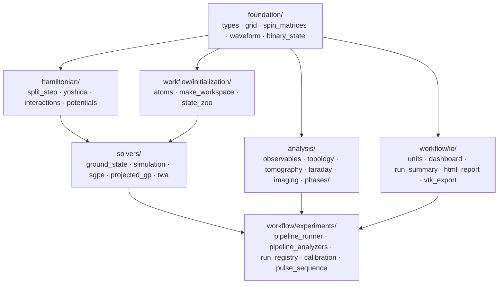

# SpinorBEC.jl Architecture

> **FROZEN 2026-05-11.** Describes the tree as of that date and is **not maintained** against the code — do not cite it as current.
> Live sources: `CLAUDE.md`, `docs/index.md`, and the code itself. Audit: `docs/audit/docs_inventory_2026-08-04.md`.

## Overview

SpinorBEC.jl is a Julia package for simulating spinor Bose-Einstein condensates (BECs) using the split-step Fourier method. It solves the spin-F Gross-Pitaevskii equation (GPE) in 1D, 2D, or 3D, supporting contact interactions, Zeeman effects, dipole-dipole interactions (DDI), and various external potentials.

The spatial dimensionality `N` is handled generically via Julia's parametric types and `CartesianIndices`, with no dimension-specific code paths.

## Module Structure

`SpinorBEC.jl` is a thin umbrella (~100 LOC) that includes per-subsystem umbrellas (`foundation.jl`, `hamiltonian.jl`, `analysis.jl`, `solvers.jl`, `rotating_basis.jl`). Each in turn loads the source files of its subdir in dependency order. **For the full file tree see `CLAUDE.md` "Project Structure".** The mermaid dependency diagram at the end of this file shows how the subsystems compose.

## Core Data Flow

```
GridConfig -> Grid (x, k, k^2 arrays)
AtomSpecies -> SpinSystem -> SpinMatrices (Fx, Fy, Fz as SMatrix)
                          -> InteractionParams (c0, c1)
AbstractPotential -> evaluate_potential -> potential_values array
SimParams + all above -> Workspace (holds everything for simulation)

Workspace -> split_step! (one time step)
          -> find_ground_state (imaginary time propagation)
          -> run_simulation! (real time evolution, returns SimulationResult)
```

## Key Types

### Grid (`foundation/types/grid.jl`, `foundation/grid.jl`)

`GridConfig{N}` specifies the number of grid points (must be positive even integers) and box size per dimension. `Grid{N}` holds the computed real-space coordinates `x`, momentum-space coordinates `k`, grid spacings `dx`/`dk`, and the precomputed `k_squared` array.

The grid is centered at the origin: `x` ranges from `[-L/2 + dx/2, L/2 - dx/2]`. Momentum-space vectors use `FFTW.fftfreq`.

### Spin System (`foundation/types/spin_atom.jl`, `foundation/spin_matrices.jl`)

`SpinSystem` stores the total spin `F`, the number of components `2F+1`, and the magnetic quantum numbers `m = F, F-1, ..., -F`.

`SpinMatrices{D,M}` holds the spin-F operators `Fx`, `Fy`, `Fz`, `F+`, `F-`, and `F.F` as `SMatrix` (StaticArrays) for compile-time-sized, stack-allocated matrix operations. The raising/lowering operators are constructed from the standard angular momentum algebra:

```
F+|F,m> = sqrt(F(F+1) - m(m+1)) |F,m+1>
```

### Atom Species (`foundation/types/spin_atom.jl`, `workflow/initialization/atoms.jl`)

`AtomSpecies` stores mass, spin `F`, scattering lengths `a0`/`a2`, and magnetic dipole moment `mu_mag`. Three atoms are predefined:

| Atom | F | Scattering lengths | Dipolar |
|------|---|--------------------|---------|
| Rb87 | 1 | a0=101.8 a_B, a2=100.4 a_B | No |
| Na23 | 1 | a0=50.0 a_B, a2=55.0 a_B | No |
| Eu151 | 6 | a_s=110.0 a_B | Yes (7 mu_B) |

### Interactions (`interactions.jl`)

For spin-1 BECs, the contact interaction is parameterized by:

```
c0 = 4pi hbar^2 (a0 + 2*a2) / (3m)    (density-density)
c1 = 4pi hbar^2 (a2 - a0) / (3m)       (spin-spin)
```

- `c1 < 0`: ferromagnetic (Rb87)
- `c1 > 0`: antiferromagnetic (Na23)

Quasi-low-dimensional reductions (1D, 2D) divide by the transverse confinement area/length. For general F, only `c0` (s-wave) is computed.

DDI uses the SpinorBEC no-4pi convention: spinor workspaces store
`c_dd = mu_0 * (g_F * mu_B)^2` per unit spin, and the FFT kernel is
`Q_ab = k_hat_a*k_hat_b - delta_ab/3` with no `1/(4pi)`. The `F^2/3`
factor belongs only when converting that solver coupling to the scalar
Lima-Pelster parameter, `epsilon_dd = c_dd * F^2 / (3*g) = a_dd/a_s`;
contact couplings keep their usual `4pi*hbar^2*a/m`.

### Potentials (`foundation/types/potentials.jl`, `hamiltonian/potentials/`)

All potentials inherit from `AbstractPotential` and implement `evaluate_potential(pot, grid) -> Array{Float64,N}`.

| Type | Formula | Parameters |
|------|---------|------------|
| `NoPotential` | V = 0 | None |
| `HarmonicTrap{N}` | V = 0.5 * sum(omega_d^2 * x_d^2) | omega per axis |
| `GravityPotential{N}` | V = g * x[axis] | g, axis (validated: 1 <= axis <= N) |
| `CrossedDipoleTrap{N}` | V = -alpha * sum(I_beam) | GaussianBeam list, polarizability |
| `CompositePotential{N}` | V = sum(V_component) | Vector of AbstractPotential |

`GaussianBeam` models a focused laser beam with wavelength, power, waist (1/e^2 radius), position, and propagation direction. The intensity profile neglects axial (Rayleigh range) variation, using only the transverse Gaussian: `I(r) = I0 * exp(-2 * r_perp^2 / w0^2)`.

### Zeeman Effect (`foundation/types/interactions_zeeman.jl`, `hamiltonian/potentials/zeeman.jl`)

`ZeemanParams` holds the linear (`p`) and quadratic (`q`) Zeeman coefficients. The energy shift for magnetic sublevel `m` is:

```
E_m = -p * m + q * m^2
```

`TimeDependentZeeman` wraps a function `t -> ZeemanParams`, enabling time-varying magnetic fields. The `zeeman_at(z, t)` dispatch handles both static and dynamic cases.

### Units (`units.jl`)

The `Units` submodule defines SI constants (hbar, AMU, Bohr radius, Bohr magneton, mu_0, k_B) and provides `DimensionlessScales` for converting between SI and simulation units based on a harmonic oscillator reference (`mass`, `omega`).

## Simulation Engine

### Wavefunction Layout

The wavefunction `psi` is stored as a single `Array{ComplexF64, N+1}` with shape `(n_x, [n_y, [n_z,]] n_components)`. The spatial dimensions come first, and the last axis indexes the spin components `m = F, F-1, ..., -F`.

Component `c` is accessed via `_component_slice(ndim, n_pts, c)`, which returns a tuple of index ranges suitable for `view(psi, idx...)`.

### Split-Step Method (`split_step.jl`)

Strang outer split + symmetric inner V step. The exact substep ordering and the rule "all substeps auto-skip when coupling ≈ 0" live in `CLAUDE.md` "Key Architecture > Split-step". For imaginary time, every `exp(-i H dt)` becomes `exp(-H dt)` and ψ is renormalised after each step.

### Kinetic Propagator (`propagators.jl`)

The kinetic phase `exp(-i k^2 dt/2)` (or `exp(-k^2 dt/2)` for imaginary time) is precomputed once and stored in the workspace. Each component of psi is independently FFT'd, multiplied by this phase, and inverse-FFT'd. The FFT plans are created via FFTW's in-place planning.

### Diagonal Potential Propagator (`propagators.jl`)

Applies `exp(-i (V_trap + E_Zeeman(m) + c0*n_total) * dt)` to each spin component. The total density `n_total = sum_m |psi_m|^2` is computed on the fly.

### Spin-Mixing Propagator (`spin_mixing.jl`)

At each spatial point, the local spinor is extracted as an `SVector{n_comp, ComplexF64}`. The local spin expectation values `<Fx>`, `<Fy>`, `<Fz>` are computed, and the spin Hamiltonian `H_spin = c1 * (<F> . F)` is constructed as an `SMatrix`. The propagator `exp(-i H_spin dt)` is computed via eigendecomposition of this small Hermitian matrix (`_exp_i_hermitian`), and the rotated spinor is written back.

### DDI Propagator (`ddi.jl`)

The dipole-dipole interaction is handled via k-space convolution:

1. Compute the local spin density `(Fx(r), Fy(r), Fz(r))` at each grid point.
2. FFT each component to k-space.
3. Convolve with the DDI kernel `Q_ab(k) = k_a * k_b / k^2 - delta_ab / 3` (precomputed at workspace creation).
4. IFFT to get the dipolar mean-field `Phi_alpha(r)`.
5. At each spatial point, construct `H_ddi = Phi_x Fx + Phi_y Fy + Phi_z Fz` and apply the matrix exponential.

The `DDIParams{N}` stores `C_dd` and the six independent components of the symmetric `Q` tensor. `DDIBuffers{N}` provides pre-allocated arrays for the spin density and convolution intermediates.

## Observables (`observables.jl`)

| Observable | Function | Description |
|------------|----------|-------------|
| Total density | `total_density(psi, ndim)` | sum_m \|psi_m\|^2 |
| Component density | `component_density(psi, ndim, c)` | \|psi_c\|^2 |
| Total norm | `total_norm(psi, grid)` | integral of total density |
| Magnetization | `magnetization(psi, grid, sys)` | integral of sum_m m\|psi_m\|^2 |
| Spin density | `spin_density_vector(psi, sm, ndim)` | (Fx(r), Fy(r), Fz(r)) |
| Total energy | `total_energy(ws)` | E_kin + E_trap + E_Zee + E_c0 + E_c1 + E_ddi |

The kinetic energy is computed in momentum space: `E_kin = 0.5 * integral(k^2 * |psi_k|^2)`. All other energy contributions are computed in real space.

## High-Level API (`simulation.jl`)

### `make_workspace`

Constructs the `Workspace` struct, which bundles all simulation state and parameters. Accepts keyword arguments for grid, atom, interactions, Zeeman, potential, simulation parameters, and optional DDI configuration. If no initial wavefunction is provided, `init_psi` generates a Gaussian in one of three configurations: `:polar` (m=0 only), `:m_plus_F` / `:m_minus_F` (single stretched component), or `:uniform` (equal population) — 22 named states in all, dispatched in `workflow/initialization/state_dispatch.jl`; `:ferromagnetic` was renamed and is no longer accepted.

### `find_ground_state`

Uses imaginary time propagation with per-step renormalization. Convergence is `dpsi_norm < tol` (sole criterion). Returns a named tuple `(workspace, converged, energy, dE, last_step)`. LBFGS polish is provided by `find_ground_state_lbfgs` with the same return shape and `grad_norm < tol` as the convergence check.

### `run_simulation!`

Runs real-time evolution for `n_steps` steps, recording observables (time, energy, norm, magnetization) and wavefunction snapshots at intervals specified by `save_every`. Supports an optional callback function. Returns a `SimulationResult`.

## Experiment System (`workflow/experiments/`)

The experiment system is YAML-driven. Top-level entry points live in `run_registry.jl`; per-step dispatch lives in `pipeline/runner.jl`.

### Pipeline shape

```
pipeline:
  - ground_state: …       # ITP / LBFGS
  - dynamics: …           # real-time, optionally repeated
  - analyze:              # one or many analyzers
      - phase_classify: {}
      - column_density_movie: {axis: 3, output_dir: …}
```

Every parameter variation is a **dotted config-path override** (e.g. `pipeline.0.zeeman.p`) — see `CLAUDE.md` "YAML schema" for the full reference. The runner applies each scan point's overrides to the raw YAML dict, re-parses the experiment, and rebuilds a fresh workspace.

For per-step dynamics knobs (sgpe, projected_gp, photon_scattering, loss, pulse_sequence, live_monitor, seed_amplitude/seed_k_cut) and entry points (`run_yaml`, `load_config`, `scan_continuation`, `scan_phase_diagram_2d`), see `dynamics.md` and `CLAUDE.md` "Entry points".

### Dashboard (`workflow/io/dashboard.jl`)

`serve_dashboard(port)` launches an HTTP server backed by `HTTP.jl` that serves the Vite-built React UI from `dashboard/dist/` plus the following JSON / binary endpoints:

| endpoint                        | purpose                                       |
|---------------------------------|-----------------------------------------------|
| `/api/runs`                     | list of run directories                        |
| `/api/data/<run>`               | dashboard JSON (energies, populations, …)     |
| `/api/density_atlas?…`          | binary atlas for the WebGPU `HeatmapGrid`      |
| `/api/snapshot/<run>/frame_N`   | per-frame ψ for the 3D raymarch                |
| `/api/live/list`                | runs with a fresh `_live_status.json`         |
| `/api/live/<run>`               | latest live status (step / t / energy / pops)  |
| `/api/lab/list?run=…`           | lab images uploaded for `<run>`                |
| `/api/lab/image` (POST)         | upload a `.png` lab image into a run dir       |

Atlases are mtime-validated and cached under `runs/_dashboard_cache/atlas__<run>__<file>__axis<N>__bsz<true|false>.bin` (example). Optional bitshuffle + zstd-3 compression via `?bsz=1` (see `docs/design/dashboard_perf_notes.md`).

## I/O (`workflow/io/`)

JLD2 for state. Streaming snapshot format and `SPINORBEC_SCRATCH_DIR` are described in `dynamics.md` "Output cadence" + `guides/tsubame.md` "Filesystem layout". `estimate_run_budget(yaml)` prints VRAM / host RAM / disk projections from a YAML.

## Dependencies

| Package | Purpose |
|---------|---------|
| FFTW | Fast Fourier transforms (in-place, planned) |
| StaticArrays | Stack-allocated spin matrices and spinors |
| LinearAlgebra | Eigendecomposition for matrix exponentials |
| JLD2 | Binary state serialization (snapshot frames, scan points) |
| YAML | Experiment configuration parsing |
| JSON | Manifests, dashboard responses, `_live_status.json` |
| HTTP / Sockets | `serve_dashboard` HTTP server |
| CodecZlib / CodecZstd | Optional snapshot + atlas compression |
| Unitful | Lab-unit YAML parsing (`"X Gauss"`, `"f Hz"`) |
| WriteVTK | VTK export (3D paraview workflow) |
| CUDA | GPU backend (weak extension `SpinorBECCUDAExt`) |
| Makie | 2D/3D visualization (weak extension `SpinorBECMakieExt`) |

No server-side plotting: dashboard renders 2D heatmaps via WebGPU (`HeatmapGrid`) and time series via SVG (`LineChartSVG`). PlotlyJS was removed 2026-04-26 — see `guides/migration_guide.md` for the user-facing changes.

## Module dependency diagram



## Reading order for new contributors

1. `src/SpinorBEC.jl` — thin umbrella that loads each subsystem.
2. `src/foundation/types/` (10 small files) — every struct in the codebase, split by topic; `workspace.jl` last because it depends on everything else.
3. `src/foundation/grid.jl` + `spin_matrices.jl` — math primitives.
4. `src/hamiltonian/integrator/split_step.jl` — the inner Strang loop.
5. `src/solvers/ground_state.jl` — ITP loop.
6. `src/workflow/experiments/pipeline/runner.jl` — YAML → run dispatch.
7. `src/workflow/experiments/pipeline/run_registry.jl` — `run_yaml` + scan loop.
8. `CLAUDE.md` "Type stability boundaries" — recurring pitfall.

## Key design choices

Don't reverse without careful thought. Listed in `CLAUDE.md` — "Conventions" (DDI normalisation, ITP Zeeman shift, scalar LHY warning, …) and "Constraints" (Workspace type params, all structs in `foundation/types/`, calibration is a YAML preprocessor, snapshots stream at F32, `run_yaml` is resumable). Optional deps live in `ext/` (HTTP, WriteVTK, Makie, CUDA) so the package loads without any of them.
