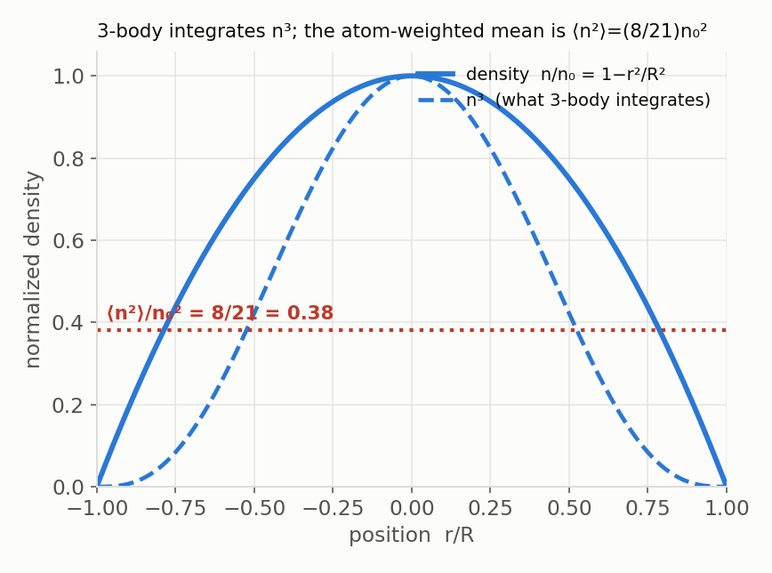
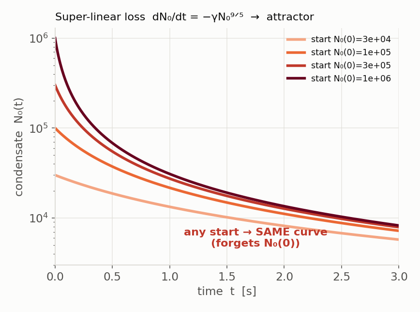
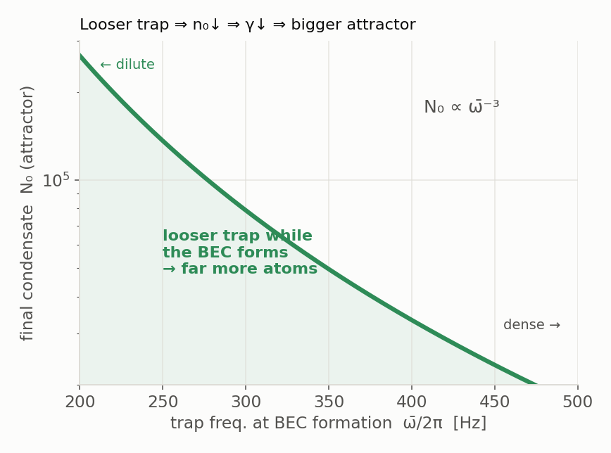

# ¹⁵¹Eu 蒸発冷却モデルの理論 — 導出と洞察

> **FROZEN 2026-07-25.** Describes the tree as of that date and is **not maintained** against the code — do not cite it as current.
> Live sources: `CLAUDE.md`, `docs/index.md`, and the code itself. Audit: `docs/audit/docs_inventory_2026-08-04.md`.

**状態: 議論用ドラフト（anko + Claude）。** issue #75 に蒸留する前の作業文書（日本語）。モデル（`src/solvers/evaporation/`）は 0 次元・2 成分（熱雲＋凝縮体）の蒸発冷却モデル。この文書の中心は、**BEC の原子数が「入れた原子数」ではなく「三体損失 × 密度の履歴」で決まる**という一点（アトラクタ）と、そこから出る「BEC を希薄に保て」という最適化指針。規約は atoms-lost（$K_3\equiv$ 博論の Söding $L_3$）。

## BEC 数を決めるアトラクタ

BEC を大きく冷たく作れるかは、凝縮体がどれだけ生き残るかで決まる。凝縮体は密（Thomas–Fermi）なので、密度に効く損失が支配する。1 体損失（背景ガス衝突）は密度に依らず遅く、2 体損失（スピン緩和）は蒸発を最低スピン状態 $|m=-6\rangle$ で行う限り禁止（それ以上下へは落ちられない）。残るのが**三体再結合**で、しかも $\propto n^3$ と密度に最も急に効くので、密な凝縮体を壊す主犯になる。これがこの章で解析する対象。

三体再結合は **3 つの原子が同時に同じ場所にいる**ときに起きるので確率は密度の 3 乗、それを「各原子が感じる率（周りの密度の 2 乗）を原子の居場所で平均」とまとめると

$$\frac{dN}{dt}=-K_3\!\int n^3\,dV=-K_3\,N\,\langle n^2\rangle,\qquad \langle n^2\rangle\equiv\frac{\int n^3}{\int n}.$$

この $\langle n^2\rangle$ を評価するには凝縮体の密度分布が要る。波動関数 $\psi$（$n=|\psi|^2$）は定常状態で Gross–Pitaevskii 方程式

$$\mu\,\psi=\Big[-\frac{\hbar^2}{2m}\nabla^2+V(r)+g\,n\Big]\psi,\qquad g=\frac{4\pi\hbar^2 a_s}{m}$$

に従う。$\mu$ は化学ポテンシャル（原子を 1 個足すのに要るエネルギー）で、固有値として左辺に立つ。右辺は運動（量子圧）＋トラップ $V=\tfrac12 m\bar\omega^2 r^2$＋相互作用 $g\,n$ の 3 つ。相互作用が強い凝縮体ではこの相互作用項（中心で $\approx g\,n_0$、$n_0$ はピーク密度）が主役で、それが運動（量子圧）のエネルギー目安 $\hbar\bar\omega$ を大きく上回る（$\mu\approx g\,n_0\gg\hbar\bar\omega$、原子数が多いほどそうなる）。このとき運動項はただの小さな補正なので落とせる——これが Thomas–Fermi 近似。残る代数式 $\mu=V(r)+g\,n(r)$ を解くと密度は放物線

$$n(r)=\frac{\mu-\tfrac12 m\bar\omega^2 r^2}{g}=n_0\Big(1-\frac{r^2}{R^2}\Big),\qquad n_0=\frac{\mu}{g},\quad R\propto\mu^{1/2}$$

を与える。原子数 $N_0=\int n\,dV\propto n_0 R^3\propto\mu^{5/2}$ を逆に解けば $n_0\propto N_0^{2/5}$——指数が小さいのは、足した原子の多くが密度でなく半径（$R^3\propto\mu^{3/2}$）に食われるから。

この放物線を $\langle n^2\rangle$ に入れる。$dV=4\pi r^2\,dr$（$r^2$ は球殻の面積）で $u=r/R$ とすると動径積分は Beta 関数になり、

$$\int n^p\,dV\ \propto\ n_0^p\,B\!\left(\tfrac32,\,p{+}1\right)\ \Rightarrow\ \langle n^2\rangle=n_0^2\,\frac{B(\tfrac32,4)}{B(\tfrac32,2)}=\boxed{\dfrac{8}{21}}\,n_0^2.$$

これで材料がそろう。凝縮体の三体損失 $dN_0/dt=-K_3 N_0\langle n^2\rangle$ に、いま出した $\langle n^2\rangle=\tfrac{8}{21}n_0^2\propto N_0^{4/5}$（密度が $N_0^{2/5}$、その 2 乗）を入れると

$$\frac{dN_0}{dt}=-\gamma\,N_0^{9/5}\qquad\Big(9/5=\underbrace{1}_{N\text{に線形}}+\underbrace{4/5}_{n_0^2\propto N^{4/5}}\Big).$$

**指数が 1 より大きいのが全て**：原子が多い＝密度が高い＝もっと速く減る、という自己抑制。だから密な雲は速く減り、希薄な雲に追いつく。$f=N_0^{-4/5}$ と置くと $df/dt=\tfrac45\gamma$（線形）なので

$$N_0(t)=\Big[N_0(0)^{-4/5}+\tfrac45\gamma t\Big]^{-5/4}\ \xrightarrow{\ \gamma t\ \text{大}\ }\ \Big[\tfrac45\gamma t\Big]^{-5/4}.$$

右辺から $N_0(0)$ が消える＝**初期原子数を忘れる**。何個ロードしても最終 BEC は同じ値に収束する（下図：初期値を 30 倍振っても同じ曲線）。もし損失が線形なら倍入れれば倍残るが、三体の超線形性が記憶を消す。

## 希薄に保つと勝つ（最適化の芯）

最終 BEC を増やすには、アトラクタ値 $\big[\tfrac45\gamma t\big]^{-5/4}$ を大きく＝$\gamma$ を小さくすればいい。その $\gamma$ にトラップの締まりが効く：$\gamma\propto n_0^2$ で、$n_0\propto\bar\omega^{6/5}$（$a_{ho}\propto\bar\omega^{-1/2}$ に注意すると $\mu\propto\bar\omega^{6/5}$）だから $\gamma\propto\bar\omega^{12/5}$、アトラクタ値は $\propto\gamma^{-5/4}\propto\bar\omega^{-3}$。つまり **BEC が形成される瞬間にトラップが緩いほど、最終 BEC は $\bar\omega^{-3}$ で急に増える**——終盤で罠を緩めて希薄に保つほど勝つ。*（$12/5$・$-3$ の指数は一緒に検算したい。）*

同じアトラクタから $K_3$ の測り方も出る：初期の減り率 $\gamma N_0^{4/5}=K_3\langle n^2\rangle$ の逆数が 1/e 寿命 $\tau=1/(K_3\langle n^2\rangle)$。博論の $\tau=1.4$ s（Fig 7.5）を逆に解いて $K_3$ を得た。$n_0$ が Fig 7.5 の BEC 数（未記載）に依るので $K_3\sim1\times10^{-41}$ **オーダー**（独立な $L\sim10^{-29}\,\mathrm{cm^6/s}$ と整合）。

## BEC はどう作られるか（2成分蒸発）

アトラクタは「凝縮体があったら」の話。その凝縮体を作るのが蒸発。$T<T_c$ では追加原子が凝縮体へ落ちるので熱雲は**飽和**し、熱原子数は温度だけで決まって $N_{th}=\zeta(3)(k_BT/\hbar\bar\omega)^3\propto T^3$、残り $N_0=N-N_{th}$ が凝縮体。$T$ が下がると $N_{th}$ が $T^3$ で崩れ（thermal crash）、凝縮体へ流れ込む。

その $T$ を下げるのが蒸発そのもの。深さ $\eta k_BT$ より熱い原子が衝突で抜け、蒸発率は「衝突率 × 高エネルギー割合」$\dot N_{ev}=-N n\sigma\bar v\,f(\eta)$、抜ける原子が平均より熱いので残りが冷える（$d\ln T/d\ln N=(\bar\epsilon-3)/3$、フィットなし）。この 0 次元近似（$\bar\omega$ しか持たない）が主な限界で、系統誤差の出所——BEC をまだ締まった罠で形成させてしまう。

## Feshbach で三体を減らす

トラップを緩める以外に、三体そのものを弱めるレバーがもう一つある：散乱長 $a_s$ を磁場（Feshbach 共鳴）で下げる。三体は $K_3\sim C\hbar a_s^4/m$ と $a_s^4$ に効くのに対し蒸発を担う弾性は $\sigma=8\pi a_s^2$ と $a_s^2$ どまり。だから密な BEC 近傍で $a_s$ を下げれば、損失（$a_s^4$）が蒸発効率（$a_s^2$）より速く落ちて得（Er/Dy の常套手段）。ただし共鳴近傍で $K_3(B)$ が非単調（Efimov）になるので精度勝負。

## 0 次元の限界と、これから

密度と寿命は（深い Thomas–Fermi で）正確だが、蒸発の空間ダイナミクスは 0 次元では捉えられない。その帰結として、まだ締まった罠（$\bar\omega\approx444$ Hz）で $T<T_c$ に達し、凝縮体が密に形成されてアトラクタ律速（$\tau_{3b}\approx0.6$ s）になる。実 3D で形成がどの締まりで起きるかが最終 $N_0$ を決める——ここを詰めるのが 3D 有限温度シミュレーション（Stoof 型 SGPE）。

一緒に詰めたい点：(1) $\gamma\propto\bar\omega^{12/5}$・$N_0\propto\bar\omega^{-3}$ の検算、(2) $\gamma(t)$ がランプに従うとアトラクタ積分は $N_0^{-4/5}(t)=\int\tfrac45\gamma(t')\,dt'$ になり、**最適ランプは $\int\gamma\,dt$ を最小化する**——新規で publishable な枠組みか、(3) issue #75 へどの深さで載せるか。
