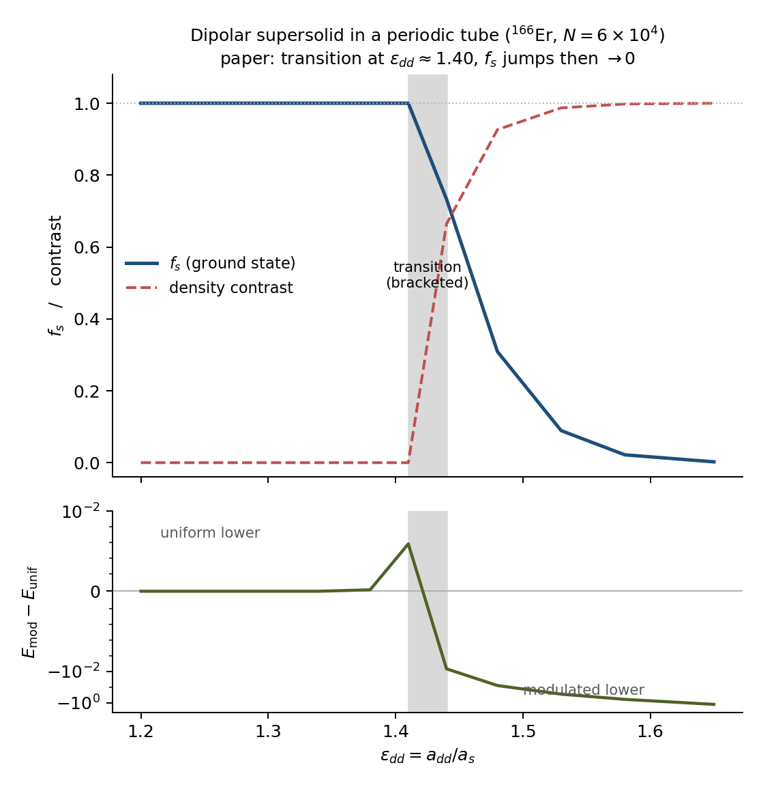

# Dipolar supersolid in a periodic tube — type-C reproduction

Verification type: **C (model fidelity)** — comparison against published
numerical results, not against this code's own statements.

Reference: S. M. Roccuzzo & F. Ancilotto, *Supersolid behaviour of a dipolar
Bose-Einstein condensate confined in a tube*, Phys. Rev. A **99**, 041601(R)
(2019), doi:10.1103/PhysRevA.99.041601, [arXiv:1810.12229](https://arxiv.org/abs/1810.12229).

Purpose: this is the first physics anchor for `superfluid_fraction`. Everything
before it was type A (units, oracles, GPU parity) or type B (agreement with a
twisted-boundary-condition GP minimisation). This is the first statement that
the number matches an independent calculation of a real system.

## Why this geometry

`superfluid_fraction` measures the free-energy cost of a phase twist across a
**periodic** box. A harmonically trapped cloud has vacuum at the box edge, no
phase rigidity along the flow axis, and legitimately reports $f_s \approx 0$ —
geometry, not state. Roccuzzo & Ancilotto use exactly the geometry the metric
assumes: radial harmonic confinement with periodic boundary conditions along the
tube axis. That is what makes their $f_s$ directly comparable rather than
approximately comparable.

## Parameters (all from the paper)

| quantity | value | source |
|---|---|---|
| species | **¹⁶⁶Er** | §II: "In what follows m is the mass of a ¹⁶⁶Er atom" |
| $N$ | $6\times10^4$ | §II |
| $\omega_y = \omega_z$ | $2\pi\cdot600$ Hz | §II |
| axis $x$ | periodic (tube), $z$ = polarization | §II |
| $n_0 = N/L$ | $3.78\times10^3\ \mu\mathrm{m}^{-1}$ | Fig. 2 caption ⇒ $L = 15.873\ \mu$m |
| mesh | $0.1\ \mu$m | §II |
| droplets at $\epsilon_{dd} = 1.45$ | 11, $d = L/11 = 1.443\ \mu$m | Fig. 2 caption |
| LHY | $\gamma(\epsilon_{dd}) = \frac{32}{3\sqrt\pi} g\, a^{3/2} F(\epsilon_{dd})$, $F = Q_5$ | §II |

The ¹⁶⁴Dy that appears in the paper's introduction is the Chomaz *et al.* pancake
experiment cited for motivation, **not** the geometry simulated. Reading Dy into
the parameters is what made the first attempt fail (see below) — it doubles
$a_{dd}$, so at fixed $\epsilon_{dd}$ it halves $a_s$ and moves $\gamma \propto
a_s^{5/2}$ into a different regime.

Our LHY convention is identical to theirs: `scalar_lhy_coefficient` implements
$\gamma = (32/3\sqrt\pi)\,g\,a^{3/2} Q_5$, and their $F(\epsilon_{dd})$ is the
same angular average as `lima_pelster_Q5`.

## Result

Both branches (uniform seed and 11-period cosine seed) relaxed to convergence by
imaginary-time propagation at each $\epsilon_{dd}$; the ground state is whichever
has the lower total energy. Grid $160\times32\times32$, $dx = 0.0992\ \mu$m.

| $\epsilon_{dd}$ | ground state | contrast | $f_s$ | $E_{mod} - E_{unif}$ |
|---|---|---|---|---|
| 1.25 | uniform | 0.0000 | 1.0000 | $+1.7\times10^{-13}$ |
| 1.35 | uniform | 0.0000 | 1.0000 | $+6.7\times10^{-11}$ |
| 1.45 | **modulated** | 0.7780 | **0.5983** | $-1.8\times10^{-2}$ |
| 1.60 | **modulated** | 0.9989 | **0.0119** | $-7.8\times10^{-1}$ |

Below the transition the modulated seed relaxes to the uniform state to
**bit-level identity** ($\Delta E \sim 10^{-12}$), i.e. no modulated branch
exists there — not merely a higher one.

A 10-point scan of the same comparison gives the curve
(`figs/dipolar_supersolid/fs_curve.png`, data + script alongside):

The transition is **bracketed between $\epsilon_{dd} = 1.41$ and $1.44$**, and the
scan resolves the first-order structure: at 1.41 the modulated branch *exists*
but sits $+8\times10^{-5}$ above uniform (contrast 0.066), i.e. metastable; by
1.44 it is $-6.9\times10^{-3}$ below (contrast 0.664, $f_s = 0.733$). Below 1.38
the modulated seed relaxes onto the uniform state to round-off, so there is no
second branch at all.

Agreement with the paper's Fig. 2 (upper panel):

- **Transition between 1.35 and 1.45**, i.e. $\epsilon_{dd} \approx 1.40$, where
  they report the roton gap closing.
- **$f_s$ jumps** from 1 to ~0.6 across the transition rather than rising
  continuously from 0 — matching their "a small jump at the uniform → modulated
  transition seems to signal a first-order transition".
- **$f_s \to 0$ in the droplet regime**: 0.012 at $\epsilon_{dd} = 1.60$, with
  contrast 0.999 (density minimum essentially zero), i.e. droplets that are
  individually superfluid but mutually disconnected — the case the paper
  singles out as having no supersolid character.

### The droplet array is the minimum in both period and shape

Two checks beyond the seeded comparison, both at $\epsilon_{dd} = 1.45$.

**Period.** Imposing $d = L/n_d$ for $n_d = 8\ldots14$ and converging each
separately puts the minimum at $n_d = 11$ ($+1.2\times10^{-3}$ at 10,
$+3.3\times10^{-3}$ at 12). Repeating at $\epsilon_{dd} = 1.55$ moves it to
$n_d = 9$, so the preferred count drops as the droplets isolate — the paper's 11
is specific to the 1.45 it quotes it at.
See `figs/dipolar_supersolid/period_scan.png`.

**Shape.** The period scan fixes the *shape*, so six deliberately broken seeds
were run as well:

| seed | $E$ | $\Delta E$ vs even array | peaks | peak-height spread |
|---|---|---|---|---|
| even 11-droplet | 4.541833 | — | 11 | 0.011 |
| alternating amplitude | 4.541833 | $5.5\times10^{-9}$ | 11 | 0.011 |
| dimerised | 4.541833 | $1.4\times10^{-7}$ | 11 | 0.011 |
| one droplet suppressed | 4.541835 | $1.8\times10^{-6}$ | 11 | 0.013 |
| uneven spacing | 4.542068 | $2.4\times10^{-4}$ | 11 | 0.029 |
| broadband noise | 4.541833 | $2.7\times10^{-9}$ | 11 | 0.011 |

All relax to the *same* even array. The uneven-spacing seed stops
$2.4\times10^{-4}$ short and at higher peak-height spread, i.e. not fully
relaxed rather than a competing state. No unequal, dimerised or defected
modulation is competitive here.

### Droplet count is a prediction, not an input

The table above seeds 11 periods, so its droplet count is imposed. Seeding
**broadband noise** instead and letting imaginary time select the wavelength, at
$\epsilon_{dd} = 1.45$:

| noise seed | droplets | $d$ (µm) | contrast | $f_s$ | $E$ |
|---|---|---|---|---|---|
| 11 | 11 | 1.443 | 0.7537 | 0.7014 | 4.544512 |
| 22 | 11 | 1.443 | 0.7507 | 0.6933 | 4.544807 |
| 33 | 11 | 1.443 | 0.6272 | 0.8586 | 4.551531 |

All seeds select **11 droplets** with $d = 1.443\ \mu$m, matching the paper. The
cosine-seeded state remains lowest in energy (4.541833), and $f_s$ tracks
convergence depth — the better-converged (higher-contrast) states have lower
$f_s$ — so 0.60 is the value to quote at $\epsilon_{dd} = 1.45$ and the
noise-seeded 0.69–0.86 are less relaxed.

## What was checked along the way, and what it cost

Four candidate explanations were eliminated by measurement before the species
error was found. Recording them because each is a trap for the next attempt:

1. **Realized $\epsilon_{dd}$.** Setting `c_dd = 12π(a_dd/a_ho)N` and checking
   $c_{dd}/(3g) = \epsilon_{dd}$ is self-referential. Measured instead from the
   code's own kernel at two independent angles: $k \parallel B$ must give
   $V_{dd}/V_{contact} = +2\epsilon_{dd}$ and $k \perp B$ must give
   $-\epsilon_{dd}$. Both matched exactly, so the prefactor cannot hide.
2. **$E_{dd} < 0$.** Not a bug. A tube's structure is dominated by
   $k \perp B$ components, where the kernel is negative. The $k=0$ mode is
   dropped by repo convention, so the naive real-space cigar argument does not
   set the sign.
3. **Transverse box.** $E_{dd}$ is genuinely *not* converged in $L_t$ (38 %
   change from $L_t = 16$ to 48 $a_{ho}$, still drifting) — the periodic image
   tubes interact. But $E_{mod} - E_{unif}$ was identical to **7 significant
   figures** across $L_t = 16/24/32$: the image contribution sits in the
   $k_x = 0$ sector and cancels in the branch difference. Harmless for the
   transition, wrong for absolute $E_{dd}$.
4. **$Q_5$.** Verified against $Q_5(0) = 1$, $Q_5(1) = 3^{5/2}/6$ (analytic) and
   the small-$\epsilon$ expansion $1 + \tfrac32\epsilon^2$. $Q_5(1.45) = 4.385$.

Two of our own errors were also caught by measurement rather than by inspection:

- A droplet-array seed with $\sigma = 0.81\,a_{ho}$ on a grid with
  $dx = 0.516\,a_{ho}$ — **1.6 points per droplet $\sigma$**. Its
  $E_{mod} - E_{unif} = +35.7$ was representation error, not physics, and
  imaginary time simply flattened it. Replaced with a smooth high-contrast
  cosine.
- A $\gamma$ scan at the wrong species showed a supersolid appearing at half the
  first-principles LHY strength. That factor (~$2^{3/2} = 2.83$ from halving
  $a_s$) is what pointed at the species, and reading §II confirmed it.

## Reproducing

The scan is CPU-only (the scalar eGPE path has no GPU backend) and takes about
5 min per ITP run at $160\times32\times32$ / 30 k steps, so a 4-point two-branch
scan is ~40 min and the 10-point figure scan ~100 min.

`test/validation/test_dipolar_supersolid_tube.jl` (ci tier, ~100 s) keeps the
cheap invariants: $a_{dd}$ of both species, $Q_5$ against closed forms, the cell
geometry, and the *sign* of $E_{mod} - E_{unif}$ at $\epsilon_{dd} = 1.30$
versus 1.45 on a coarse grid. It deliberately does not re-derive $f_s$ — that
needs the resolution and the step count above.

## Known limits

- Absolute $E_{dd}$ is not converged at $L_t = 16\,a_{ho}$ (item 3), but it is
  now **quantified and extrapolable** rather than open-ended. `make_scalar_ws`
  takes `ddi_pad=(1, p, p)`, which pads the dipolar convolution transversally
  while leaving the axial period exact. Two measured facts:
  - Padding by $p$ is **exactly** equivalent to an unpadded box $p$ times wider
    (agreement to round-off, $\le 3\times10^{-12}$ relative). So it is not a
    truncated kernel — it is a cheaper route to the same large-box limit, with
    the wavefunction grid staying small: 3.2× faster than the equivalent box at
    $p = 4$.
  - The images converge as $1/L_t^{2}$, **not** $1/L_t^{3}$, because they are
    parallel *lines* of dipoles rather than point clouds. Three independent
    ratios match the $1/p^2$ prediction to 4 decimals and exclude $1/p^3$.
    Richardson in $1/p^2$ gives the isolated-tube value; at
    $\epsilon_{dd} = 1.45$ the unpadded $L_t = 16$ number is **3.6 % low**.

  An actual cylindrically-truncated kernel would remove even that, but it has no
  closed-form Fourier transform (unlike the spherical Ronen-Bortolotti-Bohn cut
  the spinor path uses, which is the wrong tool here since it would cut the axial
  direction too and destroy the ring periodicity).
- $f_s$ here is the Leggett plane-average closed form. The paper's definition is
  the comoving-frame $1 - \langle P_x\rangle/(Nmv_x)$; those agree at $O(q^2)$
  within mean field, which is the type-B result gated by
  `test_superfluid_fraction_gp_twist.jl`.
- No $f_s$ value is read off the paper's Fig. 2 — only the curve's structure
  (transition location, jump, decay to zero) and the quoted droplet count are
  compared. A digitised point-by-point comparison would be a stronger claim than
  is made here.
